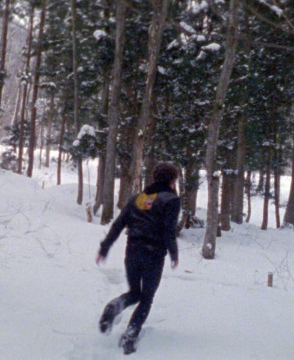

Tiger est une histoire d'amour et de solitude. Deux mannequins occidentaux, fraîchement arrivés à Tokyo, se rencontrent et s'énamourent. En cette saison hivernale, la ville se fait discrète, voire imperméable. Il ne reste que le petit monde de Renee et Jack, qui déraille silencieusement alors que leur séjour se prolonge.

Le film, réalisé en 2010, est disponible sur YouTube et Vimeo.

[Voir le film sur YouTube](https://www.youtube.com/watch?v=OMSvimkpZZU)

James McFay est réalisateur, acteur, compositeur et ancien mannequin. Il joue ici le rôle de Jack, son personnage principal. Les autres acteurs et actrices sont également issues du monde du mannequinat. Le film s'inspire du style cinéma vérité, construit autour d'anecdotes, d'éléments autobiographiques et d'observations sur l'industrie du mannequinat. La cinématographie est superbe, pleine de sensibilité, et la caméra 16mm sied l'ambiance à merveille.

Dans cette vision fascinante de Tokyo, les quelques figures japonaises de l'histoire ne se montrent finalement jamais à l'image. Ces jeunes venus d'ailleurs vivent en parallèle, naviguent entre les jobs, sans savoir de quoi le lendemain sera fait. Le réalisme intimiste de certaines scènes, la difficulté à gérer l'alimentation et le poids, sentent le vécu et ont une saveur autobiographique. Jack et son interprète ne cachent d'ailleurs pas leurs similitudes : le personnage est en train « d'enfin écrire un film qui a un sens ».

Un beau jeu d'acteur, une narration juste et des images mémorables. J'aime bien ce film.

