> Ce tutoriel est né de la collaboration de plusieurs membres du forum RPG Maker Alliance, à l'occasion d'un « challenge de la semaine » sur MagicaVoxel. Lorsque nous avons fermé le forum en 2019, ce tutoriel est alors devenu inaccessible. Je n'en suis pas l'auteur, mais il me paraît bon de le remettre en ligne quelque part !

La modélisation 3D vous semble sans doute hors d'atteinte, réservée aux pros et aux étudiant·e·s dans ce domaine. Pourtant, certains logiciels gratuits vous permettent de bricoler facilement une petite scène en 3D afin de mettre un premier pas dans ce vaste domaine... C'est le cas, entre autres, de MagicaVoxel !

Ce logiciel gratuit, disponible sur Mac et Windows (mais tournant très bien sur Linux via Wine ou PlayOnLinux), permet de créer des objets en voxels (des cubes, l'équivalent de pixels en 3D) et de les assembler. Son interface ergonomique et ses outils simples en font un logiciel accessible et amusant pour les débutant·e·s.

[Site officiel de MagicaVoxel](https://ephtracy.github.io/)

[En savoir plus sur les voxels](https://www.youtube.com/watch?v=U-0n383c27E)

## Débuter sur MagicaVoxel

*Ecrit par Nev*

Si mon petit pitch vous a convaincu, vous avez sans doute téléchargé et lancé MagicaVoxel. Vous devriez vous trouver devant un écran similaire à celui-ci. Faisons ensemble un petit tour du propriétaire...

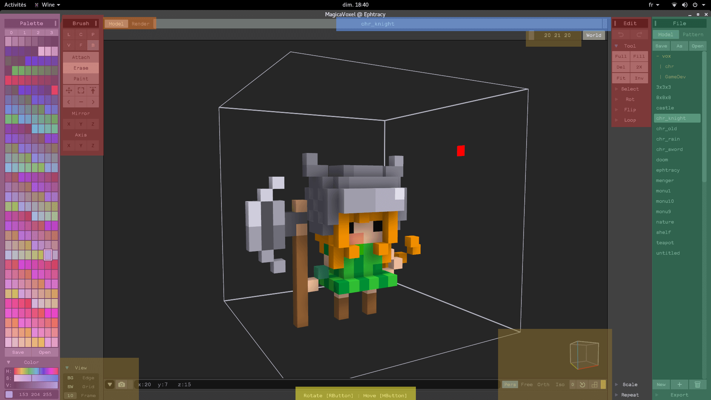

- En **vert** : Se trouvent vos fichiers. Vous pouvez créer un nouveau document, ouvrir les anciens, les supprimer, les exporter vers d'autres logiciels... Et regarder les dizaines d'exemples déjà inclus dans le logiciel !

- En **bleu** : Il s'agit du nom de votre document, à sa droite se trouve un petit carré (ici gris) sur lequel vous devez cliquer pour enregistrer votre travail. Si vous n'avez pas enregistré les dernières modifications, le carré sera rouge-orangé (pensez à sauvegarder régulièrement !!!)

- En **jaune** : Très utile au début, il s'agit du nom de l'outil que vous survolez / des actions que vous pouvez faire actuellement. Si vous avez un doute concernant un bouton, survolez le avec votre souris et le logiciel vous indiquera son utilité.

- En **violet** : Il s'agit de vos palettes de couleurs. MagicaVoxel vous en propose par défaut mais vous pouvez créer les votres via les boutons en bas et le sélecteur de couleurs. Rappelez-vous que vous peignez un voxel en entier, vous ne pouvez pas appliquer une couleur différente sur chacune de ses faces...

- En **rouge** : Vos principaux outils. A gauche vous trouverez trois modes, Attach (pour ajouter des voxels) Erase (pour en supprimer) et Paint (pour en peindre), qui se combine avec six pinceaux, L (ligne) C (cercle) P (patterns) V (voxel) F (face) B (carré). A droite vous trouverez l'option "retour arrière" (CTRL + Z) et l'option "restaurer" ainsi que plusieurs outils plus spécifiques (Tels que des outils de symétries, de rotation, de sélection...)

- En **kaki** : Il s'agit des options de caméra, à droite vous pouvez régler le type de vue (Libre, isométrique...) et recentrer la caméra sur votre objet. A gauche vous pouvez régler la grille, le fond, surligner les bordures... En haut à gauche vous pouvez gérer la définition de l'apercu, ce qui sera utile plus tard dans le rendu.

Cela fait beaucoup de choses à enregistrer, mais je vous assure que le design est fait pour que ce soit simple. N'hésitez pas à jouer avec les options que je vous ai présentées afin de les apprivoiser avant de passer à la suite.

## Composition ou mode World

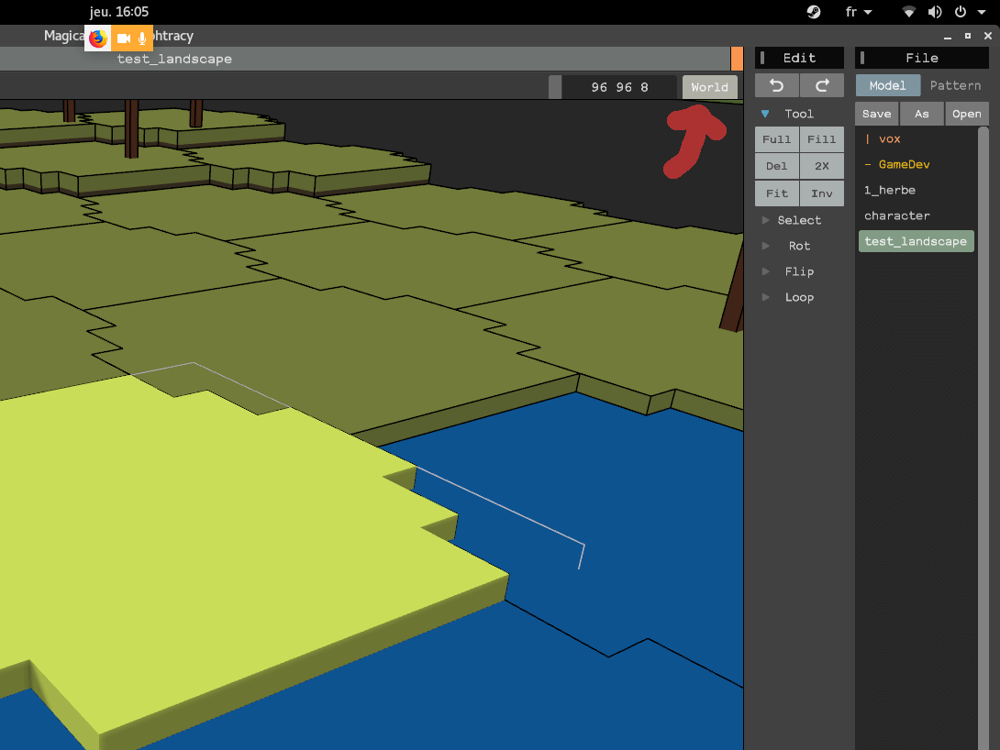

Vous êtes fier de votre premier objet et vous souhaitez créer une composition avec plusieurs objets ? Appuyez sur le bouton "world" (le bouton "edit" pour revenir à l'édition d'un bloc de la composition sera au même endroit)

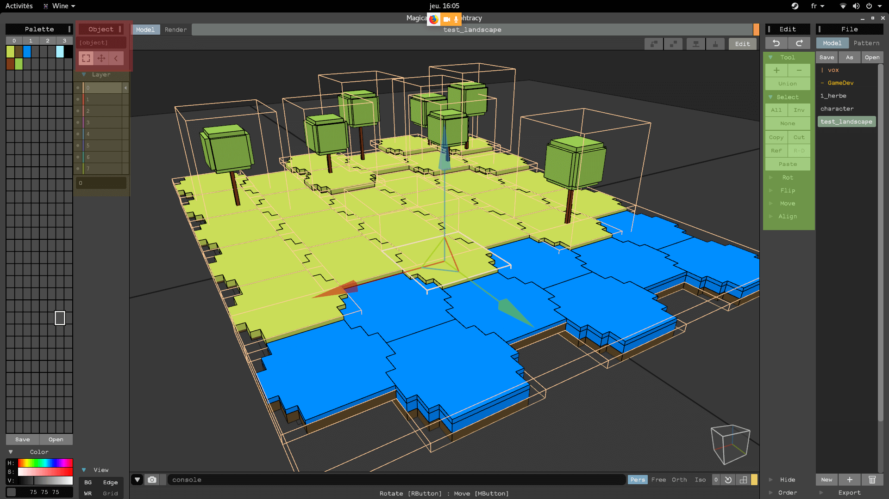

Vous voilà dans le mode "world" , vous pouvez bouger chaque objet séparément grâce aux outils à gauche en **rouge** sur les X Y et Z (Les flèches que vous voyez au centre l'écran). Vous pouvez dédoubler, supprimer et tourner vos objets à votre guises, et bien plus encore, avec les outils à droite de l'écran en **vert**.

En **brun** à droite le gestionnaire des calques, qui sert principalement si vous souhaitez faire des animations, ce que je vous déconseille quand vous débutez avec le logiciel !

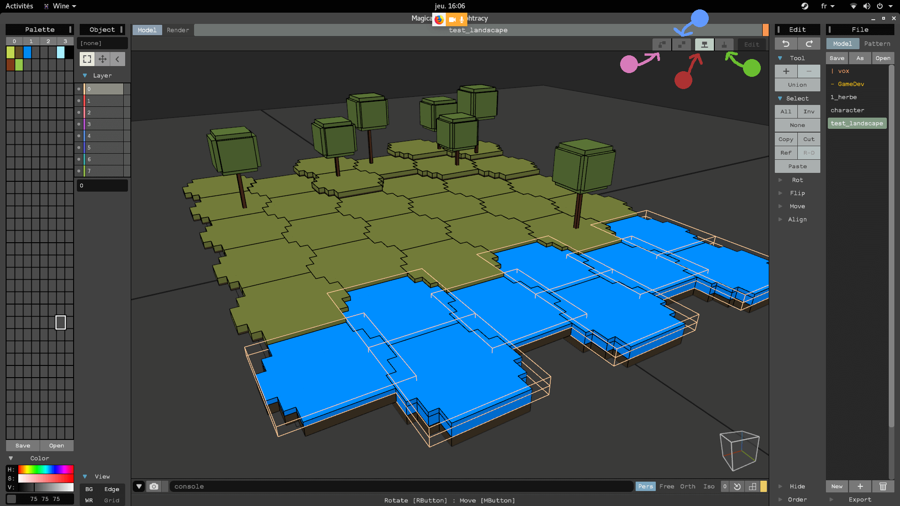

A noter également l'existence d'un système de "groupe", qui permet de gérer plus facilement une composition trop complexe. Par exemple ici tout les blocs d'eau on été regroupés en un seul groupe, qui me permet de les déplacer tous ensemble !

Pour faire un groupe sélectionnez plusieurs objets en maintenant "Maj" et en cliquant sur les objets désirés, puis en appuyant sur l'outil "group object" (En **Rose** sur l'exemple) . Vous pouvez ensuite rentrer dans le groupe (pour en éditer chaque objets membre) en cliquant sur le groupe puis sur "Enter group" (En **vert**) , pour en ressortir cliquez sur "Leave groupe" (En **rouge**). Pour désassembler un groupe, sélectionnez le et cliquez sur "Ungroup object" (En **bleu**).

## Rendu et matériaux

*Ecrit par Imanor*

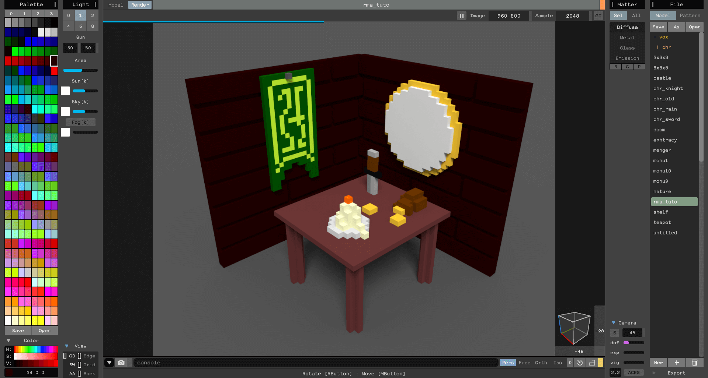

Après avoir créé votre scène, il est temps de passer au rendu. C’est l’étape où vous allez attribuer les materiaux à vos éléments et où votre ordinateur va calculer la lumière dans votre scène afin de sortir une image finale. Pour y accéder, il suffit de cliquer sur l’onglet “Render” en haut de l’espace de travail. Ce nouvel espace est accompagné d’outils différents, cependant vous pouvez toujours déplacer la caméra de la même manière que dans l’onglet “Model” !

En haut, vous pourrez définir la taille de votre image finale, ainsi que la qualité de votre rendu. Plus la valeur est haute, plus le rendu sera propre. Cependant une valeur plus haute que celle par défaut augmentera le temps de rendu de votre image. Bien entendu, plus votre ordinateur est puissant et plus les temps de rendu seront rapides !

A gauche, c’est ici que vous vous pourrez régler la lumière et l’éclairage de votre scène.

- Les 6 premières valeurs définissent le nombre de lightbounces, c’est à dire le nombre de fois où la lumière va rebondir sur les surfaces. Plus cette valeure est haute, plus la lumière dans votre scène sera précise et réaliste. Cependant il faudra plus de temps à votre ordinateur pour calculer l’image.
- “Sun” vous permet de changer la position du “soleil”, à savoir la source d’éclairage de votre scène.
- “Area” définit la taille de votre source de lumière. Plus elle est petite, plus elle sera concentrée rendant les ombres dans votre scènes très nets. A l’inverse, une valeur plus haute rendra les ombres plus diffuses. Attention, ce réglage ne doit pas être confondu avec “l’intensité” du Sun ! Une Area plus grande ne voudra pas dire que la lumière sera plus forte.
- Sun [k] vous permet justement de régler l’intensité du Sun ainsi que ça couleur.
- Sky [K] vous permet de régler l’intensité de votre ciel. Vous pouvez également changer sa couleur, ce qui aura également pour effet de teinter les ombres dans votre scène.
- Enfin, Fog [k] vous permet de rajouter du brouillard dans votre scène. Vous pourrez ensuiter modifier son intensité et sa couleur de la même manière que pour les réglages précédents.

A droite se trouvent les réglages de materiaux, c’est à dire la matière que vous allez donner à vos objets. Vous avez le choix entre modifier le materiaux de tous vous éléments (All) ou de selectionner un élement en particulier (Sel) en maintenant la touche Alt et en cliquant sur l’élement que vous voulez modifier dans votre espace de travail. Sachez que dans ce mode, vous modifierez le matériaux de tous les voxels de cette même couleur dans votre scène.

- Diffuse : c’est votre matériaux de base.
- Metal : c’est ici que vous allez pouvoir gérer les propriété réfléchissantes de votre élément. L’option Metal définira à quel point votre matériau sera réfléchissant.

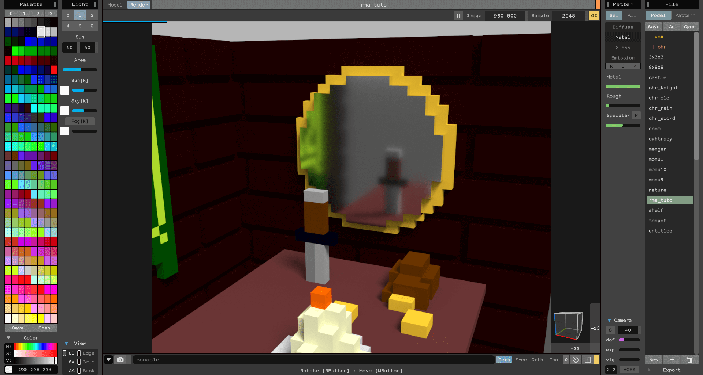

La roughness (ici l’option “Rough”) va définir la “qualité” de votre réflexion. Plus la valeur est basse et plus votre réflexion sera parfaite, comme un miroir.

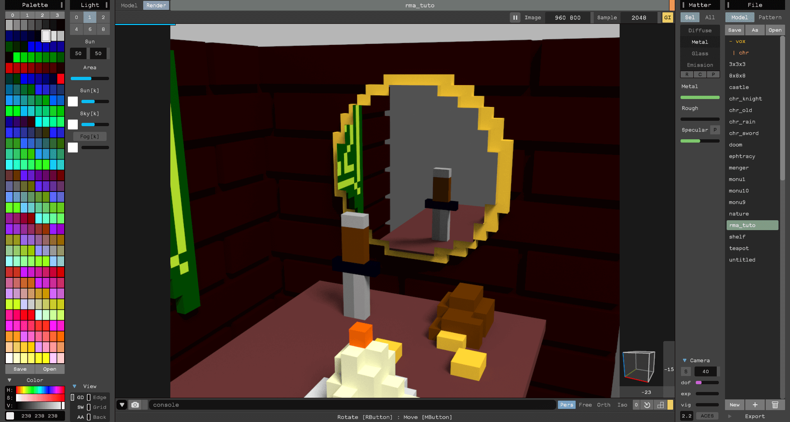

Au contraire une roughness élevée donnera un aspect mat à votre surface.

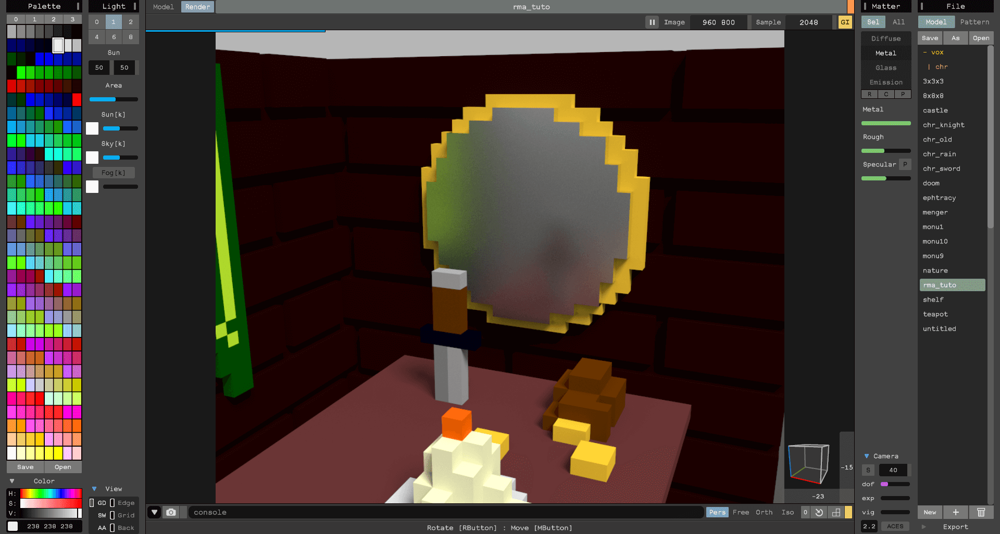

Enfin, le paramètre “Specular” définit l’intensité de votre réflexion. Si vous cliquez sur le bouton “P”, votre matériau aura alors un aspect “plastique” au lieu d’avoir l’air métallique. Ce mode vous permet d’avoir des reflets sur votre élément tout en gardant sa couleur !

Dans Glass, vous allez pouvoir donner de la transparence à votre élément. Le paramètre Glass définira à quel point votre objet est transparent

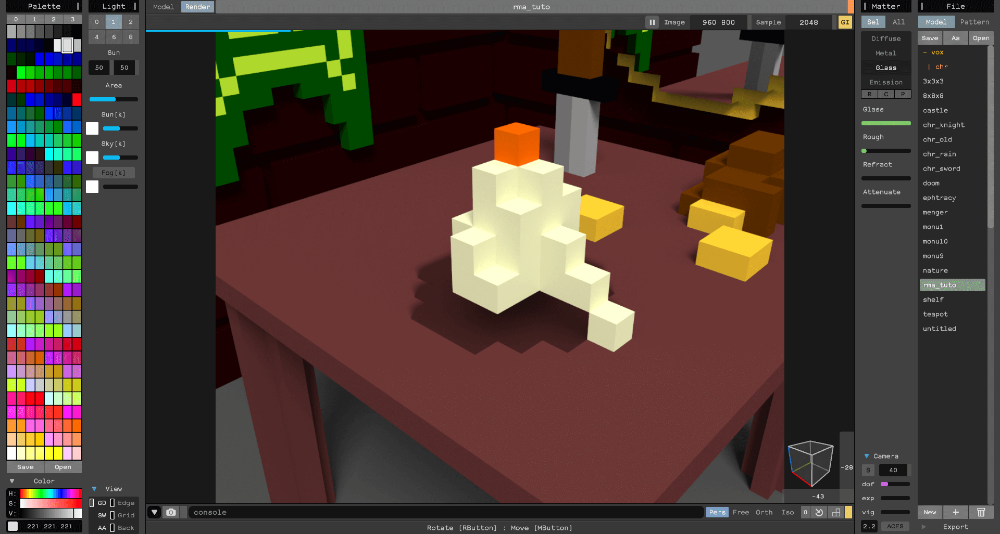

Rough ici agit de la même façon que dans “Metal”

Refract vous permet de définir l’indice de réfraction (de transparence) de votre objet, c’est à dire à quel point la lumière va être déviée en traversant celui-ci. Un indice de refraction au minimum sigifie que la lumière ne sera pas déviée, rendant donc votre objet “invisible”.

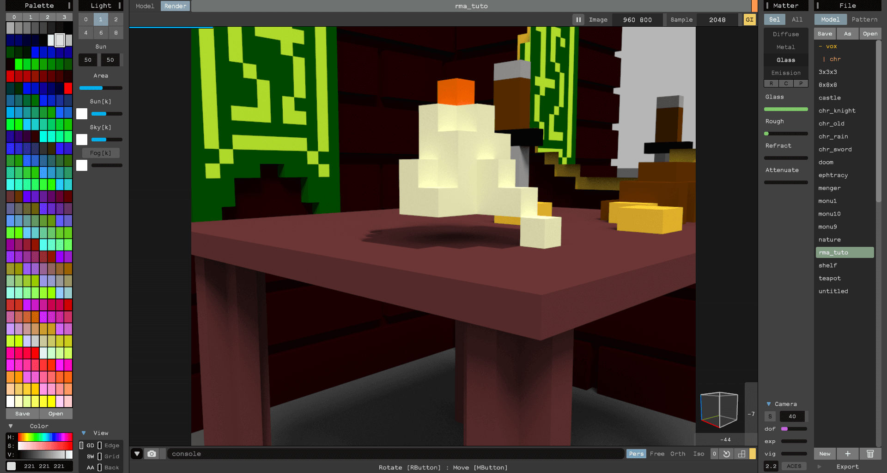

Une valeur élevée signifie que la lumière sera fortement déviée en traversant l’objet, lui donnant un aspect plus “crystal”.

Attenuate vous permet d'atténuer la transparence de votre élément. Cela aura pour effet de redonner un peu de la couleur de l’objet à sa transparence.

Enfin, Emission permettra à votre élément d’émettre de la lumière !

Emit définit à quel point votre élément sera “allumé”.

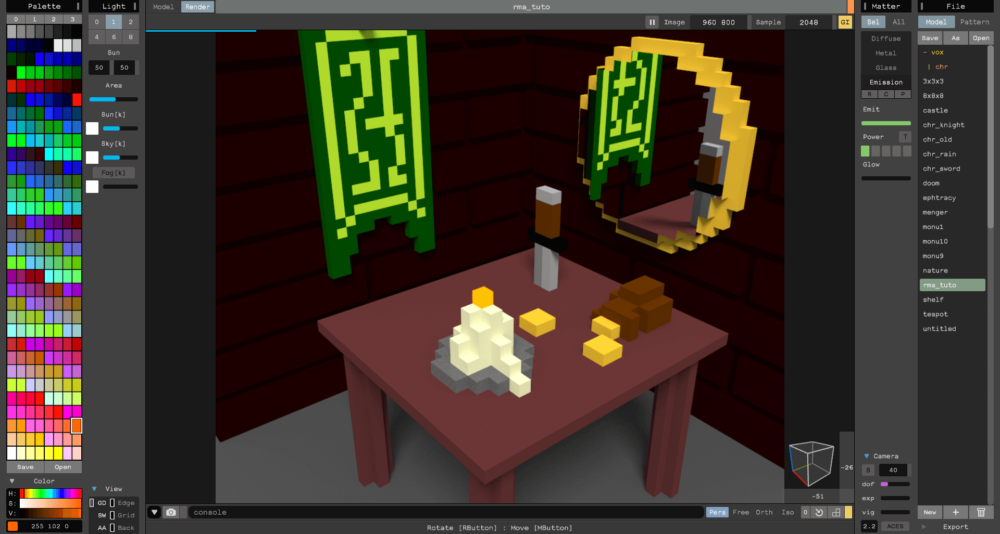

Ce réglage s’utilise en complément du réglage Power qui définit à quel point votre élément illuminera ses alentours.

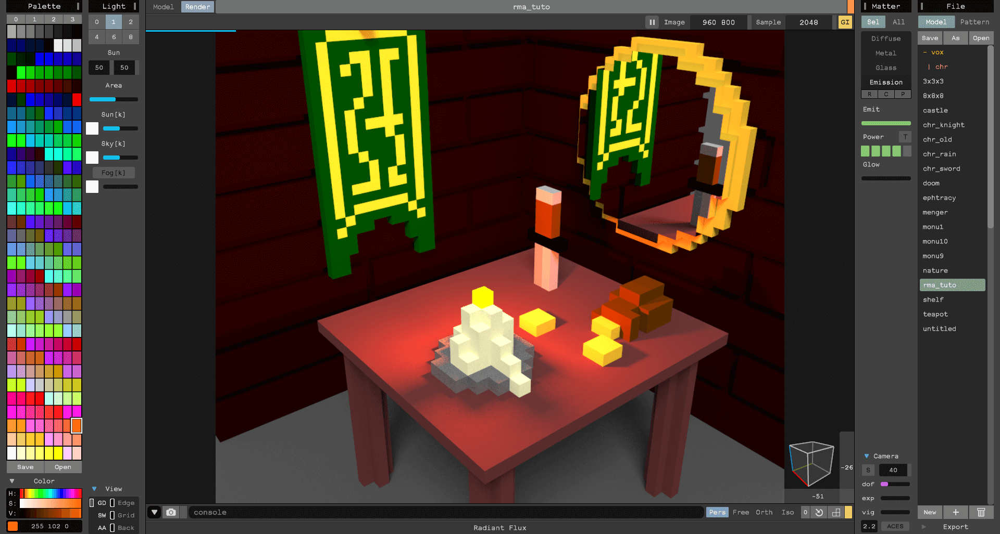

A noter que la couleur de la lumière sera celle du voxel. Egalement il est conseillé d’activer l’option “GI” (en haut à droite de l’espace de travail) si vous décidez d’utiliser l’emission. Cela permettra à votre ordinateur de calculer la lumière indirecte dans votre scène, en plus de la lumière directe. Cependant cette option peut-être assez gourmande et rallongera le temps de rendu de votre image.

Si tout cela vous fait peur, ne vous inquiétez pas ! Il vous suffit de prendre le temps d’expérimenter avec les différents réglages quelques minutes pour comprendre le principe, ce n’est vraiment pas très compliqué !

## Mettre en ligne un modèle sur Sketchfab

*[Traduit](https://blog.sketchfab.com/publishing-voxel-designs-from-magicavoxel-to-sketchfab/) par Ezekiel_Koening*

### Exporter votre modèle

Votre scène voxel est prête et il est temps pour vous de la partager ! Tout d’abord il va falloir l’exporter dans un format « mesh ». Le .obj est le format le plus couramment utilisé et sera parfaitement bien importé dans sketchfab. Choisissez le dossier d’enregistrement. MagicaVoxel va alors créer un .obj, un .mtl et un texture.png.

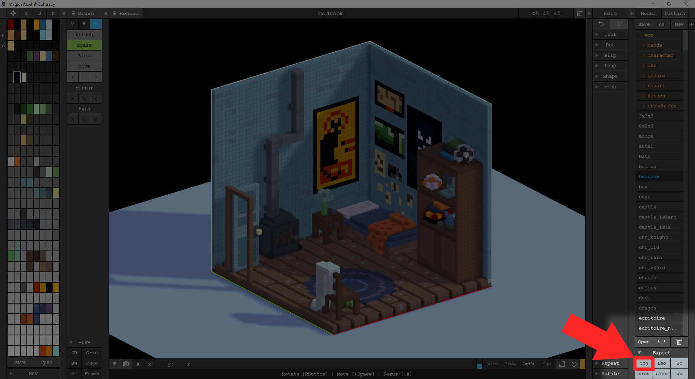

### Importer votre modèle dans Sketchfab

Appuyez sur « Upload » dans Sketchfab et sélectionnez vos trois fichiers (le .obj, le .mtl et le .png). Cliquez ensuite sur « Continue ».

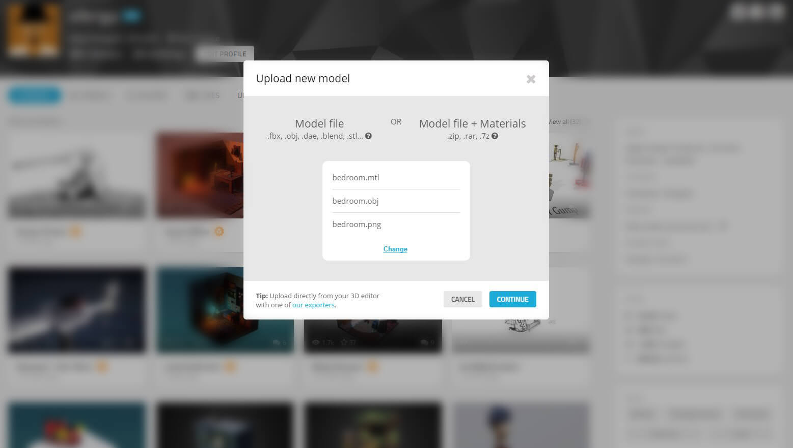

Après un court instant, votre modèle devrait apparaître. Complétez les informations (facultatif) puis cliquez sur « Continue ».

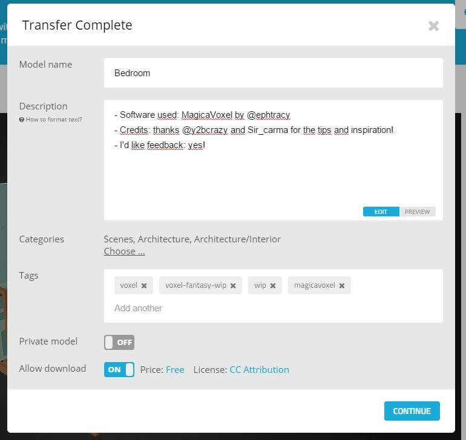

Vous pouvez désormais voir votre modèle, le faire tourner, etc.

### Paramètres de Sketchfab

Tout ça c’est très cool ! Mais est-ce que ça pourrait pas être encore mieux ? Il est temps de s’amuser un peu avec les propriétés (settings) de sketchfab ! Nous allons voir différents onglets disponibles dans les « 3D settings » de sketchfab :

#### Scène

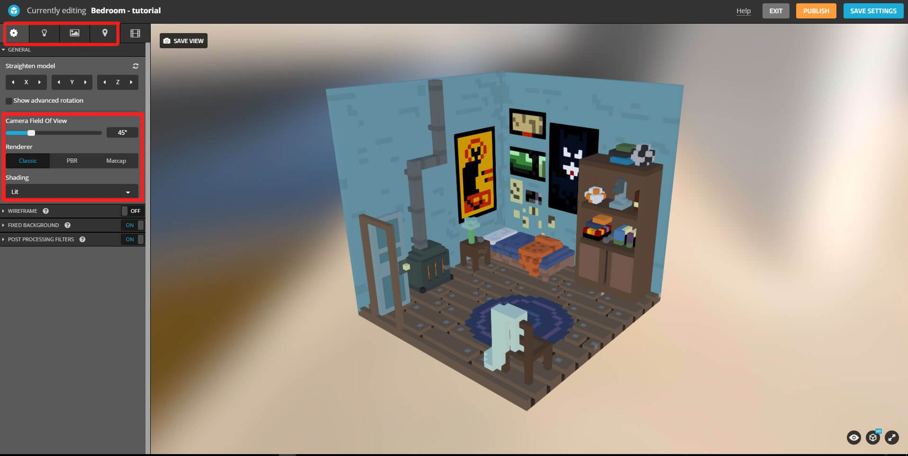

Dans l’onglet « Scene » vous pouvez changez des propriétés générales.

- Camera Field of View : une valeur intéressante avec laquelle jouer. 0° donne une vue orthogonale, ce qui va bien avec les voxels.
- Renderer : un réglage important ! Pour les voxels « Classic » est le plus approprié. Note : « PBR » signifie « Physically based rendering » ce qui donne un rendu réaliste mais qui demande beaucoup de textures et ne fonctionne donc pas vraiment avec les voxels. Matcap n’est pas très important non plus pour ce que nous voulons faire. Ici mieux vaut utiliser « Classic » qui donne un rendu simplifié.
- Shading : « Lit » donne un rendu avec des ombres. « Shadeless » ne vous donnera que des couleurs plates. Nous allons donc prendre « Lit » pour avoir de jolies ombres en temps réel.

Tant que nous y sommes, nous pouvons régler le point de pivot de notre scène en double cliquant n’importe où dans la scène.

Nous reviendrons à cet onglet « Scene » plus tard pour le reste des réglages.

#### Eclairage

« Lights » est sur Off pour le moment, donc mettez le sur On ! Vous pouvez sélectionner et éditer les sources de lumières dans l’onglet ou directement dans votre scène.

« Attached to camera » fait en sorte que les lumières suivent la rotation de la caméra.

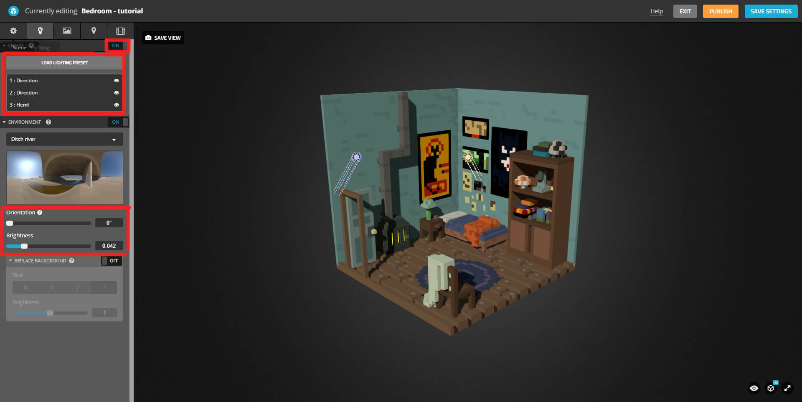

Si vous voyez des glitches au niveau des ombres, vérifiez si « Shadow bias » est bien réglé sur sa valeur par défaut, 0.005, et non pas 0.

- « Environment » est l’illumination globale de la scène. Une image à 360° est utilisée pour simuler l’éclairage réaliste d’un environnement. Choisissez un environnement qui correspond à votre scène dans le menu déroulant.
- Vous pouvez baisser l’intensité vu qu’on a précédemment ajouté des sources de lumière dans la scène. Réglez à 0 pour avoir des ombres accentuées, ou à 35 pour une très grosse exposition.
- Décochez « Replace background » pour avoir un background gris (choisissez le background dans l’onglet « Scene »).

#### Matériaux

Pour un material basique comme nous voulons le faire, vous pouvez tout mettre sur Off à part « Diffuse » (« Diffuse est la couleur du material qui est contenue dans le texture.png qu’on a importé un peu plus tôt). Baissez le réglage si les couleurs vous semblent trop brillantes.

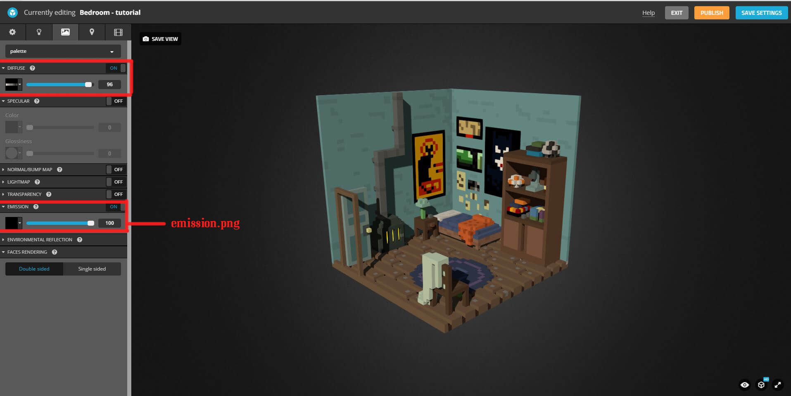

MagicaVoxel permet d’utiliser des materials émissifs, mais seulement dans sa fenêtre de rendu dédiée. Pour ajouter un effet d’emission dans sketchfab, ouvrez votre texture.png dans Photoshop ou Gimp. Ajoutez un nouveau calque et peignez en noir par dessus toute la texture, sauf sur les couleurs que vous voulez émissives.

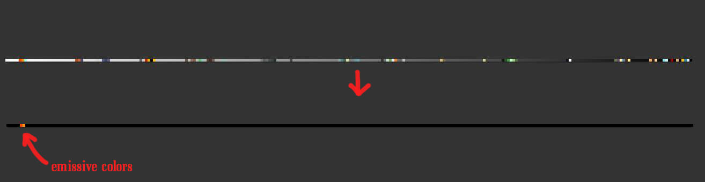

Puis, dans Sketchfab, ouvrez votre texture modifiée dans la case « emission » et augmentez la valeur. Ne vous inquiétez pas, ce sera bien mieux lorsqu’on rajoutera  
un effet de bloom (voir à post-processing).

#### Annotations

Vous pouvez créer des annotations dans votre scène afin d’ajouter un peu de storytelling, ou juste expliquer quelques détails. Double-cliquez n’importe où pour ajouter une annotation.

Conseil : Essayez de créer des annotations qui soient visibles des précédentes. Comme ça les gens n’auront pas à chercher partout dans votre scène pour les trouver. Mais si vous voulez, vous pouvez cacher quelques easter eggs !

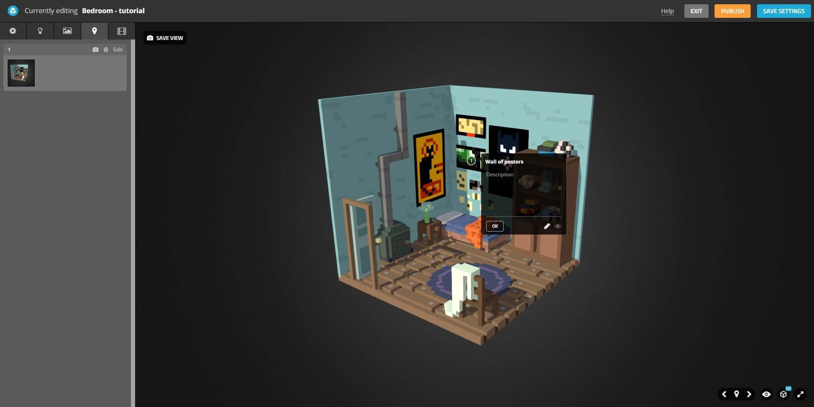

#### Post-processing

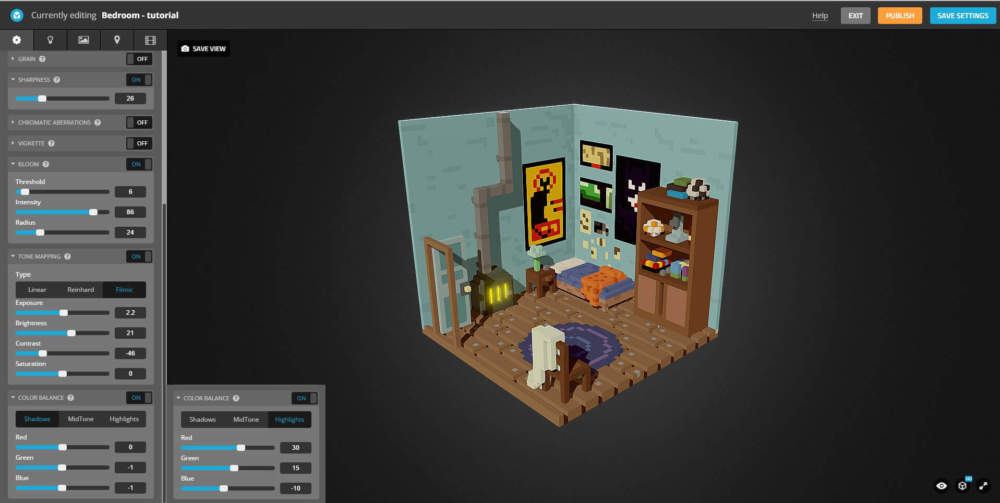

C’est à cet endroit que vous allez vraiment pouvoir mettre en valeur votre scène ! Quelques réglages sont vraiment utiles :

- Sharpness : fonctionne très bien sur des scènes larges, trouvez la bonne valeur pour que votre scène soit naturelle.
- Bloom : A utiliser avec parcimonie, mais essentiel pour vos materials émissifs ! Mettez le seuil assez bas pour que ça ne s’applique qu’aux materials vraiment brillants. Intensité et Radius parlent d’eux-mêmes.
- Tone mapping : jouez avec ce réglage pour donner une ambiance particulière à votre scène. Vous pouvez même la rendre en noir et blanc si vous baissez le seuil de saturation tout en bas !
- Color balance : à utiliser avec modération. Ajustez les couleurs, par exemple, des sources de lumières dans votre scène : rouge pour du feu, bleu pour des néons, vert ou jaune pour des extérieurs, etc.

### Partagez !

Votre scène est enfin prête ! Cliquez sur « Save view » pour sauvegarder la miniature de votre modèle 3D et la position initiale de la caméra. Votre modèle est prêt à être partagé. Vous pouvez désormais l’intégrer sur beaucoup de plateformes, dont Facebook, ArtStation, LinkedIn et plein d’autres !

## Inspirations

Voici quelques exemples pour vous inspirer :

[Voxel Room](https://sketchfab.com/models/f6354fc949bf44308246a8eb96d613c8)

[The Cart Before the Ponies](https://sketchfab.com/models/ddcc0debe1734789a5f0f4946cb3a12b)

[Voxel Bedroom](https://sketchfab.com/models/e7c7c7c5e8f74f54a0a35f54c6d6c1f2)

[Streets of Lisbon](https://sketchfab.com/models/1c19e901b8f747b1929cbd5e337bcfe5)

[Vintage Vinyl Records Store](https://sketchfab.com/models/1157d7305b5a488a94f72ea150b08074)

Quelques chaînes Youtube sur le sujet :

https://www.youtube.com/watch?v=Oh_pkLHVW8o

https://www.youtube.com/watch?v=RVXI6J0EpK0

https://www.youtube.com/watch?v=yKO1Q5QRZic

Et quelques chefs-d’œuvre pour rêver un peu :

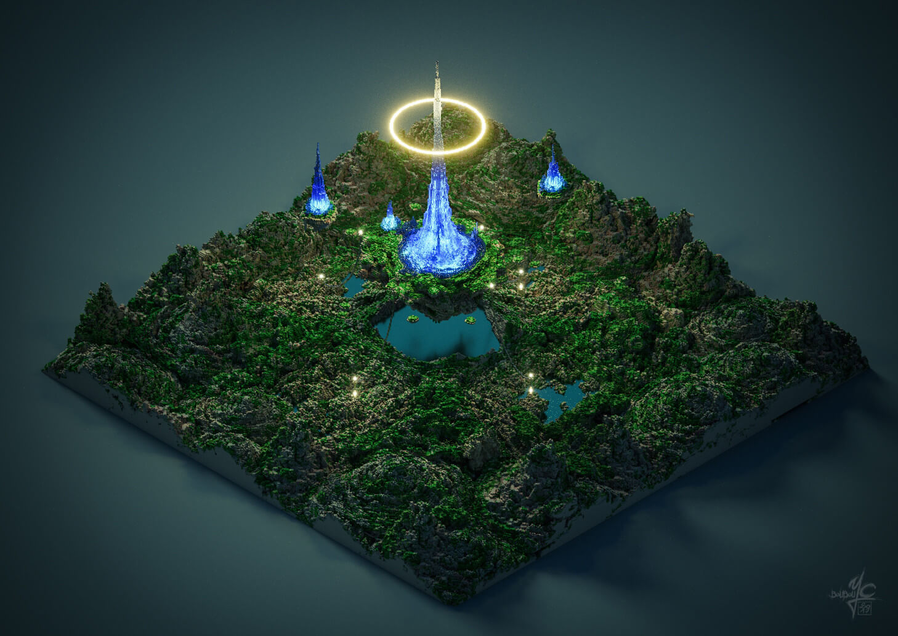

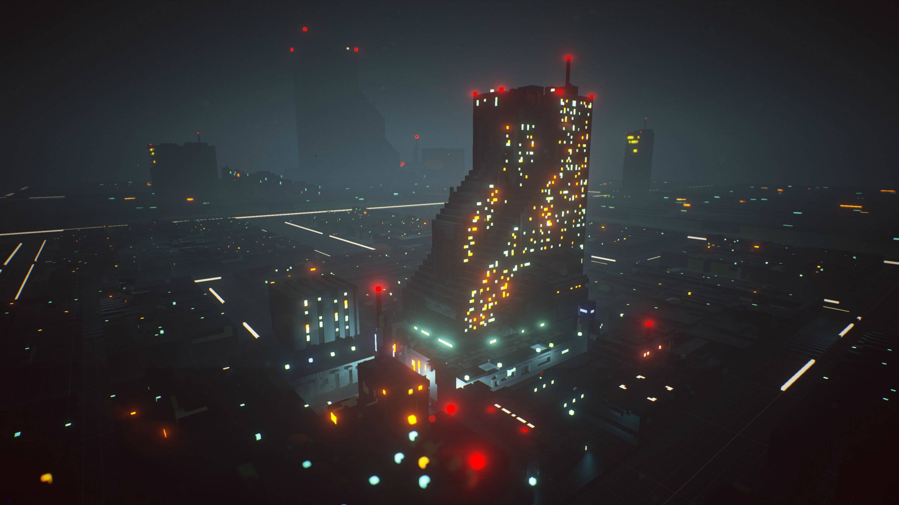

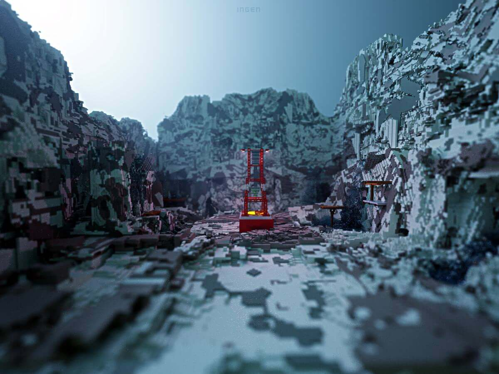

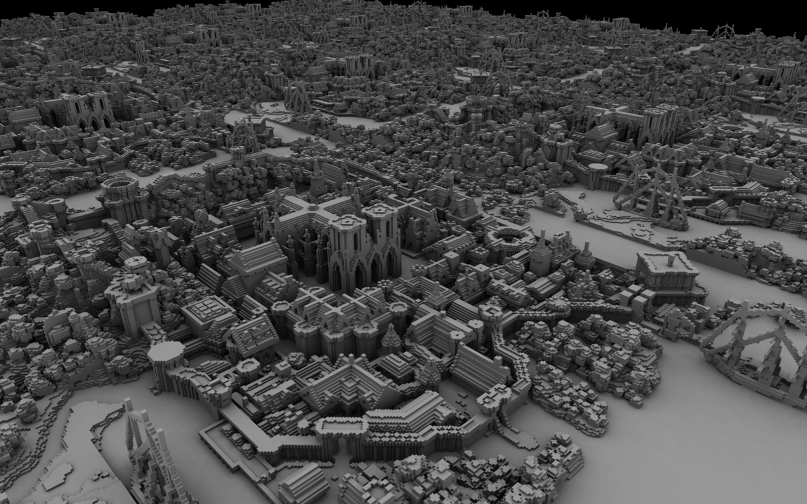

Merci d'avoir lu ce tutoriel, en espérant voir vos belles créations !