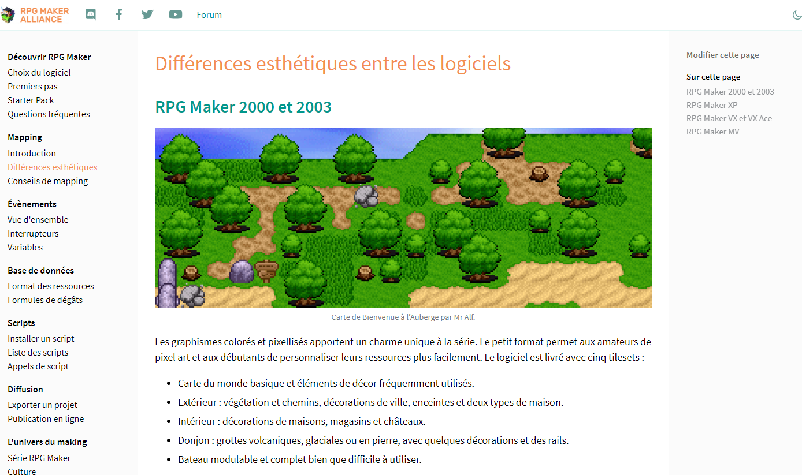

Le nouveau design de notre Encyclopédie sur RPG Maker est arrivé !

Il y a encore beaucoup de contenu à écrire, mais je suis très fier de la forme que prend le site. Le nouveau design, réalisé par Princesseuh, permet d'activer un dark mode et met en avant l'aspect collaboratif du wiki en simplifiant le processus. Sur toutes les pages, il est possible d'ajouter du contenu ou de corriger une faute en cliquant sur "Modifier cette page". Cela mène directement au fichier source de la page sur GitHub pour créer une *pull request* qui sera vérifiée par la modération.


Mise à jour : Le site était anciennement disponible à l'adresse `wiki.rpgmakeralliance.com`. Lorsque la communauté fut renommée en [Game Dev Alliance](https://gamedevalliance.fr/), nous l'avons ouvert à tous les moteurs de jeux grâce à un système de portails. Vous pouvez retrouver le thème sur le compte GitHub de Princesseuh (version [Sphinx](https://github.com/Princesseuh/sphinx-royal-theme) et [Hugo](https://github.com/Princesseuh/hugo-royal-theme)) pour réaliser vos propres sites.

