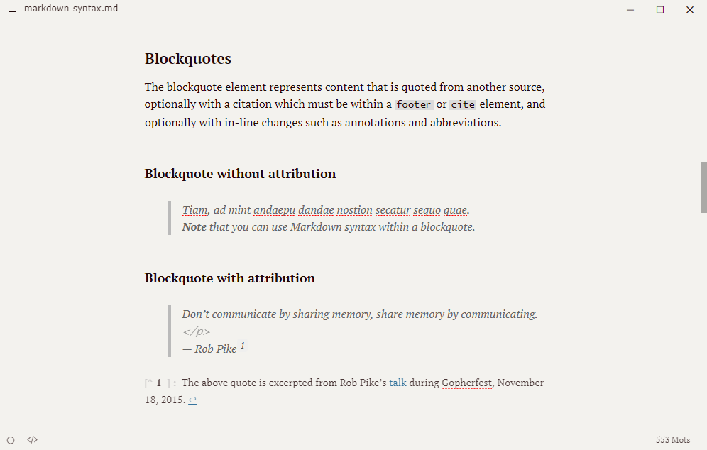
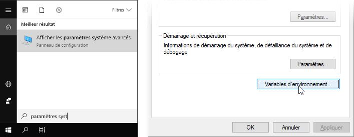
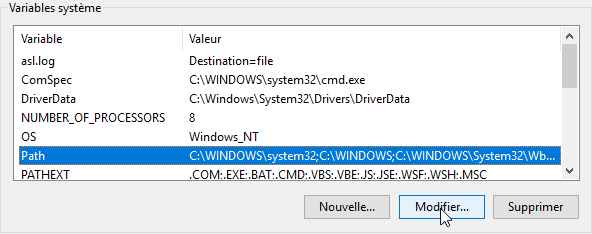
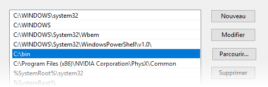
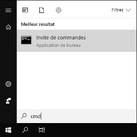
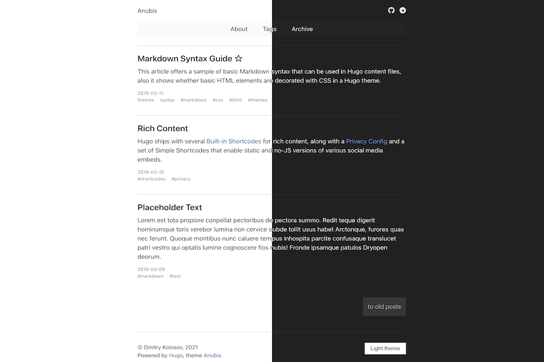
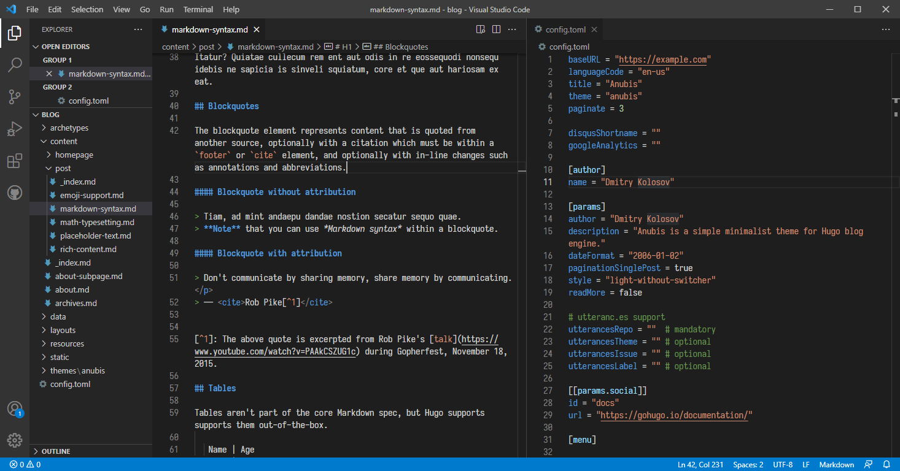

## Pourquoi Hugo ?

Hugo est un générateur de site statique. Concrètement, Hugo prend des fichiers texte et les transforme en pages web en suivant un thème visuel. Ainsi, au quotidien, il vous suffit d'écrire dans des fichiers texte au format [Markdown](https://fr.wikipedia.org/wiki/Markdown) et de laisser Hugo générer le site au complet.


Avec un site statique, les pages HTML sont générées une seule fois lors de la publication du site et tous les visiteurs recevront la même page. Par opposition, un site dynamique, comme Facebook ou la plupart des sites Wordpress, génère une page en direct à chaque fois qu'un utilisateur accède au site.

Un site statique a l'avantage d'être rapide, sécurisé, stable et compatible avec tous les hébergeurs, même ceux à bas prix ou gratuits. C'est une solution qui convient très bien à des blogs et des sites vitrine.

Hugo est une option intéressante pour vous si :

- Vous cherchez une alternative plus légère et élégante aux solutions clé-en-main comme Wordpress ;
- Vous souhaitez écrire dans un éditeur de texte sur votre ordinateur, tel que [Visual Studio Code](https://code.visualstudio.com/) ou [Typora](https://typora.io/) (il est aussi possible de connecter un CMS à son site Hugo, pour écrire des articles sur son navigateur, mais ce n'est pas l'objet de ce tutoriel) ;
- Vous souhaitez avoir le contrôle sur le code de votre site sans pour autant mettre en place de système complexe.



Personnellement, j'apprécie Hugo pour sa rapidité et sa relative simplicité qui stimule ma créativité. Une compréhension basique du web et de la programmation suffit pour personnaliser son site, grâce à l'organisation claire en templates et en shortcodes. J'utilise Hugo pour publier ce blog et c'est aussi la solution que nous avons choisie pour le [wiki](https://wiki.gamedevalliance.fr/) de l'association Game Dev Alliance.

Pour mieux vous montrer les types de site que l'on peut réaliser avec Hugo, voici une sélection de thèmes gratuits que je trouve très convaincants :


, un thème pour les agences du web") , un portfolio au design chaleureux")


, pour les blogs audacieux et légers") , que j'utilise sur ce site !")


## Installer Hugo

Hugo vous permettra de prévisualiser votre site en direct sur votre ordinateur. Il s'utilise en écrivant des commandes dans le Terminal, aussi appelé Invite de commandes sur Windows. L'installation est plutôt simple, mais si vous n'êtes pas encore à l'aise avec ce type d'outil, nous allons voir ça ensemble.




### Télécharger Hugo

1. Créez un dossier facilement accessible dans lequel vous pourrez placer tous vos programmes à utiliser dans le terminal, par exemple à l'emplacement `C:\bin`.

2. Téléchargez la [dernière version de Hugo Extended](https://github.com/gohugoio/hugo/releases), qui devrait s'appeler `hugo_extended_x.xx_Windows-64bit.zip`. Le fichier qui nous intéresse dans le zip est `hugo.exe`, à déplacer dans le dossier `bin` créé précédemment.

    Faites attention à bien télécharger la version Extended, contenant des fonctionnalités supplémentaires qui seront peut-être nécessaires selon le thème que vous utilisez.

### Ajouter Hugo au Path

Ajoutez le dossier `bin` au Path, ce qui vous permettra d'utiliser Hugo dans le terminal :

1. Ouvrez les Paramètres système avancés, puis cliquez sur Variables d’environnement.

    

2. Dans l’espace Variables système, sélectionnez la ligne Path et cliquez sur Modifier.

    

3. Dans une nouvelle ligne, renseignez le dossier dans lequel vous avez placé `hugo.exe`.

    

4. Hugo est maintenant disponible dans le terminal ! Recherchez `cmd` pour y accéder rapidement.

    

5. Ecrivez la commande `hugo version` et si vous obtenez un numéro de version, l'installation s'est bien déroulée.




### Installer Homebrew

Nous allons installer le gestionnaire de paquets [Homebrew](https://brew.sh/index_fr) : c'est un programme qui vous permettra d'installer facilement Hugo et la plupart des outils de développement informatique, et qui vous sera donc probablement utile à l'avenir. Ouvrez le Terminal, copiez la commande suivante et appuyez sur Entrée :

```sh
/bin/bash -c "$(curl -fsSL https://raw.githubusercontent.com/Homebrew/install/HEAD/install.sh)"
```

Cela téléchargera automatiquement les "*Command Line Tools for XCode*", des composants officiels d'Apple permettant d'utiliser des outils dans le terminal. Cela peut prendre un moment si votre connection est lente, donc si vous préférez, vous pouvez aussi télécharger les *Command Line Tools* par vous-même sur [developer.apple.com](https://developer.apple.com/download/all/?q=command%20line%20tools) avant d'installer Homebrew.

### Installer Hugo

Quand l'installation d'Homebrew est terminée, écrivez la commande `brew install hugo`.

Vous pouvez vérifier que l'installation s'est bien déroulée en écrivant `hugo version`. A l'avenir, mettez à jour Hugo avec `brew update` puis `brew upgrade`.

---

[Autres méthodes d'installation](https://gohugo.io/getting-started/installing/#macos).




Si vous utilisez Debian/Ubuntu, utilisez `snap` car la version de Hugo sur `apt-get` est vieille de plusieurs années. Dans le cas d'Arch Linux et d'autres distributions, vous pouvez directement installer Hugo.

[Méthodes d'installation](https://gohugo.io/getting-started/installing/#linux).

Je vous conseille d'installer la version Extended --- vous pouvez vérifier votre version avec `hugo version`.




## Créer un site

Dans le terminal, utilisez la commande `cd` pour naviguer jusqu'au dossier où vous souhaiterez créer votre site. Par exemple :

```js
cd Documents
```

Si vous n'êtes pas sûr·e de votre chemin, tapez la commande `dir` (ou `ls` sur Mac/Linux) pour afficher la liste des dossiers, puis `cd NomDuDossier`, et ainsi de suite. Pour remonter d'un dossier, écrivez `cd ..`.

Une fois à l'endroit souhaité, écrivez :

```
hugo new site mon-premier-blog
```

Hugo créera un dossier appelé `mon-premier-blog` avec un contenu très simple. Vous pouvez l'ouvrir et l'examiner. Pour commencer, nous allons y ajouter un thème.

### Télécharger un thème

Vous trouverez une liste de thèmes gratuits sur [themes.gohugo.io](https://themes.gohugo.io/), classés par tags. Ainsi, si vous choisissez le tag Blog, vous obtiendrez tous les thèmes étant prévus pour accueillir un espace de blog. La plupart des thèmes de blog permettent aussi de créer des pages fixes accessibles à l'aide d'un menu de navigation. Si besoin, vous trouverez sans doute d'autres sites proposant des thèmes gratuits ou payants.

Je vous propose d'essayer le [thème Anubis](https://themes.gohugo.io/hugo-theme-anubis/) pour commencer : il est simple et nous permettra d'essayer la plupart des fonctionnalités de base. Téléchargez le thème depuis le site ou bien ce [lien direct](https://github.com/Mitrichius/hugo-theme-anubis/archive/master.zip). Renommez le dossier `hugo-theme-anubis-master` en `anubis` et placez-le dans le dossier `themes` de votre site.



> Si vous êtes un utilisateur de git, il peut être plus intéressant d'ajouter les thèmes en tant que submodule.

### Copier le site d'exemple

La plupart des thèmes ont besoin de leurs propres images et leurs propres paramètres pour fonctionner correctement. Dans le dossier du thème, vous trouverez un dossier `exampleSite` qui contient toute la base nécessaire. Dans le cas du thème Anubis, on y trouve un dossier `content`, `static`, et un fichier `config.toml`. Copiez le contenu de `exampleSite` et collez-le dans le dossier de votre propre site pour remplacer le contenu existant.

## Prévisualiser le site

Nous pouvons maintenant afficher le site ! Retournez dans le terminal et faites `cd mon-premier-blog` pour entrer dans le dossier de votre site, puis démarrez le serveur :

```
hugo server
```

Tapez l'adresse indiquée dans votre navigateur, et voilà ! Le site est tout simple, mais le principe sera le même lorsque vous utiliserez des thèmes plus complexes. Tant que la fenêtre du terminal est ouverte, le site sera mis à jour en direct dans votre navigateur alors que vous écrirez vos pages. C'est très pratique !

> Pour redémarrer rapidement le serveur, faites Ctrl+C pour l'arrêter, flèche du haut pour réécrire la commande, puis Entrée pour valider.

## Créer du contenu

Les articles et autres pages du site se trouvent dans le dossier `content`. Remarquez que le blog a été rempli avec quelques articles d'exemple qui montrent les possibilités de Hugo. Gardez-les de côté le temps de vous familiariser avec la syntaxe !

Vous pouvez ouvrir les fichiers avec le Bloc-notes de Windows, mais le meilleur moyen d'écrire du contenu est d'ouvrir le dossier du site dans un éditeur de code tel que  [Visual Studio Code](https://code.visualstudio.com/), qui est gratuit. Vous aurez une meilleure vue d'ensemble ainsi qu'une coloration syntaxique !



Ensuite, commencer à écrire est aussi simple que d'examiner comment sont faits les articles pré-existants dans votre thème pour suivre le même principe. Voici une [référence rapide](https://github.com/adam-p/markdown-here/wiki/Markdown-Cheatsheet) de la plupart des choses que vous pouvez faire en Markdown. Vous verrez, c'est très intuitif et cela deviendra vite une seconde nature ! Pour ajouter des vidéos YouTube et d'autres choses impossibles avec la syntaxe Markdown, Hugo possède un système de [shortcodes](https://gohugo.io/content-management/shortcodes/).

### Structure des dossiers

Pour aller plus loin dans la personnalisation de votre site, il sera bon d'avoir une idée générale de l'utilité de chaque dossier, pour trouver ce que vous cherchez plus facilement :

- `content` : le contenu du site.

- `archetypes` : modèles permettant de créer de nouvelles pages avec un format standard et la date pré-remplie en utilisant la commande `hugo new`.

- `layouts` : contient des templates HTML, autrement dit des morceaux de page web modulables qui composeront le site. Lorsque les thèmes sont correctement découpés en templates, cela vous permet de modifier facilement un morceau du site sans risquer de toucher au reste.

- `static` : les images, fichiers CSS, JavaScript, etc. qui seront copiés tels quels lors de la construction du site.

- `config.toml` : ce fichier contient les paramètres de base de votre site tels que son nom, ainsi que des paramètres propres à votre thème.

### Paramètres des pages

En haut des fichiers Markdown, dans ce qu'on appelle le *front matter*, vous pouvez préciser le titre de l'article ainsi que sa date, mais aussi ajouter d'autres paramètres, notamment `draft: true` qui signifie que l'article est un brouillon. Par défaut, un brouillon est masqué lors de la publication du site, mais vous pouvez l'afficher lors de votre prévisualisation avec l'option `hugo server -D`. Utile pour travailler sur des articles sans pour autant les rendre publics par erreur !

### Modifier le thème

La plupart des thèmes ont des options de personnalisation documentées dans un Readme accessible sur GitHub ou dans le dossier du thème. Par exemple, dans le cas du thème Anubis, vous pouvez [personnaliser les icônes](https://github.com/Mitrichius/hugo-theme-anubis#custom-icons) qui s'affichent en haut à droite.

Ces options de personnalisation demandent simplement de modifier des paramètres dans `config.toml` et d'ajouter des images à votre site. Mais que faire si vous souhaitez modifier le code du thème lui-même, par exemple pour en changer le design ? Vous pourriez directement aller dans le dossier du thème et modifier le bon fichier, mais c'est une mauvaise pratique. Il est conseillé de ne jamais modifier directement le contenu de `themes`, car si le thème est mis à jour par la suite, vous aurez beaucoup de mal à copier la mise à jour tout en conservant vos propres changements.

La meilleure manière de modifier un fichier du thème est de créer un fichier du même nom à la racine du site. Par exemple, si je veux modifier le header, situé dans :

```
mon-premier-blog/themes/anubis/layouts/partials/header.html
```

Je copie le fichier `header.html` à cet emplacement :

```
mon-premier-blog/layouts/partials/header.html
```

Hugo utilise en priorité les fichiers situés à la racine du site. Je peux maintenant modifier le nouveau `header.html` sans modifier le contenu du dossier `themes`.

## Publier le site

Comme Hugo génère un site statique, le dossier final contient de simples pages web que vous pouvez déposer sur n'importe quel hébergeur, même ceux gratuits ou à bas prix. Je vous propose deux possibilités : vous pouvez soit générer le site par vous-même et envoyer le dossier final sur un hébergeur, soit automatiser le processus à l'aide de GitHub.

### Publier manuellement

Pour publier votre site manuellement, vous devez louer un hébergeur pour quelques euros ou en trouver un gratuit. Généralement, on vous fournira alors des identifiants pour vous connecter au serveur à l'aide d'un client FTP tel que [FileZilla](https://filezilla-project.org/).

Jusqu'à maintenant, vous avez utilisé la commande `hugo server` dans le terminal pour visualiser le site localement. Pour réellement construire le site, la commande est encore plus simple :

```
hugo
```

Le résultat sera situé dans le dossier `public`. Connectez-vous à votre hébergement web à l'aide de votre client FTP, copiez-collez le contenu du dossier `public`, et le tour est joué !

> La commande `hugo` ne vide pas le dossier `public` avant de reconstruire le site. Veillez donc à supprimer le dossier `public` vous-même avant de lancer `hugo`, ou vous risqueriez d'y laisser d'anciens fichiers privés ou des brouillons.

### Publier automatiquement avec GitHub Pages

Il existe des méthodes pour automatiser le déploiement du site sans que vous n'ayez besoin de le reconstruire manuellement à chaque fois. Dans le cas de mon blog, j'héberge le code source sur GitHub et j'utilise GitHub Actions pour reconstruire le site automatiquement à chaque changement, puis le résultat est envoyé sur GitHub Pages. Ainsi, je n'ai jamais à débourser un centime pour gérer mon blog !

GitHub permet de stocker des projets sous la forme de *repositories*, communément appelés *repo*, ou dépôts en français. Ce service utilise [git](https://git-scm.com/), un outil en lignes de commandes permettant de télécharger et envoyer les repo, mais aussi de conserver l'historique entier de votre projet et de travailler à plusieurs. Cependant, git est assez difficile à utiliser pour un débutant ; c'est pourquoi nous allons plutôt utiliser [Github Desktop](https://desktop.github.com/), qui est une interface graphique permettant d'utiliser git facilement. Vous trouverez un téléchargement officiel pour Windows et Mac, ou bien des versions non officielles pour Linux.

#### Transformer votre projet en repo

GitHub Desktop permet de créer un repo de zéro, ou bien de transformer un dossier existant en repo git --- c'est ce que l'on veut faire avec notre site.




Cliquez sur **File** > **Add local repository**. Nous devons le créer à l'emplacement du site. Par exemple, si le site est situé dans :

```
D:\Documents\mon-premier-blog
```

Créez le repository ainsi :

- **Name :** `mon-premier-blog`
- **Local path :** `D:\Documents`
- Décochez **Initialize this repository with a README** (IMPORTANT ! Sinon, le contenu du dossier sera effacé)
- **Git ignore :** none
- **License :** none




Ouvrez un terminal dans le dossier du site puis :

```
git init
```

Pour créer un dossier `.git`. Vous pouvez maintenant ouvrir le repo dans Github Desktop avec **File** > **Add local repository** si vous le souhaitez.




A la racine du site, créez un fichier `.gitignore` et ouvrez-le avec Visual Studio Code ou le Bloc-notes pour y écrire ceci :

```txt
resources
public
```

Ce sont simplement les noms de deux dossiers que nous ne voudrons pas envoyer sur GitHub, car ils contiennent souvent des fichiers temporaires inutiles.

#### Publier le repo

Il existe deux façons de créer un site avec GitHub Pages :

- La première méthode, que je vous recommande pour une première fois, publie votre site à l'adresse `https://<utilisateur>.github.io`. Pour utiliser cette adresse, votre repo devra s'appeler `<utilisateur>.github.io`. Choisissez donc votre pseudo sur GitHub en fonction de l'adresse voulue ! Par exemple, ce blog est publié à l'adresse `https://aureliendossantos.github.io` puis il est redirigé vers une adresse personnelle.

- La deuxième méthode permet de créer une infinité de sous-sites pour des projets spécifiques, à l'adresse `https://<utilisateur>.github.io/<projet>`. Pour utiliser ce type d'adresse, votre repo devra s'appeler `<projet>`.

Vous pouvez combiner ces deux méthodes, en ayant un site principal et plusieurs sous-sites de projets.

Pour publier le site, nous enverrons le code source (le dossier dans lequel vous travaillez) sur GitHub, et c'est leurs serveurs qui se chargeront de construire le site. Ainsi, deux choix s'offrent à vous :

- **Publier le code source publiquement :** tout le monde pourra voir le code de votre site afin de, peut-être, y trouver de l'inspiration. Je vous y encourage si c'est possible !

- **Garder le code source privé :** le repo du code source sera privé et le site final sera publié dans un repo séparé public. C'est utile si vous écrivez un blog et que vous ne voulez pas que des visiteurs puissent voir vos brouillons, par exemple.

Selon votre choix, la marche à suivre sera légèrement différente.




1. Dans GitHub Desktop, assurez-vous d'avoir *commit* vos changements puis cliquez sur **Publish repository**. Appelez le repo `<utilisateur>.github.io` ou `<projet>` et décochez **Keep this code private**.
2. Créez une branche `gh-pages` et publiez-la.
3. Retournez dans la branche principale.
4. Créez le fichier `.github/workflows/gh-pages.yml`. Si vous n'êtes pas à l'aise pour créer des dossiers et des fichiers, vous pouvez aussi le créer en allant sur la page web de votre repo (**Repository** > **View on GitHub**) puis dans l'onglet **Actions**. Insérez le contenu suivant :

```yml
name: GitHub Pages
on:
  push:
    branches:
      - main
jobs:
  deploy:
    runs-on: ubuntu-latest
    steps:
      - uses: actions/checkout@v2
        with:
          submodules: recursive
      - uses: benmatselby/hugo-deploy-gh-pages@master
        env:
          HUGO_VERSION: 0.84.4
          HUGO_EXTENDED: true
          TARGET_REPO: utilisateur/repo
          TARGET_BRANCH: gh-pages
          TOKEN: ${{ secrets.HUGO_BUILD_TOKEN }}
```

Mettez l'adresse de votre repo dans `TARGET_REPO`, au format `<utilisateur>/<nom-du-repo>`. Par exemple, dans le cas de ce blog, ce serait `aureliendossantos/aureliendossantos.github.io`. Vous pouvez également changer la valeur de `HUGO_VERSION` comme bon vous semble --- elle sera peut-être trop vieille au moment où vous lirez cet article.




1. Dans GitHub Desktop, assurez-vous d'avoir *commit* vos changements puis cliquez sur **Publish repository**. Son nom importe peu mais il doit être différent du repo public.
2. Depuis le site de GitHub, créez un autre repository appelé `<utilisateur>.github.io` ou `<projet>`. Il peut être laissé vide pour le moment.
3. Dans le repo privé, créez le fichier `.github/workflows/gh-pages.yml`. Si vous n'êtes pas à l'aise pour créer des dossiers et des fichiers, vous pouvez aussi le créer en allant sur la page web de votre repo (**Repository** > **View on GitHub**) puis dans l'onglet **Actions**. Insérez le contenu suivant :

```yml
name: GitHub Pages
on:
  push:
    branches:
      - main
jobs:
  deploy:
    runs-on: ubuntu-latest
    steps:
      - uses: actions/checkout@v2
        with:
          submodules: recursive
      - uses: benmatselby/hugo-deploy-gh-pages@master
        env:
          HUGO_VERSION: 0.84.4
          HUGO_EXTENDED: true
          TARGET_REPO: utilisateur/repo
          TOKEN: ${{ secrets.HUGO_BUILD_TOKEN }}
```

Mettez l'adresse de votre repo dans `TARGET_REPO`, au format `<utilisateur>/<nom-du-repo>`. Par exemple, dans le cas de ce blog, ce serait `aureliendossantos/aureliendossantos.github.io`. Vous pouvez également changer la valeur de `HUGO_VERSION` comme bon vous semble --- elle sera peut-être trop vieille au moment où vous lirez cet article.




Ce fichier crée un *workflow* lu par GitHub Actions. Voici ce qu'il s'y passe en français :

- Il se déclenche dès qu'il y a un *push* (l'envoi d'un commit) sur la branche **main** ;
- Un serveur démarre avec Ubuntu (Linux) ;
- Le script `actions/checkout` télécharge notre repo sur le serveur, ainsi que les éventuels submodules qu'il contient ;
- Le script `enmatselby/hugo-deploy-gh-pages` télécharge Hugo sur le serveur, construit le site puis l'envoie vers la destination précisée.

#### Générer un token d'accès

Jetez un œil à la dernière ligne du fichier : pour obtenir le droit d'écrire dans vos repos, ce workflow a besoin d'un token d'accès. Par sécurité, nous n'allons pas l'écrire directement dans le champ `TOKEN:`, car n'importe quel visiteur pourrait alors récupérer le token et écrire dans nos repos ! Nous allons écrire le token dans un « secret », un espace spécial dans lequel une fois que vous aurez écrit le token, il vous sera impossible de le voir de nouveau, mais il sera bel et bien stocké par GitHub.

1. Sur le site de GitHub, allez dans vos paramètres d'utilisateur, puis **Developer settings** > **Personal access tokens**.
2. Générez un nouveau token et cochez le scope "repo".
3. Copiez le token obtenu (il sera impossible de le voir de nouveau).
4. Retournez sur la page du repo, puis allez dans **Settings** > **Secrets** > **New repository secret**.
5. Appelez le secret `HUGO_BUILD_TOKEN` et dans l'espace "Value", collez le token que vous aviez copié.

C'est tout ! Quand GitHub lira `${{ secrets.HUGO_BUILD_TOKEN }}` dans le workflow, il utilisera le token, mais personne d'autre ne peut le lire.

Désormais, à chaque *push* de votre code source, un serveur va démarrer pour publier votre site. Vous pouvez regarder sa progression et vérifier les éventuelles erreurs depuis la page web du repo.

### Rediriger vers un nom de domaine

Cette étape est optionnelle : vous pouvez tout à fait garder votre adresse en .github.io. Cela dit, si vous achetez un nom de domaine auprès du fournisseur de votre choix, vous pouvez y rediriger votre site gratuitement. Pour débuter, je vous recommande de lire la [documentation de GitHub Pages](https://docs.github.com/en/pages/configuring-a-custom-domain-for-your-github-pages-site) à ce sujet, qui est claire et concise.

---

Vous savez désormais tout ce qu'il faut savoir pour bien commencer, en tout cas je l'espère ! Si vous avez eu un problème en suivant ce tutoriel, n'hésitez pas à me contacter pour que je puisse le compléter.
