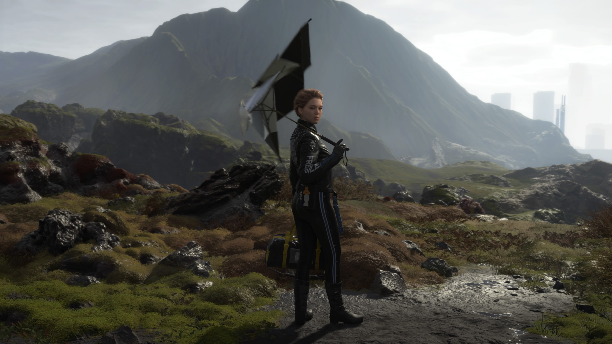
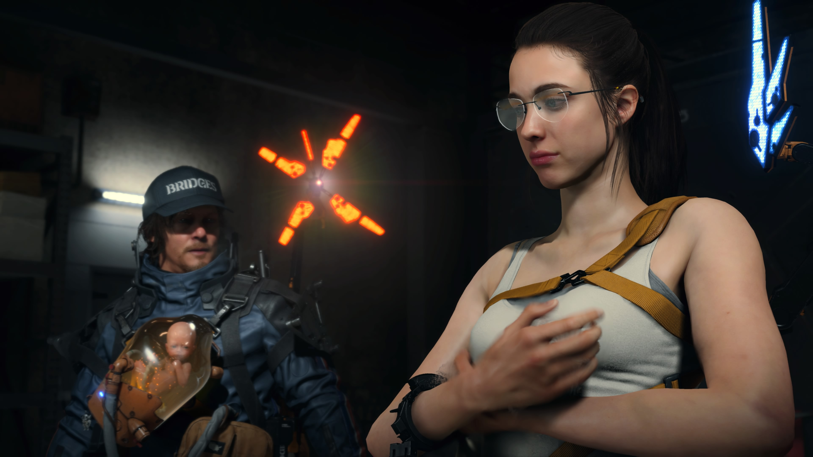
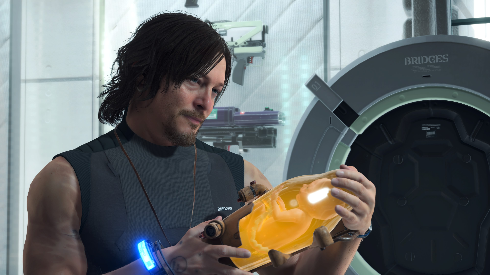
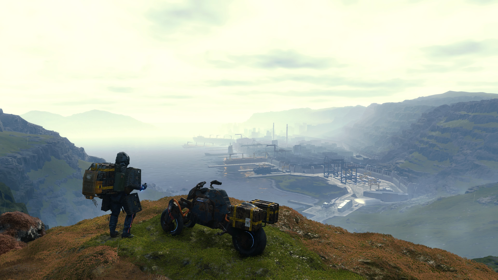
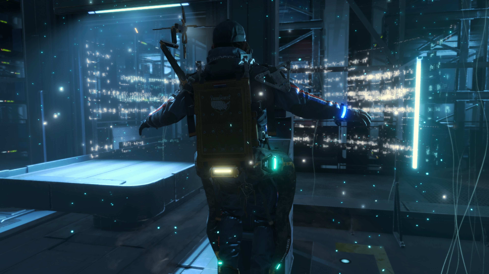
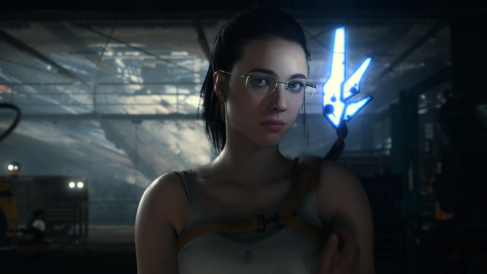

People saying Death Stranding... How is it bad writing?

Like, is it ridiculous, melodramatic and beats you over the face with its themes with no sense of subtlety? yes

Does it also work exactly as intended to deliver an experience that hits emotionally like few games? Oh yeah

---

A few replies saying Death Stranding, but that’s a game where every momentous ridiculous word melds into the mechanics of the game you are playing. It is superb. It’s melodramatic and silly but it’s not bad writing

Naming people like John Bunyan would isn't bad writing imo

---

Yes it’s ridiculous and melodramatic AF, but I cannot imagine calling Death Stranding bad writing when
a) it resonated with me on a human level like few other pieces of art and 
b) it’s almost prophetic in that MGS 2 kinda way where it feels like a message from the other side.

Kojima in 2019: Imagine a future America where everyone is huddled in bunkers in fear, depending on deliveries to survive.                      2020:

---

It has a character named Die Hardman. His name is a reference to the movie, Die Hard.

I’m so glad you agree

---

Death Stranding isn’t badly written, you just don’t know how to process earnest media anymore.

---

Has it got flaws in terms of gameplay and story? Of course but nothing major and I do love it and it feels genuine and authentic.

---

Seemingy unrelated concepts get thrown around with reckless abandon, DOOMS, BTs, Repatriates, BBs...

---

Yes, the game is heavy handed with it's imagery and symbolism, but frankly considering the vast gulf of media literacy among the population, maybe that's a good thing if your goal is primarily to have your message understood?

Yeah Kojima seems to simultaneously want to bluntly hammer home his message *and* obscure it with dense lore and imagery. Good for him tbh

He has the free association fervor of a manic conspiracy theorist but he applies it to his own stories. Everything means everything it can mean simultaneously, and while it always ends up incredibly convoluted the fact it ends up mostly coherent is incredibly underrated.[^Dont]

[^Dont]: Don't worry about that...

<!-- Death Stranding should be a ten car pileup of mixed metaphors, contradictory themes and dream logic with no grounding, but against all odds it mostly isn't. It is thematically consistent, clear, and its world is a cohesive thing with predictable rules that cement the themes. -->

Death Stranding devrait être un carambolage de métaphores et de thèmes contradictoires, un rêve illogique sans fondations, mais contre toute attente, ce n'est pas le cas --- la plupart du temps. Le jeu est thématiquement cohérent, clair, et présente un monde aux règles crédibles qui cimentent les thèmes.

> It’s a funny word ‘strand’. A strand is part of rope or bond while ‘stranding’ means being washed up on the shore, and ‘being stranded’ is when you can’t go home. I’m stranded now, Sam.

Chaque mot-clé prend tous les sens qu'il peut avoir en même temps et se fond dans les mécaniques du jeu pour prendre vie. C'est mélodramatique et un peu ridicule, mais c'est aussi tout simplement superbe.

<!--Every momentous ridiculous word melds into the mechanics of the game. It is superb. It’s melodramatic and silly but it’s not bad writing.-->

> I'm Fragile. But I'm not that fragile.

I mean... and I say this as someone with a lot of love for this game and its absolutely bonkers story... it is a *little* badly written. I think my biggest issue is that Kojima tends to rely on a *lot* of heavy exposition dumps, particularly towards the end. And some of the big concepts are not explained super well, even despite the infodumps. Like I said, it’s not a dealbreaker, but I think it could have been told a bit better haha.

I definitely understand his brand of exposition not being for everyone but I don’t equate awkward with bad when the rest of the script is so richly dense and raw. I dunno, for me these are speed bumps not war crimes the way others talk about it.

---

<!--Earnestness is underrated in modern storytelling, especially in AAA games.-->

La sincérité est sous-estimée dans le *storytelling* moderne, surtout dans les jeux AAA.

---

I think you need to get into a particular groove with it in that you need to freely flow from taking it seriously to knowing when it’s in on the joke. Which isn’t for everyone! But it’s not inherently bad either

Yeah but I mean I feel what's serious and what's meant as a joke is a bit subjective, and to take that mentality is just kind of dismissing any poor writing as a 'joke'.

For sure all art critique is subjective but Kojima knew exactly which parts were which when he wrote it. When I say in on the joke I don’t mean the game is attempting to be funny, just self aware. There’s a literal boss fight with fighting game health bars haha. And like, I don’t think it has poor writing period so I’m not attempting a “so bad it’s good” defence, I think it’s written exactly as it should be.

---

The sequence starting with the higgs fight is all a false "this is the videogame ending you expected" section. It directly references what it is with references to a boss fight, princess beach, etc. Following that you find out your damsel was never in danger, was the antagonist

^ gets it. should also note Higgs is the only main character portrayed by a video-game voice actor and not a screen/stage actor - not a coincidence. Higgs is just a weird meta-commentary on gaming. he has powers (can teleport etc) but u have to walk. "aren't u tired of the grind?" taunts you, the player, for having to play this boring walking sim. meanwhile he's a "badass" with all these powers. but in the end its all revealed as fake and the heart of the game is revealed.

---

Death Stranding est un des jeux les plus poignants et sincères auquel j'ai joués. Les dialogues sont souvent bidons, mais:

C'est un jeu qui est aussi sincère émotionnellement qu'il puisse l'être, et nous transperce sur les thèmes de la solitude et les difficultés à tisser des connexions humaines, et ce sur le plan interactif.

C'est une grande leçon qui nous apprend qu'on donne du sens à un open world non pas en y jetant une liste d'objectifs mais en rendant l'exploration elle-même intéressante.

---

C'est une expérience tellement unique qu'il me paraît miraculeux qu'elle nous soit arrivée en un seul morceau et dans un état aussi pur.

Une leçon de synergie entre les mécaniques et la narration, malgré les dialogues douteux.

---

Il faut dire que le jeu vidéo en est à un stade où son potentiel reste encore à révéler et arriver à réellement communiquer quelque chose, quoi que ce soit, est toujours un triomphe, une expérience jubilatoire. Même si cette chose pourrait paraître évidente ou naïve.

Nous en sommes encore à un stade où nous explorons comment communiquer par le jeu, et Kojima comprend comment partir des modèles standards et accessibles pour exprimer des idées puissantes.

---

I think Death Stranding does a better job of easing you into its world and establishing stakes than Control has done. It's a very Cool concept and I'm a sucker for meta experiences, but the writing is annoyingly coy. -> je peux donc dire que le writing de death stranding est l'inverse de coy

Death Stranding réussit mieux que presque n'importe quel jeu à nous introduire dans son monde et établir les enjeux avec une certaine franchise. La séquence d'introduction est terriblement dense et pourtant parfaitement contrôlée, nous laissant avec les bonnes connaissances et les bonnes interrogations en suspens. Peu après avoir repris la manette, on se retrouve avec quelqu'un sur le dos.

---

Les missions où l'on doit porter des humains sont vraiment réussies. La mise en scène, le paysage, la musique, les sensations de jeu... tout nous fait comprendre l'importance de la tâche, appelle à notre sens des responsabilités pour nous lancer solennellement dans la mission et braver les environnements à deux.

---

Look I'm gonna say it: pilgrims progress by John Bunyan had a character named giant despair and another who was the pope, named, "pope" so I don't want to hear you whine that "die hardman" is a bad name when bunyan's literally never been out of print since the 1600s

No one complains that characters in media have the most grounding names to the point that people basically refer to their characters by their actor names. Meanwhile each stranding character's name has at least one meaning and each one is unforgettable both in name and personality

---

It is absolutely one of the most earnest and thorough expressions of a deeply human experience in the interactive medium. It's sombre but hopeful. But more importantly captures this emotional brevity through both narrative context and the act of interactivity. It's a milestone.

**I often catch myself just reminiscing over my time with it.** (*introduction, voilà pk je fais un article mtn, parce que l'édition sort et c'est ouf que je pense encore tout le temps au jeu*) It's incredibly elegant with how interactivity captures this sense of genuine worry and concern for us as people and society, but has this unshakeable will planting seeds of hope and value in community and people.

I think in a sea of games that revel in misery and suffering, even if that's the artistic intent, Death Stranding is the one that almost perfectly encapsulates both the internal and external dichotomy and struggle of the human experience being part of a community.

It's so conscious of the uphill battle of just living and being, the seemingly impossible odds against us, the arguable pointlessness of it all, but continuously highlights the value of hope and the human will to survive and grow. And how ultimately this conquers all.

---

I legitimately think the pushback is because of people who A) don't understand the concept of auteur theory and confuse auteur with artiste trying to take him down a peg, and B) because the game is not something we've seen before, so it's hard for people to process

I think there's a bit of embarrassment--really? ghost babies???--that doesn't come with, I don't know, say, zombies? Because zombies are popular and culturally accepted. We've seen The Walking Dead on AMC, we all get zombies.

I agree wholeheartedly. People see kitsch and interpret that as embarrassing or unearnest, and thus not having value. "Jar baby you carry around? Lol, that's stupid". Yet many of the game's best moments surround this and how it's handled. How people respond. And I think when you learn more about Kojima the earnestness really lands. His experience with loneliness and struggles to connect with people, or feel he's doing the right thing in forming relationships, is as real and empathetic as it gets. And Death Stranding is all this.

My big concern about the Big Game (tlou2) coming out today is an impression that people describe it as challenging because it shows content that is unpleasant, not because it gives us a way to grow. Challenging content is a way to cultivate spiritual and intellectual mass

Agreed. I'm only through the prologue. I like it. But it's also right on the nose with its emotional beats. They work, but not in the way Death Stranding does. Not yet, anyway. Like in Death Stranding you could be on the hike of a goddamn lifetime late in the game, your gear degraded, you're out of rope and ladders, and you cross a mountain and some stranger's shit is there to make the entire final stretch easy and it hits like a ton of bricks.

I broke down in tears when the song played and I looked up and there were signs from other players telling me I could make it

I think Death Stranding is challenging because it faces us with difficulty, with strain and stress, and it says "so. are you gonna be a better person now?" and we're like "yeah... yeah, you're right." If I'm just watching ugly shit, why do I care?

---

C'est un débat que j'ai parfois avec mes amis. Kojima est-il un génie ou péniblement sur-côté ? Écrit-il avec un talent unique ou plutôt comme un enfant ? Est-ce un professionnel du fanservice ou bien est-il notoirement incapable de respecter son public ? À chaque fois, tout le monde a un avis différent, certains sont tranchés, d'autres pensent qu'il est un peu toutes ces choses à la fois.

Quand on dit que le jeu attend de toi que tu comprennes quand il est sérieux ou non. Je dis pas ça pour excuser toutes les erreurs de Kojima. Il a eu des problèmes avec ça a plusieurs reprises. Johnny c'était une petite blague optionnelle dans le 1, puis une blague difficile à éviter et plus déplacée dans le 2 jusqu'à être tellement dans ta face dans le 4 que c'est pendant une cinématique et il ruine la scène, et là je pense que tout le monde est d'accord que ça aurait été mieux si ça avait juste été un vrai personnage. Kojima est bien connu pour être un spécialiste du fan service mais ici, ça l'a peut-être rendu aveugle. Aussi dans le 4, y avait les scènes porno avec les meufs ennemies et dans le genre"truc où tu arrives pas à accepter" ça se pose là. Donc voilà on pardonne pas tout

Être particulièrement vigilant quand je vais traiter les avis d'Internet sur la scène Mario et Peach parce que même s'ils y ont trouvé quelque chose de deep moi sur le moment et toujours après coup, j'étais vraiment saoulé que le jeu ait actuellement été Mario et Peach...

Kojima tends to be divisive because his games tend to have a gritty, realistic tone complete with anti-war, anti-capitalist messaging, while also indulging in some silly cartoon style antics. Does something have to maintain a single tone throughout? No. But it’s a lot harder to go in several tonal directions without completely bringing the house down. And I’d say that Kojima’s own track record is kind of mixed: his strengths are his weaknesses as a writer.


La *Director's Cut* n'en a que le nom, le terme étant imposé par Sony et critiqué par Kojima lui-même dans un [tweet](https://twitter.com/HIDEO_KOJIMA_EN/status/1414442497401524224). Je ne la trouve vraiment pas terrible car elle ajoute du contenu superflu voire de mauvaise qualité, et conseille plutôt la version PS4.



Images from https://imgur.com/gallery/mcqtdmf

