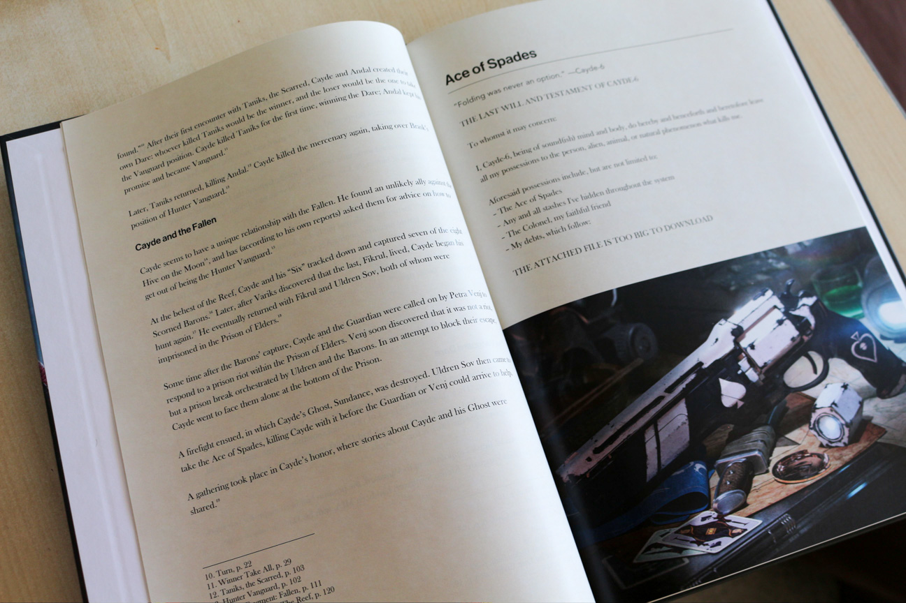
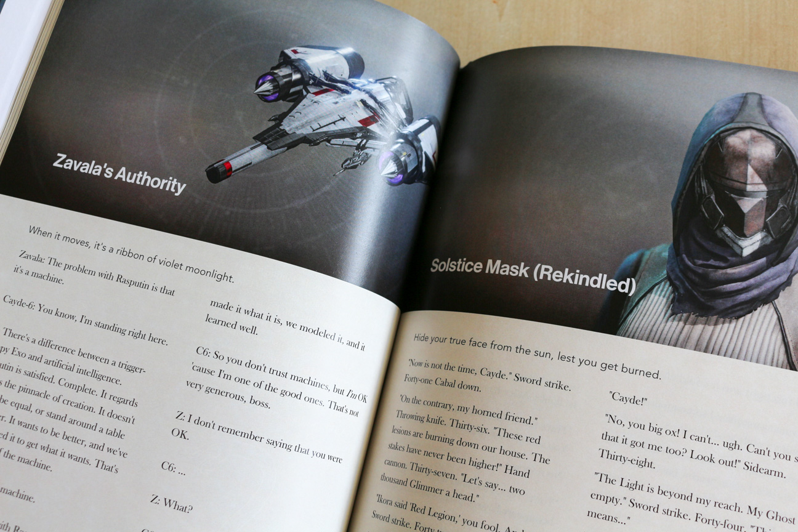
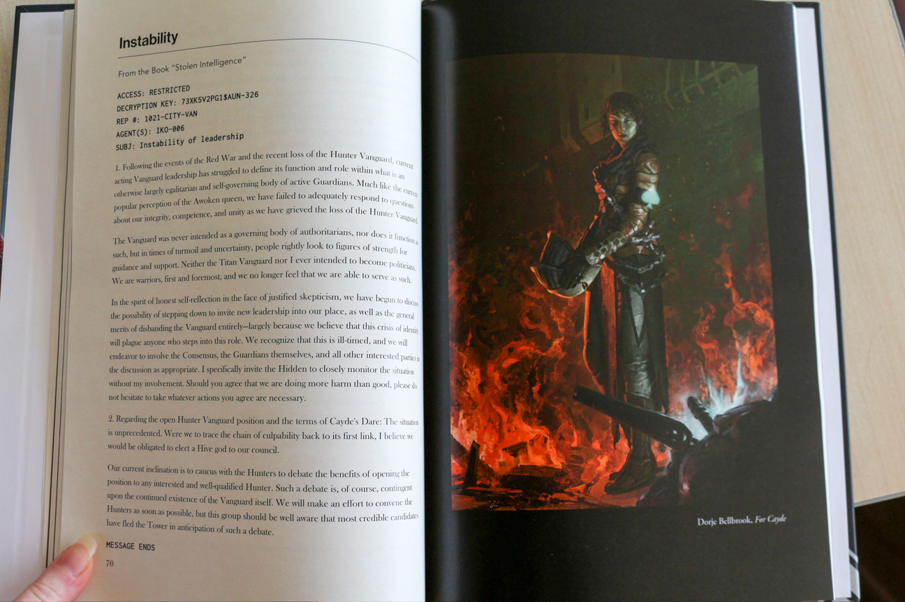
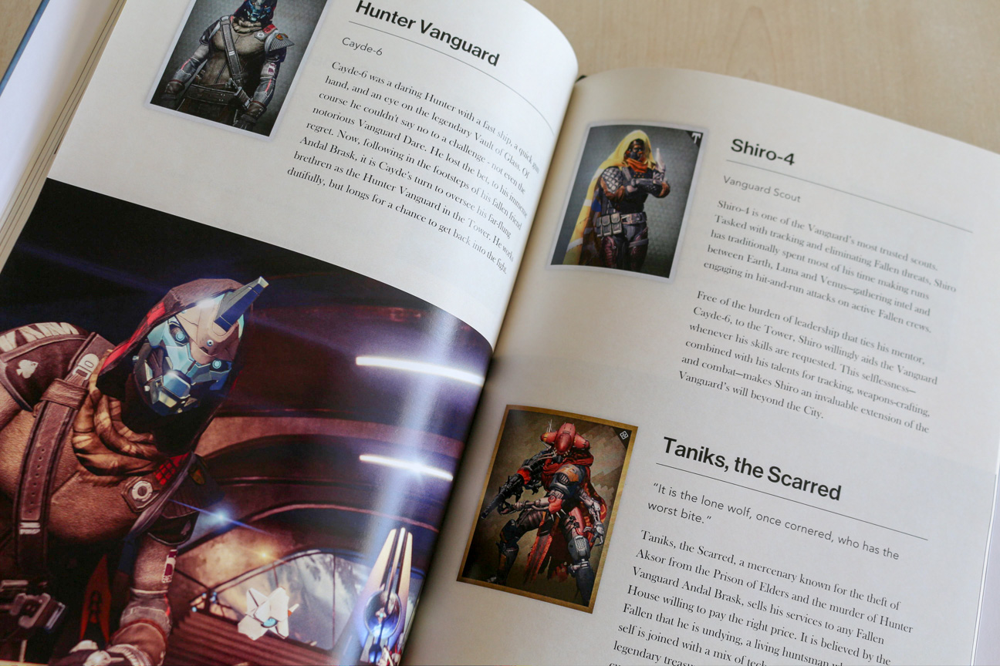

Cayde-6 est un des rares personnages sympas du jeu. Les autres ne pensent qu'à sauver le monde et ça les rend un peu ronchon, mais ce gars-là est très attachant. J'ai donc préparé « Le livre de Cayde-6 » pour l'anniversaire de ma moitié, avec qui j'ai parcouru le jeu. J'y ai rassemblé tous les textes de lore que l'on peut trouver dans le jeu, avec de jolies illustrations.

Heureusement, je n'ai pas eu à tout récupérer et recopier à la main, car il existe beaucoup de ressources géniales maintenues par les fans. Destiny a fait naître une communauté vraiment surprenante.

De nombreux outils ont été développés autour de l'API du jeu, comme l'incontournable [Destiny Item Manager](https://destinyitemmanager.com/) qui permet de gérer son équipement avec une efficacité redoutable, le site [Ishtar Collective](https://www.ishtar-collective.net/) qui répertorie tout le lore, ou encore [Braytech](https://braytech.org/) qui permet de visualiser sa progression. Sur tous ces sites, on peut sentir que les développeurs sont profondément inspirés par l'identité visuelle du jeu ; je dirais même que leur motivation pour créer ces apps vient en partie d'un désir d'y rendre hommage. On retrouve des éléments d'interface et l'iconographie d'origine, réinterprétées avec une sensibilité différente sur chaque site. Cet environnement m'a beaucoup aidé à établir mon propre style, simple mais fidèle.

Pour récupérer les entrées de lore et les images d'équipement, je me suis rendu sur Ishtar Collective et [Destiny Data Explorer](https://data.destinysets.com/). J'ai organisé tout ça dans Word et il ne manquait plus qu'à transformer ce catalogue en un vrai livre premium.

Heureusement, certains artistes de Bungie sont prolifiques sur ArtStation et les _fan arts_ ne manquent pas. Le kit de presse officiel contient de grands screenshots parfaits pour d'impressionnantes doubles-pages, mais aussi les polices de la charte graphique. On ajoute à cela une subtile texture de parchemin, et la recette est toute trouvée !

Word m'en a fait un peu baver parfois. Les styles c'est bien beau, mais ça ne me permet pas d'automatiser la disposition des images, entre autres problèmes. Les professionnels utilisent sans doute un autre outil pour mettre en page leurs livres, mais je ne savais pas trop vers quoi me tourner... J'ai donc préféré rester dans ma zone de confort pour pouvoir expérimenter plus facilement, même si cela impliquait d'ajuster toutes les pages une par une.

J'ai fait imprimer le livre chez CoolLibri car leur interface de preview était plutôt rassurante et m'a permis de régler quelques problèmes. Au final, j'ai laissé passer quelques erreurs qui sont naturelles pour une première impression : les pages entièrement encrées sont gondolées et la police est un peu trop fine. Mis à part ces petits détails, on pourrait presque croire que c'est un livre officiel !

[Télécharger le livre](https://mega.nz/#!BcYSBQYb!EnY3IxHxzzMLvh5KWg9FJvUX3z-Wz-OHJwdwMCwXKyg)
