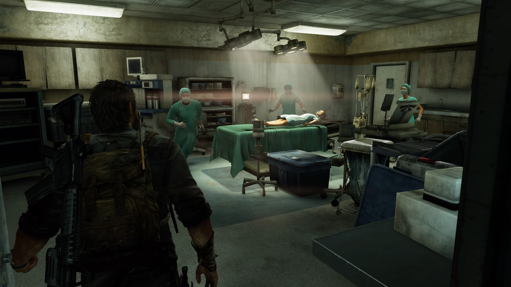
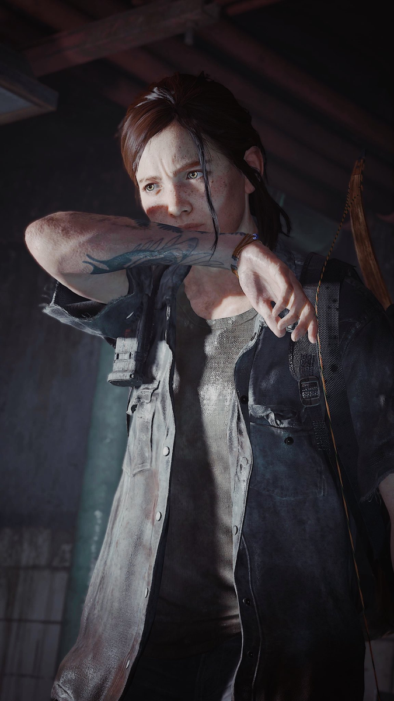
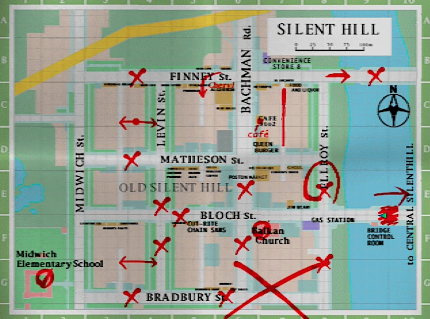
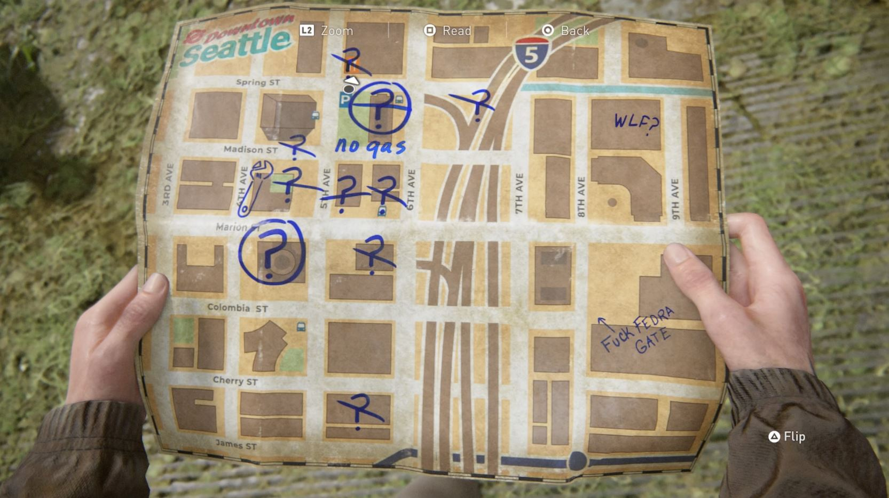

<!--
My big concern about the Big Game (tlou2) coming out today is an impression that people describe it as challenging because it shows content that is unpleasant, not because it gives us a way to grow. Challenging content is a way to cultivate spiritual and intellectual mass

Agreed. I'm only through the prologue. I like it. But it's also right on the nose with its emotional beats. They work, but not in the way Death Stranding does. Not yet, anyway. Like in Death Stranding you could be on the hike of a goddamn lifetime late in the game, your gear degraded, you're out of rope and ladders, and you cross a mountain and some stranger's shit is there to make the entire final stretch easy and it hits like a ton of bricks.

I think Death Stranding is challenging because it faces us with difficulty, with strain and stress, and it says "so. are you gonna be a better person now?" and we're like "yeah... yeah, you're right." If I'm just watching ugly shit, why do I care?
-->

> Cet article spoile les éléments d'histoire les plus importants des deux _The Last of Us_. Avant d'aller plus loin, comprenez qu'une partie du plaisir de la série repose sur l'effet de surprise.

En 2013, Naughty Dog avait attiré l'attention lors de la sortie de _The Last of Us_ premier du nom, grâce à un gameplay immersif jonglant avec aisance entre jeu de discrétion et d'action, une volonté rafraichissante de produire un véritable _blockbuster_ d'auteur, comme on peut en voir au cinéma, mais aussi par la grande question posée à la fin du jeu : Ellie doit-elle mourir afin d'obtenir une chance de sauver l'humanité ?

Ce qui a rendu le jeu mémorable, c'est justement de ne pas avoir laissé au joueur le plaisir de donner sa réponse. En étant confrontés à une décision difficile et qui n'est pas la nôtre, nous nous posions mille questions : qu'aurais-je fait à la place de Joel ? Pourquoi a-t-il agi ainsi ? Ellie va-t-elle rejeter Joel ou va-t-elle fermer les yeux pour préserver leur relation ?

Alors que les crédits défilent, nous parcourons toutes les éventualités dans notre esprit et finalement, nous prenons position bien plus farouchement que si le jeu nous avait proposé le choix [*Sacrifier Ellie*] / [*Sauver Ellie*] avec différentes fins que l'on aurait regardées en _New Game+_. Ironiquement, cette fin unique nous pose un bien plus grand dilemme que des fins multiples. Elle est aussi bien plus interactive, les discussions autour de cette fin ayant certainement contribué à la renommée du jeu.

Alors, lorsque quelques joueurs sur Internet ont à l'époque critiqué le jeu pour l'absence de choix, je m'étais simplement dit qu'ils étaient un peu trop habitués aux codes du jeu vidéo mais avaient quand même, au fond d'eux, profité de tout l'impact de cette fin singulière. Par contre, j'ai été interpellé lorsque le schéma s'est répété cette année, en pire. J'ai pu lire des critiques incisives sur _Part II_, de la part des joueurs comme de la presse, avec comme argument principal : « J'aurais voulu qu'Ellie tue Abby à la fin ! Moi, j'aurais voulu pardonner Abby plus tôt ! »

Le jeu est construit de sorte qu'on ne peut qu'avoir des réactions fortes et des désaccords avec les personnages. Il est bien normal d'avoir une position sur le sujet, mais pourquoi donc faudrait-il pouvoir l'exprimer _in game_, plier les personnages en fonction de nos valeurs ?

Je suis d'abord tombé sur la critique de Maddy Myers titrée « *We're better than this* » pour Polygon.[^Polygon] L'autrice reproche au jeu, entre autres choses, de l'obliger à incarner un personnage obsédé par une vengeance avec laquelle elle ne s'identifie pas. Allant jusqu'à qualifier l'expérience de « torture » si l'on est en désaccord avec les choix de Joel et d'Ellie, puisque le jeu tenterait de nous faire culpabiliser pour des choix que nous n'avons pas fait.

[^Polygon]: Maddy Myers, "[The Last of Us Part 2 review: We’re better than this](https://www.polygon.com/reviews/2020/6/12/21288535/the-last-of-us-part-2-review-ps4-naughty-dog-ellie-joel-violence)", 12 juin 2020, Polygon.

Cette remarque, très récurrente chez les détracteurs du jeu, suggère que _The Last of Us Part II_ aurait la même approche que _Spec Ops: The Line_ et tous ces autres jeux PS3 dont le gimmick était d'utiliser un héros passe-partout dans un environnement standard pour endormir le joueur, avant de forcer ce dernier à faire des trucs « horribles » tels que... tuer des gens ; le but étant ensuite de le confronter aux conséquences de ses actes et ainsi amener une sorte de réflexion sur la violence. Je ne vais pas vous mentir, _Spec Ops_ m'avait tout de même fait un petit effet à l'époque, mais je ne peux pas dire que je le recommanderais aujourd'hui. En tout cas, il me paraît malhonnête d'affirmer que _The Last of Us Part II_ n'en serait qu'une redite en HD ou de réduire sa proposition au message « la violence, c'est mal ».

Ce genre d'intervention très défensive des médias, relevant davantage de l'étalage de ses valeurs personnelles que de la critique, alimente une idée qui ne me plaît pas trop et selon laquelle un bon jeu vidéo devrait fournir une pseudo-liberté pour l'expression de nos valeurs les plus vertueuses. Il semble aujourd'hui quasi-obligatoire pour un _blockbuster_ de placer son public au centre de l'expérience... Dans le cas d'un jeu vidéo, le joueur doit pouvoir s'exprimer par le gameplay, ou bien défendre ses opinions dans les choix de dialogue, puis en savourer les conséquences. Pour accomplir cette ambition, le jeu doit idéalement proposer une liberté d'action totale... c'est le graal de nombreux joueurs. Mais étant donné que dans la réalité, un jeu ne peut contenir que ce que les développeurs veulent bien y mettre, disons plutôt qu'un jeu doit refléter les valeurs et la vision du monde de son public. J'ai le sentiment de retrouver cette injonction à nous brosser dans le sens du poil plus largement dans toute l'industrie de la _pop culture_, par exemple chez Marvel, DC et compagnie, qui font leur beurre sur des personnages et des valeurs qui mettent tout le monde d'accord. Un site comme Polygon alimentant cette culture au quotidien, à travers des news sur les super-héros à la mode, a peut-être du mal à intégrer à sa ligne éditoriale un _Last of Us Part II_ qui utilise ses personnages très différemment.

<Figure
	src="batman.png"
	caption="L'argument de vente principal du film *Batman: Death in the Family* est que l'on peut y choisir si Robin meurt, en écho au comic d'origine de 1988 où les lecteurs avaient voté la mort du personnage par téléphone."
/>

Dans les productions grand public vues comme « positives » et « bienveillantes », les protagonistes sont souvent du bon côté, ou bien ont commis des erreurs qu'ils sont toujours capables de réparer. C'est un principe qui me paraît systématique, accoutumant l'audience à considérer comme normal qu'un héros impose sa perspective sans le moindre doute. Une posture à laquelle il ne faudrait surtout pas s'identifier, n'est-ce pas ?

Or, il me semble que la notion d'aimer un personnage est de plus en plus confondue avec celle de s'identifier à lui. Je crois que c'est un truc de notre époque. En tout cas, cela rend la perception d'un personnage comme Joel particulièrement troublée : le jeu passe son temps à éveiller notre empathie pour le bonhomme à travers des scènes où il agit comme un père protectif, tendre et encourageant. Son côté meurtrier, égoïste et trompeur n'est pas explicité avec la même insistance, ce qui n'est pas un problème en soi mais alimente la confusion d'une partie du public, passive dans son appréciation de l'œuvre et désireuse de trouver en Joel un modèle, quitte à glisser sous le tapis tous les aspects dérangeants du personnage.

Joel est un héros typique de jeu vidéo : une sorte de Nathan Drake en plus vieux et bourru, mais surtout plus torturé. Il n'est peut-être pas très doué avec les mots, mais il est sensible et ferait n'importe quoi pour protéger ceux qu'il aime. Il est facile de voir ce qui l'a élevé au rang d'icône auprès des gamers, nourris depuis toujours par ces valeurs patriarcales de puissance et de domination, parfois jusqu'à des doses ridicules comme dans _God of War_, mais qui sont ici nuancées -- ou excusées -- par la complexité et la sensibilité du personnage.

Le jeu serait-il complice de la confusion qu'il porte par son écriture complaisante ? Je ne sais pas avec quel degré de cynisme l'histoire a été conçue pour pouvoir être ainsi lue de deux façons différentes en fonction de sa vision du monde : soit comme l'exploration d'une relation parentale malsaine, soit comme la validation de la figure de l'homme viril, largement incompris mais profondément bon. Cette liberté d'interprétation a permis aux gamers de faire du premier _The Last of Us_ un véritable porte-étendard. Quelle ironie, quand on sait que ces mêmes gamers finiront par s'acharner sur le deuxième épisode, plus clivant, des années plus tard.

---

Il est urgent de mieux éduquer le public en lui donnant de meilleurs outils quant au traitement d'une histoire, et ainsi lui rendre la pleine responsabilité de s'approprier l'œuvre de manière responsable. Une bonne histoire impliquera souvent des personnages ayant commis des erreurs irréparables ou ayant un côté sombre, et c'est l'exploration sans concession de ces aspects qui donne du corps à une oeuvre. Les nombreux instants de tendresse de _The Last of Us_ peuvent nous amadouer, mais ils ne doivent pas déformer notre jugement global : je ne crois pas qu'on puisse raisonnablement conclure, alors que les crédits du premier jeu défilent, que Joel est un bon père. Pourtant, lorsqu'il fut assassiné dans _Part II_, beaucoup de monde s'est plaint que les développeurs avaient gâché le personnage, et par extension gâché le jeu.

Dans _The Last of Us Part II_, Ellie endosse à son tour le rôle d'anti-héroïne. Elle exploite les personnes autour d'elle pour accomplir sa quête macabre mais est capable, au fond, de trouver une rédemption.

Peut-être parlerai-je plus en détail de _Part II_ prochainement, car je l'ai trouvé très intéressant. Mais c'est tout pour aujourd'hui !

# Champ-contrechamp

[Abby revivant le cauchemar de l'hopital](./fin.jpg)
The story orbits a decision Joel made at the end of the first game – cinematically, the game returns to this moment like a recurring nightmare.

Je dois dire que pour ma part, alors que je me lançais dans le jeu, la future mort de Joel me semblait irrémédiable ; la seule question était de savoir quand et comment. Cela dit, il restait difficile d'imaginer ce que donnerait cette suite, le premier _The Last of Us_ se suffisant à lui-même. On ne le réalise pas dès le début, mais avec le recul, c'était très malin d'articuler le jeu autour de la fin, non pas comme une simple suite chronologique mais en traitant la décision de Joel et toutes les questions sans réponse qui en découlent. Les implications sont disséquées sous tous les angles, et c'est le cas de le dire puisque tout le jeu s'appuie sur une opposition des points de vue, d'une façon plus concrète que jamais.

A la moitié du jeu, tout bascule et nous devons incarner Abby, un changement choquant puisque ce qui était alors une figure d'antagoniste absolue et très lointaine, devient tout à coup accessible au creux de notre main et plus humaine que jamais -- pour devenir un personnage magnifique.

Et c'est la grande idée de _The Last of Us Part II_ : l'utilisation du langage du cinéma pour créer un jeu d'oppositions radical, à l'échelle de l'arc narratif entier des personnages. L'exploration, à travers le langage du cinéma, de la relation entre les deux parties d'un conflit à mort. Le jeu explore ce qui se passe lorsqu'on observe l'autre côté, lorsqu'on expérimente le regard de l'autre. A la manière d'un champ-contrechamp, chaque sujet est considéré séparément, de façon isolée, prenant tout l'espace du cadre.

On se rend compte, mieux que jamais, combien pour exister, chaque opposant d'un conflit a besoin de cette confrontation à l'autre, mais aussi de ne pas le comprendre entièrement.

Pour que cela fonctionne, pour nous confronter à ces oppositions d'idées et de visions malaisantes, sans pour autant tomber dnas un discours convenu et mielleux, il fallait un jeu sincère, qui prenne parti, quitte à devenir plus clivant que d'habitude. Ainsi, les questions posées par le jeu "qui nous sommes pour juger si facilement les autres", ou à quel point elles essaient de ne pas se comprendre, pourraient sembler naives et convenues, mais cela fonctionne parce que le jeu est sincère, il prend parti quitte à devenir plus clivant que d'habitude.

Il va ainsi plus loin que les questions moralisatrices sur la tolérance et devoir se mettre à la palce des autres

{/_ Le concept d’un jeu à deux faces sert donc moins une opposition discursive ou morale qu’une opposition de principe entre les deux personnages principaux. Je dois reconnaître que là où le jeu aurait pu se solder par un laïus simplet sur la tolérance ou le devoir d’admettre que nous ne pouvons jamais être totalement à la place des autres, il va finalement plus loin et sert sa cause sans pour autant imiter son bornage idéologique. Car The Last of Us Part II sert d’autant plus ce progressisme là qu’il n’en épouse pas ses limites. En allant s’ancrer effectivement dans des mythologies anciennes, comme les origines de l’Amérique et les évangiles ; en tournant autour de la famille, sujet universel par excellence, le jeu ne cherche pas à aller platement dans le sens du vent, il lui donne une histoire, des contradictions, des nuances. Et c’est parce que nous avons aussi un rôle de spectateur, que nous recollons les morceaux, que nous passons d’un personnage à l’autre dans un tissu temporel, que l’on retrouve une forme d’universalité débarrassée de toute prétendue condescendance. On prend de la distance. _/}

## Comment ça représente les personnages horribles (lien avec la suite)

Autre élément de langage que le champ contre champ: Là où The Last of Us Part II est brillant, c’est qu’il fait aussi de la linéarité le principe moteur des deux protagonistes-antagonistes, une ligne mentale et obsessionnelle qu’elles se sont fixées pour mener à bien leurs vengeances respectives. Ellie comme Abby sont prises dans des trajectoires similaires mais qui s’inversent : Abby cherche une forme de rédemption tardive, tandis qu’Ellie s’enfonce sciemment dans la spirale de la violence.
l’histoire d’Ellie qui a grandi, tombe amoureuse, part dans une quête folle de vengeance, et de celle qui devient sa rivale, Abby.

Toutes deux sont les monstres que Joel a créés. C’est Joel qui a empêché le destin messianique d’Ellie (elle devait être sacrifiée à la fin de premier épisode pour permettre la création d’un vaccin contre l’épidémie), la forçant à vivre dans un monde qui n’avait plus besoin d’elle, et c’est Joel qui a assassiné le père d’Abby, la lançant dans sa quête de vengeance. Ce n’est pas un hasard si The Last of Us Part II s’ouvre sur la mort de Joel, cowboy paternaliste dont l’ombre plane sur les tribulations de ces deux femmes cherchant à s’entretuer.

# gameplay brutal pour une violence aussi jouissive et dérangeante, mais pas dissonnante

Il faut voir, dans les passages de customisation des armes par exemple, à quel point le gun porn est exalté. Ce qui diffère avec le premier jeu, c'est combien les affrontements contre les humains sont source de sensations fortes, et nous marquent bien plus que les monstres. Ce sont les plus prenants à jouer, ce qui en dit long sur l’effet d’attraction-répulsion qu’exerce sur nous ce jeu, sans pour autant tomber dans un truc de petit malin ni dans une forme de manipulation cynique.

Le jeu pousse à un degré de violence tellement brutal qu’il devient parfois insoutenable. Les choses peuvent d’ailleurs paraître pas évidentes de ce point de vue-là. D’un côté, comme je le disais plus haut, il y a une volonté de mise à distance par le récit, la diffraction des points de vue, de l’autre comme tu dis la violence peut sembler exaltée et complaisante, sans beaucoup de possibilité d’y échapper. C’est évidemment un reproche fait au jeu.

Comme la plupart des jeux vidéo, The Last of Us Part II est jouissif dans son exaltation d’une tension de danger et son accomplissement de mises à mort. Je ne suis pas quelqu’un de particulièrement sadique. Or, ici je prends beaucoup de plaisir à rayer un à un tous les ennemis d’une carte. --mais je pense que le ressenti varie bcp en fonction des façons de jouer. Nolwenn qui galère beaucoup a juste envie de fuir et se sent trop oppressée, il n'y a pas d'amusement. j'ai été particulièrement immergé mais qqn d'autres pourrait ressentir du fun en entendant les ennemis crier à la panique, ce qui serait une mise à distance par rapport à l'intrigue, mais qui est une façon tout à fait valide de le ressentir, puisque tout est fait -le soin réaliste et la fluidité des événements- pour qu'on prenne du plaisir à jouer le méchant qui sème la panique.-- Les développeurs ont redoublé d’efforts pour “humaniser” nos victimes : les ennemis dialoguent entre eux, s’appellent par leurs prénoms.

**Mais il ne faudrait pas que cet extrême niveau de détail du jeu lui confère l’illusion d’une réalité provoquant un retour moral sur nos actions symboliques. Il ne sert qu'à nous ancrer dans la réalité du personnage. Le seul qui doit être jugé, c’est le personnage et non le joueur.**

Le jeu essaie clairement de réduire la dissonance entre le jeu et le récit, dont on sentait dans les derniers Uncharted qu'elle commençait à devenir un vrai problème pour le studio. Par conséquent, comme on est souvent forcé d’agir à cause des personnages, sans qu’évidemment on épouse totalement leur perspective, on est pas dans un jeu qui nous pousse au massacre gratuit à tour de bras. De par sa manière de nous faire changer de camp, on se pose des questions sur les actes d’Ellie et d’Abby. Si bien que souvent en donnant un coup de hache en gros plan dans un ennemi il est arrivé de me demander : “Mais qui est ce type ?”. Le jeu arrive à distiller un tel hors champ en humanisant même un pauvre PNJ, que cela produit une _distance intéressante_.

Il n’y a pas de manipulation cynique car le jeu arrive constamment à maintenir ce jeu d'équilibriste entre distance et connexion avec ce que vivent ses héroïnes. S’iI nous confronte à nous-mêmes, c’est donc en passant par une expérience narrative et radicale de l’autre. Ce qui permet de créer une réflexion plus large et pertinente qu’un exercice réflexif en fin de compte assez balourd. On est vraiment dans une expérience hybride qui sait employer à merveille les moyens du cinéma pour faire du jeu vidéo.

C’est vrai qu’il y a un parti pris très fort à demander au joueur d’être à la fois agissant et impuissant, de ressentir simultanément du plaisir et du dégoût à massacrer à tour de bras, sans jamais retomber sur un discours clé en main. Surtout, la mise à mal des protagonistes (qui va extrêmement loin sans que nous ne puissions y faire quoi que ce soit) semble à rebours des habitudes vidéoludiques.

# La violence n'est pas un spectacle, elle est subjective

{/_ C’est d’autant plus vrai que la question sur la violence est trompeuse. Le jeu cherche explicitement à lui donner une dimension réflexive, et donc au bout d’un moment malaisante. Mais il ne s’agit pas d’un dispositif putassier où la mise à distance est sans cesse annulée par la complaisance de la mise en scène. La violence ici n’est pas un sujet de l’ordre du spectacle, son enjeu c’est celui de la subjectivité du point de vue par une expérience morcelée et trompeuse du réel. Jouer l’autre, non pas pour mieux le comprendre et s'y identifier, mais simplement pour mieux le connaître. C’est là toute la subtilité et l’intelligence du jeu. Et c’est très concret ce rapport dans lequel nous place le jeu en passant par la violence et l’autre. Il ne s’agit pas de moraliser les images et donc le jeu vidéo avec un discours culpabilisant suranné. Le but est de produire une expérience bien plus vertigineuse et intéressante qu’une simple provocation lancée aux appétits inavouables du joueur. C’est vrai que moi aussi, par moments, je luttais contre ce que le jeu m’obligeait de faire – et que j’ai aussi pris du plaisir à dégainer mon fusil à pompe. _/}

_The Last of Us Part II_ nous fait jouer l'autre non pas pour nous forcer à nous identifier à lui -- encore que c'est notre droit -- mais plutôt pour mieux le connaître et expérimenter sa subjectivité. Et c'est de cette subtile différence que naît toute la richesse de l'expérience.

> À travers ces marqueurs d’allosubjectivité, le jeu confronte le joueur à l’altérité du personnage dans le but de réaliser une _fusion identitaire_. Car pour arriver à un personnage-joueur à proprement parler, il faut que l’un fasse un pas vers l’autre et vice-versa. Une allosubjectivité pure dénuée de toute fusion d’avec le joueur nous relègue à _une posture immersive d’identification cinématographique_ secondaire classique (Dans les études cinématographiques, l’identification primaire est celle du spectateur au dispositif cinématographique (au premier chef la caméra), se faisant le sujet privilégié du spectacle; l’identification secondaire est celle aux personnages et au récit, par le biais de l’empathie.)

> Il faut envisager la question de l’identité du personnage en termes de dominante : on aura ainsi des jeux à dominante avatorielle, en ce qu’ils tentent globalement de positionner le joueur comme incarnant un personnage censé être sa propre représentation dans l’univers ludo-narratif, et des jeux à dominante actorielle, où le joueur se positionne davantage en accompagnateur d’un personnage bien défini. En somme, si le jeu vidéo comme média peut être envisagé comme étant à la confluence des pratiques ludiques et des pratiques fictionnelles, il faut reconnaître que la liberté d’agir est conférée par l’avatar, et la force du récit, par l’acteur. Pour « jouer » sur les deux fronts et obtenir un récit interactif, il faut une mesure d’acteur dans l’avatar et une mesure d’avatar dans l’acteur.

[^quiestje] (p.11)

en d'autres termes: "on ne peut simplement « devenir » ou « diriger » un autre avec une frontière claire et nette entre le joueur et le personnage, en partie parce que ces deux postures correspondent à deux niveaux différents de l’expérience vidéoludique : le jeu et la fiction."

tout le challenge de tlou2 c'est cette émotion de dégout qui est constante au cours du jeu et qui nous distancie du personnage. Mais trop nous distancier, et cela revient à suivre un personnage de film, alors que tout le talent du jeu est d'être borderline, arrivé à nous impliquer dans cette subjectivité qui nous rejette.

(contrairement à spec ops par exemple où c'est un twist, on nous implique dans le perso au début parce qu'il nous ressemble, donc c'est plus facile)

Comment ils font ?

S'inspirer de cette description pour gears of war et adapter à ce qui rend unique tlou2:

> "un certain nombre d’opérations effectuées par la caméra virtuelle visent à faire partager au joueur la réalité diégétique vécue par son personnage.
> Faute d’espace, deux suffiront pour nos besoins. Lorsque le joueur vise avec son arme à feu, un puissant zoom estautomatiquement effectué pour approximer la vision focalisée du personnage et permettreun contrôle plus fin sur la visée. Plus spectaculaire encore, si le joueur enfonce la baïonnette-scie mécanique de son arme dans un ennemi, la caméra recule pour montrer lamort sanglante, mais au passage un jet de sang vient violemment éclabousser l’« objectif » de cette caméra virtuelle. Le choc de cette image (couplée d’un son « juteux » à volume élevé) surprend le joueur et augmente drastiquement l’intensité de cemoment, ce qui a pour effet d’aplanir la distance entre l’expérience du joueur et celle du personnage : pendant un court instant, le joueur n’est plus dans une position spectatorielle distante et sécurisée, mais se retrouve lui-même « trempé » dans cette violence."

décrire le gameplay viscéral:
les ennemis qui nus encerclent plus vite que notre pensée
les tirs fusent et nous frolent
contrairement à des jeux spécialisés dans l'infiltration, la planification est très limitée parce que ce qui se passera dans un instant est imprévisible. on est toujours dans la réaction, toujours soumis à la situation au lieu de la contrôler
il faut alors fuir sous les tirs ennemis pour retrouver une cachette temporaire ou répondre par la brutalité, plus fort que ses opposants parce que c'est eux ou nous

le breathing system apporte tellement de présence ça carry
quand ellie court pour fuir les ennemis et halète à s'en déchirer la gorge
jpeux te dire qu'on reprend son souffle avec elle quand elle s'arrête

{/_ dans tlou2, facile de fusion identitaire parce qu'on connait déjà bien ellie du 1. On n'a pas cet atout avec Abby, mais c'est arguably un personnage moins challenging avec lequel fusionne, parce qu'elle réagit de façon beaucoup plus empathique aux événements, son arc est même une histoire de rédemption. _/}

[^quiestje]: Dominic Arsenault, « [Qui est je? Autour de quelques stratégies vidéoludiques de design de personnage pour gérer l’actantialité ludonarrative du joueur et son immersion fictionnelle](https://www.academia.edu/7274218/_2013_Qui_est_je_Autour_de_quelques_strat%C3%A9gies_vid%C3%A9oludiques_de_design_de_personnage_pour_g%C3%A9rer_l_actantialit%C3%A9_ludonarrative_du_joueur_et_son_immersion_fictionnelle_book_chapter_) », chapitre du livre _Avatars, personnages et acteurs virtuels_ (sous la direction de Renée Bourassa et Louise Poissant), 2013.

Ce qui marche bien c'est qu'on se laisse entrainer dans cette folie meurtrière, ce mélange dégout violence. Cela marche bien, sauf dans un cas de figure précis. Quand vous attaquez le dernier ennemi d'un groupe, il vous suppliera parfois de le laisser vivre. Alors on s'arrête net.

<Video src="suppl.webm" attr="controls" poster="poster-suppl.jpg" />

Si vous continuez à vous laisser porter par le jeu, cela peut avoir un très bon effet dramatique. Cela dit, entre l'arrêt de l'animation, le changement de caméra et le button prompt, il y a un soudain recul dans la mise en scène qui s'opère.

Notre champ d'action, habituellement délimité par les capacités physiques et l'état d'esprit d'Ellie, s'élargit soudainement avec l'élargissement du champ visuel et ce button prompt, qui transforme un meurtre normalement évident en un choix.

Pour peu que l'on doute, on en vient à se demander si le jeu n'oublie pas l'intermédiaire d'Ellie pour s'adresser pas directement au joueur, lui donnant d'ailleurs tout le temps du monde pour prendre sa décision puisque l'affrontement est terminé. C'est maladroit pour deux raisons : cela brise ce subtil équilibre de la subjectivité puisqu'on a l'impression que le jeu communique avec nous personnellement, et en plus, ce n'est une illusion de choix puisque le jeu ne réagit pas de façon intéressante si l'on ne fait rien.

On se sent alors trompé en tant que joueur, comme si, effectivement, on voulait nous faire culpabiliser pour un acte que _nous_ avons fait sous la contrainte. Pour moi, cette maladresse est intéressante parce qu'elle montre combien le jeu d'équilibriste du jeu est difficile à maintenir, mais ce n'est que ça, une maladresse, et ne devrait pas être considéré comme un réel message du jeu.

# gimmicks naughty dog et touche de survival

Le jeu est parfaitement fidèle à toute une série de conventions vidéoludiques, à commencer par celles de son genre : le survival. Ce terme peut avoir plusieurs sens. Il y a d’abord le survival horror, d’où la carte de Seattle qu’on annote progressivement au début du jeu (comme dans un Silent Hill). Et puis il y a l’autre type de survival, celui des reboot de Tomb Raider ou de Metal Gear Solid 3: Snake Eater, par exemple. Ce survival-là est beaucoup plus militarisé, renvoie au jeu de guerre, ou plutôt de commando, ce qui pour le coup nous porte vers un ultraréalisme traumatique aussi troublant qu’accoutumant.

pour parler de l'aspect commando le moment qui fonctionne le mieux c'est la zone séraphite et passer en mode réaliste. ça devient un jeu de survival opprenssant, mais un autre type de survival, plus militaire, plus commando, au feeling là aussi assez unique. essayer de prendre une photo au début ils sont deux ou trois on se fait repérer et là on lance un molotov et photo de ellie bras tendu molotov en l'air bien dramatique

 

sur le jeu qui assume sa structure: le jeu nous octroie tout de même généreusement des instants de complicité et de tranquillité dans sa phase ouverte lors de l'arrivée à Seattle, on retrouve un terrain connu avec ce rappel de Uncharted: The Lost Legacy, mais on vit l'abattage froid du cheval comme une page qui se tourne. On comprend que cela ne se passera plus comme ça.

(Sur la nature vidéoludique de l’ouvrage) Et puis il y a les gimmicks habituels de Naughty Dog, désormais si connus qu'ils font partie de la recette attendue : les duos de personnages qui plaisantent et badinent (le passages où nous “sortons” seule semblent par contraste d’une oppressante solitude), l’objectif du segment de jeu (une tour, un immeuble au loin) en ligne de mire qui se rapproche peu à peu, etc.

# cinématographie - la structure en diptyque, adaptée du cinéma, raconte la vengeance

C’est pas une expérience graphique qui invite à flâner, contrairement à Uncharted 4 qui incite sans cesse à s’émerveiller de ses environnements exotiques. Pour moi le jeu se traverse vite, ce qui n’est pas gênant car cela correspond aussi à ses intentions cinématographiques, et lui donne même une certaine consistance – on ne diverge pas.

Le jeu va plus loin dans ses emprunts au cinéma en éclatant la narration et en affirmant son contrôle sur la temporalité de l'histoire. The Last of Us Part II utilise un découpage particulièrement lent, laissant aux deux parties du diptyque tout l'espace nécessaire pour développer leur propre progression de gameplay.

Le jeu crée avec cette structure une myriade de résonances entre les points de vue des différents personnages. En ajoutant à cela les flashbacks habituels à la sauce Naughty Dog, on obtient un découpage rafraîchissant du récit, tantôt vécu viscéralement, tantôt apprécié avec un recul impartial. [transition possible avec le côté juge]

The Last of Us Part II intègre tout le savoir-faire acquis au fil des années en matière de jeu cinématique, mais il me paraît moins soucieux de se confronter au modèle cinématographique qu’auparavant. La démarche est mûrie, indépendante, cette suite ne prétend plus à une quelconque universalité. Ce n’est plus une odyssée, avec une portée héroïque et une morale à la fin. Le jeu ne dit même plus grand-chose de notre époque. C’est un jeu personnel, qui suit sa propre histoire et se resserre (ou se dilate) autour de ce qu’il a à raconter. En premier lieu, ses personnages grandioses.

Le jeu semble effectivement avoir moins de choses à prouver, et donc il se concentre sur ce qui va faire sens, en particulier ces personnages.

Tout le jeu, par son expérience, consiste à changer notre regard sur l’ennemi. C’est aussi là où il fait écho avec son époque : dans un monde toujours plus clivé, sa façon de nous faire épouser un double récit de vengeance permet de nous mettre dans la position du grand réconciliateur. De celui qui écoute, pardonne en ayant soi-même joué au bourreau. Mais c’est surtout une expérience du préjugé, du malentendu, de la réalité tronquée, qui répond à notre ère.

The Last of Us Part II est une oeuvre de juriste, faite pour entendre différentes voix. Ici, il n’y a pas une vérité, mais plusieurs, et la seule certitude qu’il nous reste à la fin est celle de notre humanité – dont il faut parfois admettre les erreurs, les égarements, et toute cette dimension compassionnelle ambiguë qui travaille le jeu.

Polygon reproche au jeu le fait qu’Ellie et Abby ont mille fois l’occasion de s’asseoir à une table pour régler leurs différends, mais qu’elles ne le font jamais. Et pour cause, chacune est fébrile dans ses raisons, chacune sait que parler les mènerait vite à se reconnaître et à se pardonner. Il leur faut donc abréger, éviter de se parler, se tirer dessus sans hésiter, car c’est là la loi de la trajectoire. Pour Ellie, la vengeance n’est pas une affaire de volonté ; c’est un principe aveugle qui – on le comprend à la fin – est une façon de pardonner Joel par-delà la mort, en devenant aussi monstrueux que lui.

C’est une figure fascinante, avec laquelle Druckmann réussit à nous mettre face à quelque chose de bouleversant parce qu’irréconciliable. Une sorte de père maudit dont l’héritage est devenu trop encombrant – avec ce dernier plan du jeu magnifique. Si l’on en revient à l’autre sujet clé du jeu, la famille, Joel est un personnage qui pousse à une mélancolie d’une tristesse infinie.

Un très beau plan, d’un classicisme évident, qui sonne comme un abandon, presque un enterrement.

The Last of Us Part II possède pour moi une valeur plus intemporelle, au demeurant classique. En dehors des prologue, épilogue et de quelques flashbacks, l’essentiel du jeu se déroule à Seattle en l’espace de trois jours. On respecte donc plus ou moins des règles d’unité d’action, de temps et de lieu, comme dans la tragédie classique. Comme dans la tragédie classique encore, les protagonistes sont soumis à l’attraction de leurs destinées. Toute possibilité d’un libre-arbitre semble sapée par la fatalité.

{/_ genre dans la dernière partie les esclavagistes chelou je m'en battais tellement les couilles de leur vie @Aurélien ils servent à rien du tout pour moi ils étaient juste là pour être des 100% méchants débiles et qu'il n'y ai aucune remise en cause au fait que tu les éclate. ça fait vraiment filler du coup _/}

le jeu n'a même pas des valeurs si éloignées du premier "la famille avant tout" si ce n'est qu'elles ont probablement été davantage renforcées depuis

now lets be real, je ne m'intéresse pas tant que ça au théatre. i prefer my shiny video games. cependant, j'ai pu sentir que cette structure tragique avait vraiment quelque chose de spécial. ce flottement saisissant de l'unité de lieu et d'action. et je pense donc qu'il y a une grande richesse dans cette reprise d'anciens codes. il y a du potentiel pour sensibiliser une nouvelle génération à des choses qui ne se font plus tellement aujourd'hui.

# la conclusion : un jeu dérivatif à apprécier avec un regard critique

Tout comme son prédecesseur, le jeu est un agrégat de beaucoup de clichés de son genre, qui semblent parfois présentés sans grande conviction, peut-être juste pour s'inventer une appartenance à son genre. Si l'apparition d'un culte religieux rejetant la technologie et voyant en les zombies une intervention démoniaque pouvait faire tiquer, le clou est définitivement enfoncé lorsqu'on rencontre les négriers de zombies. Pourquoi amener cette imagerie lors de la conclusion du jeu ? Peut-être bien juste parce que c'est cool, parce qu'on a envie d'imiter les grands, et parce que c'est encore un autre moyen de nous dire que la nature humaine est bien malsaine ; ainsi ils méritent bien qu'on les assassine et brûle leur domaine sur notre passage. Une section du jeu particulièrement étrange qui aura, j'imagine, interrogé pas mal de monde.

I simultaneously agree with basically all the flaws/see where it comes from, yet also enjoyed playing both games.

Despite their formulaic and derivative nature, I still think they resonate w/people and are worth playing for the top-tier production quality.

I don't know about Part 2, but yes, the first one is well worth playing. It's a good game, above average, with great production values. It's not among the best things the medium has to offer, however, not even close, and certainly not something other games should want to imitate.

The Last of Us—a perfectly fine pastiche of better books and films—and game ideas--jusqu'à voler l'identité d'Ellen Page en faisant genre de rien-- mais avec un gameplay que j'aime et surtout très engageant à chaque instant. Et parfois mieux réalisé techniquement que ses inspiration. Donc il y a ça.

The Last of Us is only significant in how much money went to its creation, and there are a million other creative voices who could have used that money to say something more meaningful.

The Last of Us is derivative. It’s derivative because it is unthinking. It tells the story it tells because it wants to be baby’s zombie fiction 101. When streaming it last year, I said “oh no, this guy’s going to be a cannibal.”

Throughout The Last of Us, we keep stumbling into these moments; you meet someone, they end up being bad. The twist is always that everyone along the way relentlessly sucks somehow, or something will come along to force them forward. The game is insistent that sure, our protagonists are bad, but so is everyone else, in some way. Le choix moral de la fin semble ambigu parce que tout le monde est un connard, ça l'aurait pas autant été si les gens avaient été normaux.

look, if you enjoyed the game and you are fully cognizant of the fact that Joel’s a piece of shit who uses ellie as a cipher for his daughter and doomed humanity to suffer, and if you’re totally aware that all the crazy shit that happens in those games happens because the story is just copying other zombie fiction, fine. It’s okay to enjoy whatever you want, even if it’s problematic. I’m sure there’s probably stuff I like that’s problematic too! **All I’m objecting to is praising it as an objective good thing that we oughtta emulate, because it’s just… god, it’s so empty, so tasteless.**

(transformer en: je pense que les jeux de naughty dog sont tout de même importants parce qu'ils nous fournissent un blueprint bien exécuté (they have an incredible shotgun and rope physics), dont d'autres peuvent s'inspirer parce qu'il faut le transformer en une vraie structure pour créer quelque chose de vraiment artistique) I’d hesitate to call Naughty Dog games genre-savvy so much as genre imitators; they treat the genre like a blueprint rather than as a framework to better understand other people, or help people understand themselves, which is the entire fuckin’ point of art. [fin]

the heart of true grey morality borderline requires you embody a protagonist that isn't perfectly alturistic, put in situations that don't follow the narrative conventions of heroism. And most of the AAA space is designed around these comforts.

en fait de Last of Us tu avais des moments impactant mais qui n'était pas forcément gagnés par la cohérence de l'histoire c'était des moments qui était set up de façon assez mal à droite et à droite mais qui marche très bien parce qu'ils étaient extrêmement bien mise en scène. par rapport à cela The Last of Us 2 à une histoire beaucoup plus cohérente une meilleure continuité ce qui fait que chaque événement en plus de sa bonne réalisation a vraiment un impact parce qu'il est porté par toutes les histoires qui la précède
Donc il y a clairement une évolution qui fait plaisir à voir

In his review of The Last of Us Part II, Keogh describesNaughty Dog’s position in the industry as a “jaded messianic one.” Their
games “bravely push[] the medium forward with their sheer level of craft” whilealso “holding it back with how they anchor that craft in musty old conventions.” As I noted above, both games in The Last of Us franchise are distinguished by the creative tension at their core between the experiences of human goodness and human evil, between an aesthetic, humanistic vision of the world and a violent, nihilistic one—a tension that is expressed mechanically as much as it is expressed thematically. Inasmuch as the gamer ideology prizes artistry while preservingmasculinist norms and values, Naughty Dog remains thoroughly trapped inthis in-between space: a triple-A developer of ‘gamer’s games’ (big budget, high production values, violent) that also cares about complicated questions of morality and careful portrayals of characters and their relationships

[^keogh]: Brendan Keogh, “The Rest of Us: Revenge, Prestige, and Putting the Last of Us: Part II in Its Place,” Overland, July 28, 2020, https://overland.org.au/2020/07/the-rest-of-us-revenge-prestige-and-putting-the-last-of-us-part-ii-in-its-place/

TLOU2 is a profoundly affecting and accomplished Triple-A action game that uses well-trodden tropes and themes to present an endless, exhausting spiral of revenge between two characters. Its grandest accomplishment is using an unconventional dynamic between player and character(s) to make every act of revenge equal part justified, understandable, horrific, and absolutely the wrong thing to do. It does what Triple-A videogames do best, using tried-and-tested conventions to great effect and affect. it is not, despite what many critiques have said, a game where the player is forced to do bad things and then told they should feel bad for doing them; it is a game where the characters do bad things and then have to deal with the consequences, and the player comes along for the ride.

an undercurrent of TLOU2’s praise: that this prestigious game where you shoot a bunch of zombies and people in the head marks the time when games become consecrated as art thanks to the empathetic and diverse characters, strong themes and serious storytelling. TLOU2 is spectacular, devastating, beautifully crafted and a huge accomplishment. But perhaps a game primarily about shooting zombies and humans in the head is not actually the daring and pioneering next step for the entire medium of videogames that those journalists and marketers and developers with the most invested in the Triple-A industry’s dominance of the field would have us think it is.

# Notes

La théorie selon laquelle l'influence du joueur est la raison d'être ultime du jeu vidéo ne tient pas selon moi. L'interactivité est essentielle, mais on peut l'utiliser pour "to let you shovel shit or play horseshoes, not 'win' an argument with your only living friend over whether or not he has to kill you."

---

Pour certains, les jeux doivent proposer des choix, ou au moins une illusion de choix qui s'aligne avec les valeurs du joueur, mais j'aime l'idée d'habiter un environnement qui en est dépourvu. La vraie vie est pleine d'histoires où l'on n'a pas de choix, notamment quand on vit dans la pauvreté.

Le jeu ignore la volonté du joueur. Et alors ? Pourquoi le devrait-il ? **Ce qui compte, c'est l'interactivité, mais pas le choix.** L'incarnation, pas le pouvoir. C'est d'autant plus pertinent dans un jeu qui explore la fatalité. [transition]

---

> L’article s’intitule “Nous valons mieux que ça” et affirme ouvertement que les auteurs du jeu se trompent en disant que l’humanité tend vers la sauvagerie. Déjà, ce n’est pas forcément le point de vue du jeu – qui contextualise très précisément un état de guerre (où revient l’écho ancien mais plus que jamais actuel de la sécession américaine, il faudra en parler) et où, en effet, la violence n’engendre plus que la violence puisque tout le monde est devenu soldat.

---

Joel est le protagoniste de TLOU et devient le deutéragoniste du 2.

Joel est le centre absent du jeu qui plane comme une ombre sur la destinée des héroïnes, mais son absence permet à Ellie de s’émanciper.

Ellie y laissera deux doigts, bêtement. Ces deux doigts en moins sont la trace d’un manque irremplaçable et inconsolable, celui de Joel, c’est-à-dire d’un père qu’elle avait mis à l’écart.

---

> Immature poets imitate; mature poets steal; bad poets deface what they take, and good poets make it into something better, or at least something different. The good poet welds his theft into a whole of feeling which is unique, utterly different from that from which it was torn; the bad poet throws it into something which has no cohesion. A good poet will usually borrow from authors remote in time, or alien in language, or diverse in interest.
