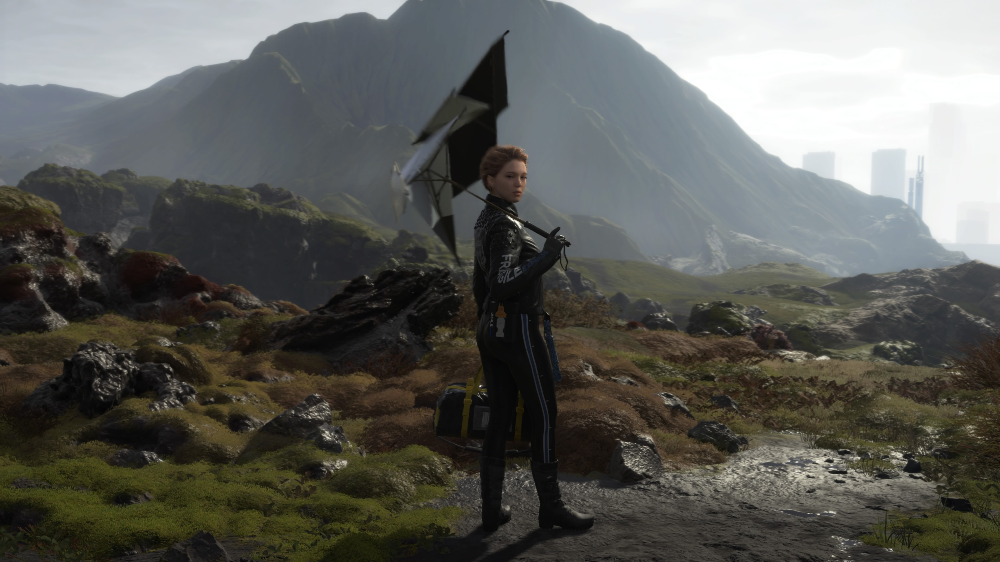
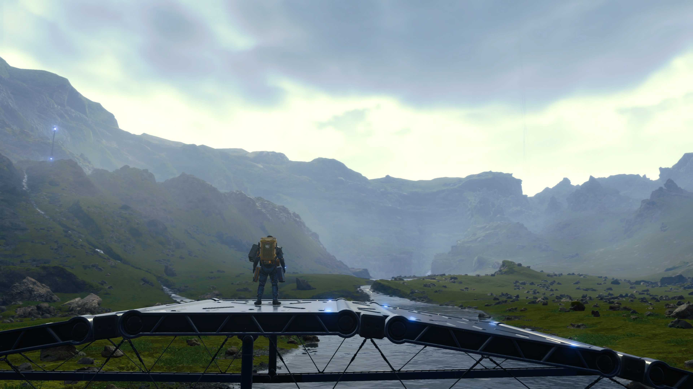
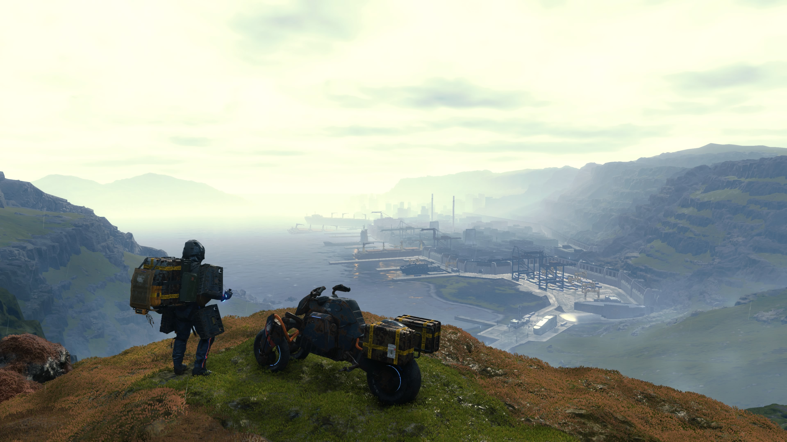
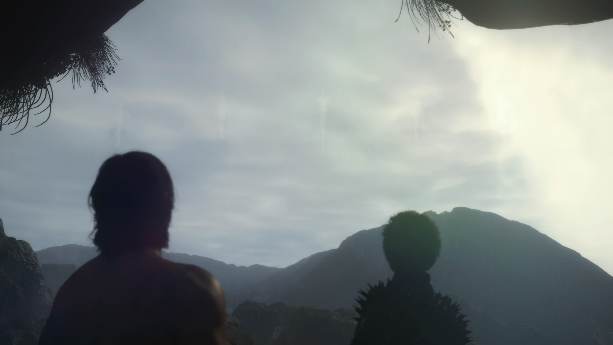
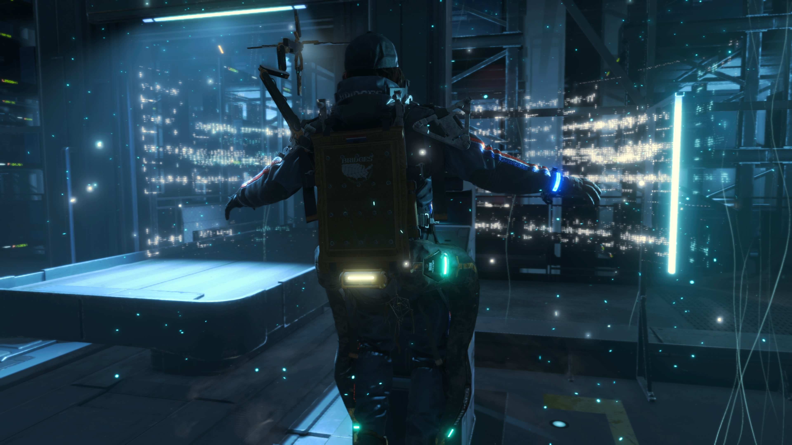
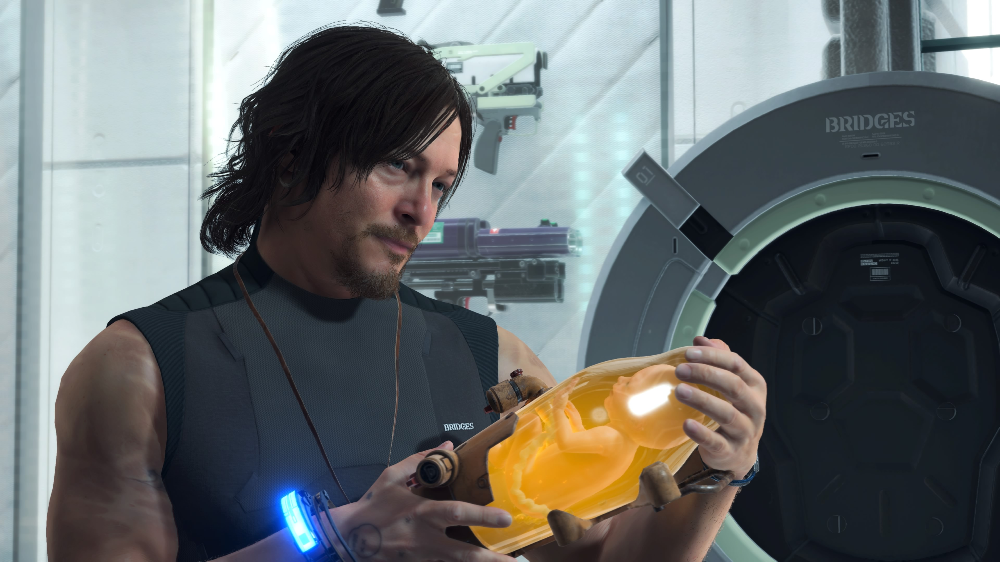
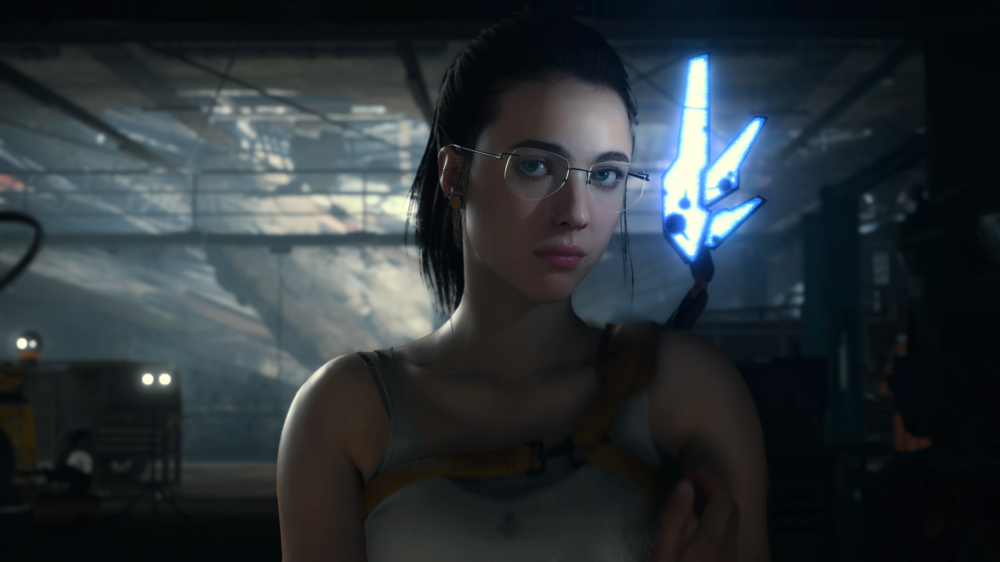
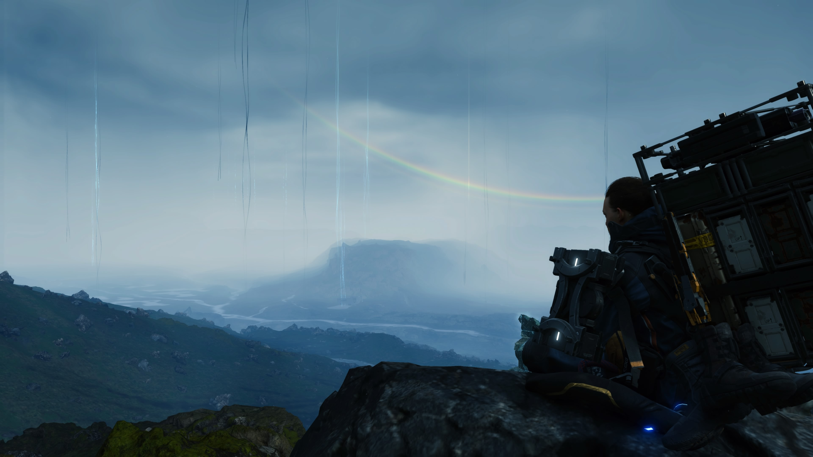
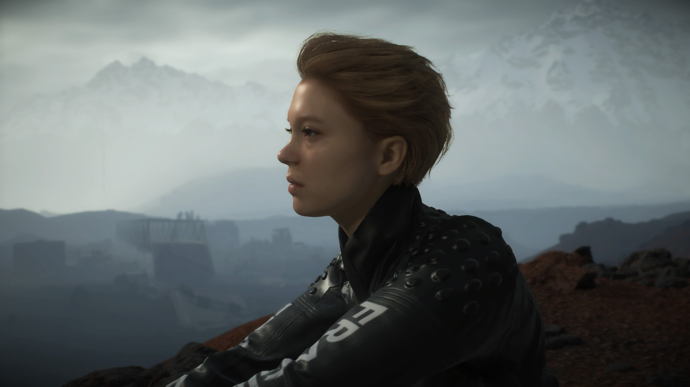

Les gens aiment dire que Death Stranding est mal écrit... Mais pff... Je ne suis pas d'accord ?

Est-ce qu'il est ridicule et mélodramatique ? Est-ce qu'il nous balance ses thèmes à la figure sans aucune espèce de subtilité ? Oui ! Mille fois oui !

Et est-ce que le tout fonctionne exactement comme prévu pour nous toucher et nous délivrer une expérience comme aucun autre jeu ? Je crois bien que oui.

Le jeu a bien sûr des faiblesses en termes de gameplay et surtout d'histoire, mais rien de majeur... D'autant plus qu'il a l'avantage d'être en compétition directe avec les jeux vidéo, non pas le cinéma, sinon certains défauts seraient un peu plus difficiles à accepter. Mais bon ! L'important c'est qu'il sonne vrai, honnête.

Comme beaucoup l'ont déjà dit, c'est une grande leçon qui nous apprend comment donner du sens à un open world en rendant le voyage, dans son sens le plus concret de parcours, intéressant en lui-même. Mais c'est aussi un jeu empli d'émotion, qui aborde des thèmes rarement osés dans les AAA et tout en justesse. En fait, c'est une expérience tellement unique qu'il me paraît miraculeux qu'elle nous soit arrivée en aussi bon état.

Il faut dire que le jeu vidéo en est à un stade où arriver à réellement transmettre quelque chose, quoi que ce soit, est chaque fois un triomphe. Nous explorons encore comment communiquer par le jeu, et dans ce contexte, Kojima comprend comment partir des modèles standards et accessibles pour exprimer des idées puissantes.

On retrouve dans Death Stranding, sous une autre forme, ce qui était marquant dans MGS2 et qui l'a rendu culte : le jeu a une aura prophétique, comme un avertissement venu d'une autre dimension. Je n'ai pas besoin de vous expliquer l'ironie et surtout la magie de jouer à ce jeu un an après sa sortie, pendant le confinement. Death Stranding contient une résonnance émotionnelle et esthétique qui appartient aux œuvres d'art les plus touchantes.

 

 

 

 

Il est également joyeusement pourvu d'éléments étranges, étonnants, voire kitsch, que le public a pu trouver embarrassants ou inintéressants. Pourtant, les moments les plus marquants de l'expérience tournent autour de ces éléments, vecteurs du message de l'auteur qui me paraît profondément honnête dans son choix de sujets, surtout quand on le connaît un peu : la solitude, la difficulté à former des connexions avec les autres, la sensation de passer à côté de la vie, la maladresse...

Kojima semble aussi bien vouloir nous marteler ces thèmes en plein visage que les brouiller par son histoire rocambolesque. Des concepts et nouveaux termes sans rapport apparent sont jetés à tout va avec une nonchalance déconcertante. Death Stranding devrait être un carambolage de métaphores contradictoires, une histoire illogique sans fondations, mais contre toute attente, ce n'est pas le cas -- la plupart du temps. Le jeu est thématiquement cohérent, clair, et présente un monde aux règles crédibles qui cimentent son sujet. Chaque mot-clé prend tous les sens qu'il peut avoir en même temps et se fond dans les mécaniques du jeu pour prendre vie.

> It’s a funny word ‘strand’. A strand is part of rope or bond while ‘stranding’ means being washed up on the shore, and ‘being stranded’ is when you can’t go home. I’m stranded now, Sam.

> I'm Fragile. But I'm not that fragile.

 

 

 

Alors bien sûr, c'est effectivement assez mal écrit parfois. Les textes d'exposition sont inutilement lourds et malgré cela, certains concepts sont survolés dans les dialogues et nécessitent de lire les logs pour mieux les comprendre. Mais comment peut-on dire que cela rend le jeu mauvais quand Kojima affiche dans de nombreuses scènes un tel niveau de maîtrise et de raffinement de son art ?

Moi je vous le dis, le vrai sujet c'est que la sincérité est sous-estimée et mal comprise dans la narration moderne, surtout dans les grosses productions. Comme si passer par quatre chemins pour nous raconter les choses était un gage de qualité. A l'inverse, chez Kojima comme dans beaucoup de productions japonaises, il faut rentrer dans un certain état d'esprit permettant d'accepter l'enchaînement de scènes sérieuses et de blagues ridicules. Je n'essaie pas d'excuser son écriture ni de dire que le jeu est un nanar. Que l'on soit prêt à l'accepter ou non, l'auteur savait exactement ce que représentait chaque scène, donc il les a écrites comme elles devaient l'être. Les dialogues sont souvent bidons, mais c'est un jeu aussi sincère que possible.

Je pense notamment aux missions où l'on doit porter des humains, qui sont vraiment mémorables. La mise en scène, le paysage, la musique, les sensations de jeu... tout nous fait comprendre l'importance de la tâche et appelle à notre sens des responsabilités. On approche solennellement la mission et on brave les environnements à deux.

Dans l'océan de jeu narratifs qui se complaisent dans la misère et la souffrance, peut-être parfois par intention mais le plus souvent par facilité, Death Stranding brille par sa capacité à exprimer une vision plus complète de l'expérience humaine, sombre mais pleine d'espoir. Il exprime la beauté d'un corps qui travaille, le bruit des bottes contre la terre, la fatigue, les muscles éreintés, une nuit de repos dans un abri de métal, avant de repartir. Il nous offre un instant de grâce quand, arrivé en haut de la montagne, la musique se lance et le panneau d'un inconnu nous dit que l'on va y arriver. Il comprend ce qu'est vraiment la vie ; ce combat quotidien contre des difficultés qui semblent impossibles à surmonter, la futilité de tout ça, mais aussi la valeur de l'espoir et la volonté de survivre, de grandir. Et comment cela vainc tout.

Il s'agit de l'une des expressions les plus sincères et profondes d'une expérience humaine dans un jeu. Death Stranding parvient à capturer une émotion esthétique non seulement par la narration, mais aussi et surtout par l'interactivité. En cela, c'est un monument du jeu vidéo.

 

 

 

 

 

 

 

 

Images tirées de [imgur.com/gallery/mcqtdmf](https://imgur.com/gallery/mcqtdmf). Notez également que la _Director's Cut_ n'en a que le nom, le terme étant imposé par Sony et critiqué par Kojima lui-même dans un [tweet](https://twitter.com/HIDEO_KOJIMA_EN/status/1414442497401524224). Elle n'est vraiment pas terrible car elle ajoute du contenu superflu. Je vous conseille plutôt la version PS4 (en anglais !).

 

<!--

No one complains that characters in media have the most grounding names to the point that people basically refer to their characters by their actor names. Meanwhile each stranding character's name has at least one meaning and each one is unforgettable both in name and personality

I legitimately think the pushback is because of people who A) don't understand the concept of auteur theory and confuse auteur with artiste trying to take him down a peg, and B) because the game is not something we've seen before, so it's hard for people to process

I agree wholeheartedly. People see kitsch and interpret that as embarrassing or unearnest, and thus not having value. "Jar baby you carry around? Lol, that's stupid". Yet many of the game's best moments surround this and how it's handled. How people respond. And I think when you learn more about Kojima the earnestness really lands. His experience with loneliness and struggles to connect with people, or feel he's doing the right thing in forming relationships, is as real and empathetic as it gets. And Death Stranding is all this.

My big concern about the Big Game (tlou2) coming out today is an impression that people describe it as challenging because it shows content that is unpleasant, not because it gives us a way to grow. Challenging content is a way to cultivate spiritual and intellectual mass

Agreed. I'm only through the prologue. I like it. But it's also right on the nose with its emotional beats. They work, but not in the way Death Stranding does. Not yet, anyway. Like in Death Stranding you could be on the hike of a goddamn lifetime late in the game, your gear degraded, you're out of rope and ladders, and you cross a mountain and some stranger's shit is there to make the entire final stretch easy and it hits like a ton of bricks.

I think Death Stranding is challenging because it faces us with difficulty, with strain and stress, and it says "so. are you gonna be a better person now?" and we're like "yeah... yeah, you're right." If I'm just watching ugly shit, why do I care?

---

C'est un débat que j'ai parfois avec mes amis. Kojima est-il un génie ou péniblement sur-côté ? Écrit-il avec un talent unique ou plutôt comme un enfant ? Est-ce un professionnel du fanservice ou bien est-il notoirement incapable de respecter son public ? À chaque fois, tout le monde a un avis différent, certains sont tranchés, d'autres pensent qu'il est un peu toutes ces choses à la fois.

Être particulièrement vigilant quand je vais traiter les avis d'Internet sur la scène Mario et Peach parce que même s'ils y ont trouvé quelque chose de deep moi sur le moment et toujours après coup, j'étais vraiment saoulé que le jeu ait actuellement été Mario et Peach...

Kojima tends to be divisive because his games tend to have a gritty, realistic tone complete with anti-war, anti-capitalist messaging, while also indulging in some silly cartoon style antics. Does something have to maintain a single tone throughout? No. But it’s a lot harder to go in several tonal directions without completely bringing the house down. And I’d say that Kojima’s own track record is kind of mixed: his strengths are his weaknesses as a writer.

-->
