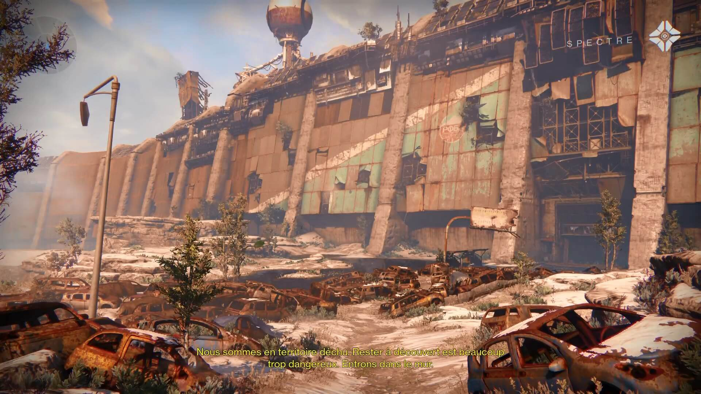
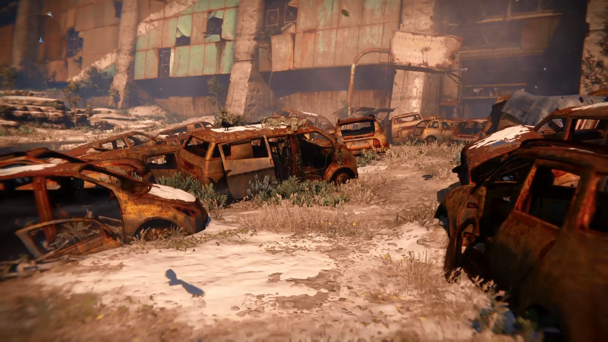
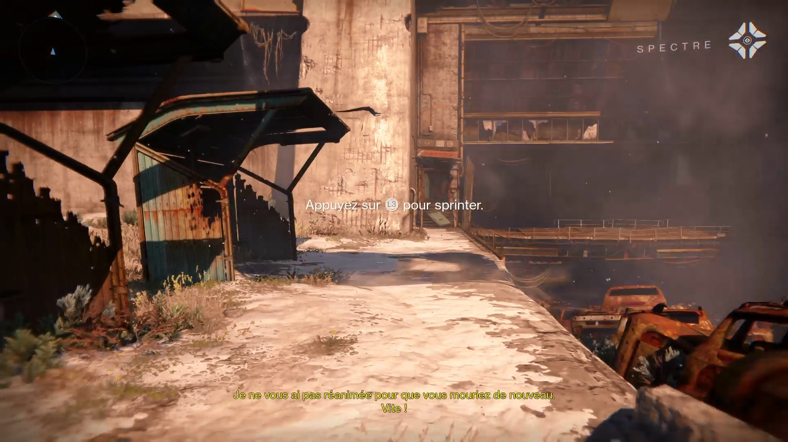
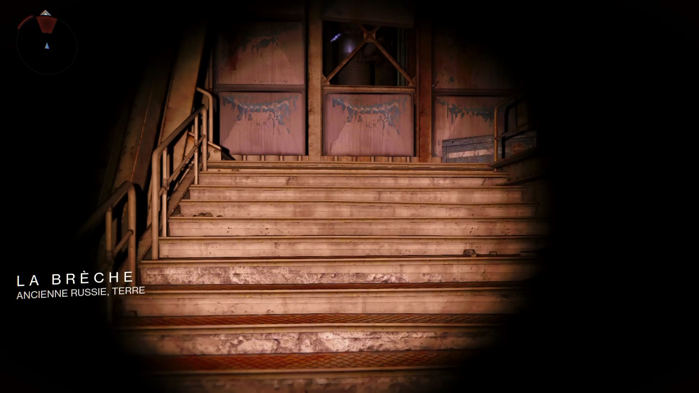
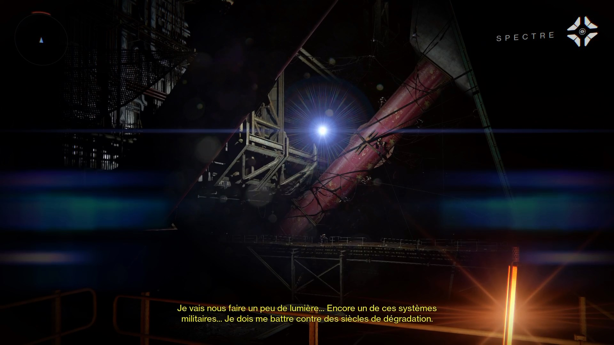
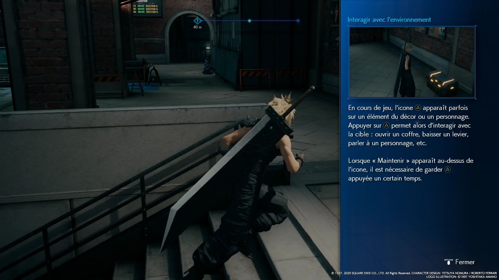
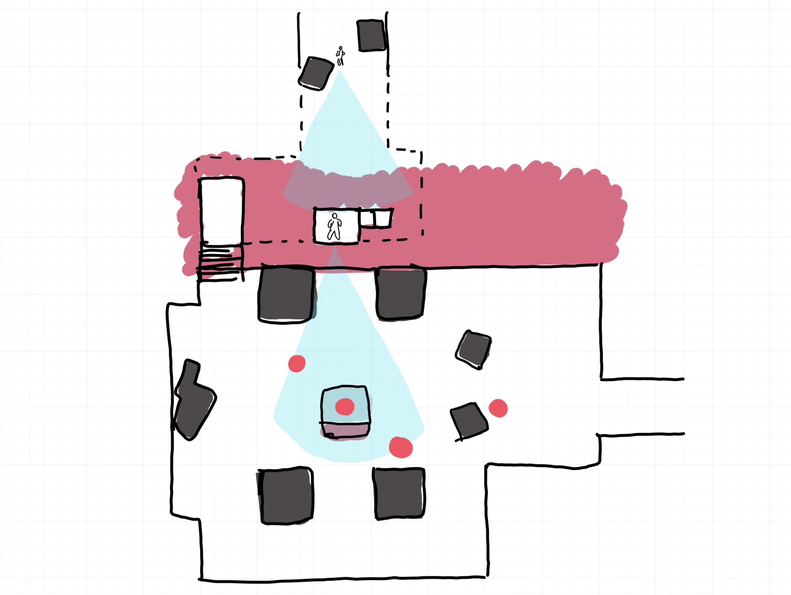
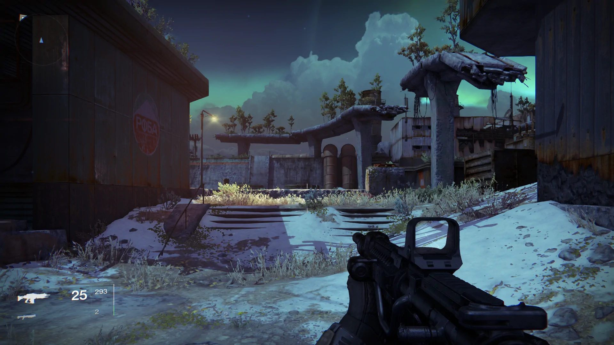
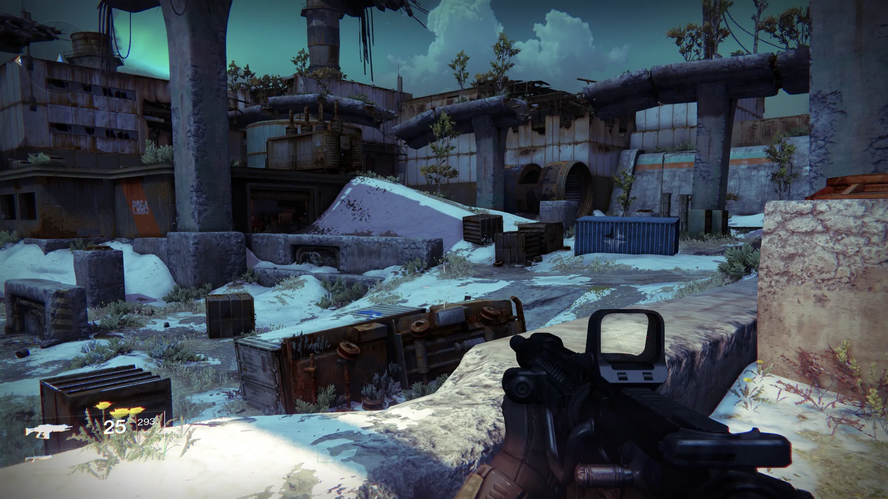
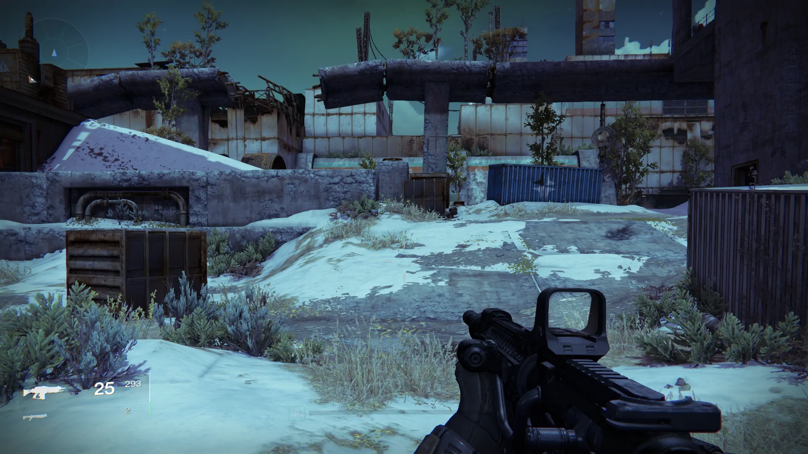

Destiny est un FPS sorti sur consoles en 2014 et dont vous avez sans doute déjà entendu parler, d'abord en raison de son budget com' et puis parce que c'est un jeu important : il a, sous bien des aspects, influencé l'industrie du jeu vidéo. Quand je l'ai découvert, j'ai été impressionné dès l'introduction, qui me fascine encore aujourd'hui. A vrai dire, c'est peut-être mon moment de jeu vidéo préféré.

Il y aurait bien des louanges à faire pour tout ce qui constitue le premier contact du jeu --- même le menu de téléchargement est mémorable --- mais nous allons ici nous concentrer sur le design du niveau d'introduction. En une quinzaine de minutes, il jongle avec aisance entre les éléments du cahier des charges, arrivant aussi bien à nous plonger dans l'univers, à nous expliquer le gameplay et à nous faire vivre tout un panel de sensations que nous retrouverons plus tard dans le jeu. A la fin, on est captivé et on ne demande qu'à en voir plus.

Pour mieux comprendre ce niveau, je l'ai fait essayer à plusieurs personnes, notamment des débutant·e·s n'ayant pas du tout l'habitude des FPS et étant intimidé·e·s à l'idée de devoir manier deux joysticks. Malgré leur forte appréhension, cette introduction parvient toujours à les mettre en confiance : même si vous êtes une quiche avec une manette, vous aurez l'impression d'avoir accompli quelque chose de cool, et c'est précisément cela que j'aimerais étudier dans cet article. Vous n'aurez pas vraiment l'impression de suivre un tutoriel artificiel, mais bien de déjà vivre votre aventure --- votre _légende_, comme le dit le slogan du jeu.


Notez que ce niveau d'introduction a ensuite été réutilisé dans Destiny 2, mais quelques changements rendent l'expérience moins élégante et moins efficace, donc nous ne nous attarderons pas dessus. Egalement, j'accorderai « le joueur » au masculin pour faciliter la lecture et vous prie de m'excuser pour toute gêne occasionnée.


## Cinématique d'exposition

Avant de commencer, si vous souhaitez vous mettre dans l'ambiance, je vous mets ici la vidéo qui se joue au tout début, juste après la création de votre personnage, et qui expose l'univers. C'est fait à la sauce Destiny, donc c'est assez... flou. Mais c'est très joli.





Dans la scène sur Mars, j'ai trouvé les variations de couleur très intéressantes. Pour moi, cela accompagne les jump cuts (les sauts dans la vidéo) pour évoquer le passage du temps, les ellipses durant le voyage des trois astronautes. Cela donne aussi une impression de filtre « vieux film » en plus onirique, comme si la scène était le souvenir d'une époque passée --- ce qui est pour le moins à propos puisque la scène suivante nous présente des épaves de voiture qui semblent être là depuis un bon bout de temps.

Le début du jeu se déroule dans un ancien cosmodrome, situé sur ce territoire autrefois appelé Russie :





C'est bon, la partie peut commencer ! Comme j'ai quelques centaines d'heures sur Destiny au compteur, je pourrais expédier très rapidement les combats de ce niveau, mais je vais tenter de jouer moins méthodiquement et précisément, pour simuler ce que ferait quelqu'un qui découvre le jeu. Gardez tout de même en tête qu'un vrai débutant ne serait pas aussi efficace, ce qui n'est pas bien grave puisque l'introduction est faite pour ça, comme je vous le disais --- cela ne ferait que rendre les affrontements plus dramatiques.

## Analyse étape par étape

### Entrée dans le mur

Pendant les deux premières minutes, nous n'avons pas d'arme et nous contentons de suivre le chemin en nous imprégnant de l'ambiance. Par les dialogues, les sons et les indications visuelles, le jeu donne un rythme relativement soutenu malgré un environnement plutôt reposant.





Le mur donne beaucoup de caractère au décor, et c'est aussi un bon point de repère : le grand renfoncement, très sombre, dessine comme une porte nous invitant à l'explorer. Comme le niveau commence sur une pente descendante, on peut garder un oeil sur l'objectif tout en regardant où l'on marche. Il y a un certain sentiment d'urgence, communiqué par le Spectre et par le level design qui dessine un couloir net avec le chemin et les voitures.


  


Une fois en bas, une ouverture nous invite à apprécier la vue, puis le chemin continue, délimité par les abris et le sol clair, jusqu'à la petite entrée que l'on remarque finalement assez tard.

La scène suivante attire notre attention sur le fonctionnement du radar, qui clignote en rouge sur un fond totalement noir en raison de l'obscurité ---  c'est plutôt malin. Le jeu nous tease la présence d'ennemis de façon graduelle : on commence par en entendre quelques-uns se balader dans les conduits autour de nous, avant de se rendre compte qu'ils sont en fait beaucoup plus nombreux qu'on ne le pensait...


 


Pendant que le Spectre remet le courant, le jeu nous laisse le contrôle de la caméra mais s'assure que l'on sache où regarder si l'on veut voir l'action. Au début, il fait complètement noir, à l'exception du Spectre et d'un néon orange au sol qui nous permet de ne pas être désorientés. Ensuite, les lumières s'allument progressivement, accompagnées de bruit localisés, ce qui nous laisse le temps de nous retourner pour la révélaton de l'armée de Déchus. Un son de grille et le mouvement du Spectre nous avertissent alors de l'ouverture d'un passage sur la droite.

### Premiers affrontements

On s'enfonce un peu plus loin dans la structure pour récupérer notre première arme : le bon vieux Khvostov. En regardant à travers sa mire abîmée, on comprend qu'il a connu d'autres combats il y a bien longtemps. Mais pas le temps d'y réfléchir : ni une ni deux, un premier ennemi se dresse devant nous.





Cette dernière séquence est vraiment géniale. A peine avez-vous le temps de lire « Appuyez sur R1 » et de regarder votre manette pour poser le doigt dessus, que pile à ce moment-là, un ennemi surgit de nulle part dans un bruit inquiétant. Par réflexe, vous appuyez sur la touche, et voilà : vous avez fait votre premier frag de mêlée, sans même vraiment y penser, comme si la manette était déjà une extension de votre esprit --- alors que nous ne sommes que dans le tuto ! Ça marche à tous les coups et c'est vraiment satisfaisant.

Au cours de ce tutoriel, toutes les touches sont indiquées par de grands textes au milieu de l'écran. Malgré ce qu'on pourrait penser, ils ne sont pas intrusifs car ils ne coupent pas le déroulement du jeu et n'empêchent pas de voir ce qu'il se passe derrière. De plus, ils sont faciles à lire car très courts, étant donné que les actions se passent d'explications : on comprend tout de suite leur intérêt par le contexte. Enfin, fermer le texte est naturel puisqu'il suffit d'essayer l'action, ce qui est bien plus intuitif que les nombreux jeux où il faut d'abord fermer la fenêtre explicative puis se souvenir de l'action à réaliser.

Rencontre suivante :





C'est amusant de voir à quel point tous les méchants de l'intro font des entrées en scène dramatiques. Bien sûr, cela paraîtrait très artificiel si cela arrivait aussi souvent dans la suite du jeu, mais comme à ce stade, le moindre ennemi nous émeut, cela fonctionne très bien.

Le joueur arrive dans l'arène depuis une position en hauteur. C'est un procédé qui sera utilisé plusieurs fois au cours de l'introduction, car cela nous permet de mieux appréhender la situation. On a une meilleure vue d'ensemble du niveau, on est dans une position relativement sûre et on peut choisir quand on souhaite entrer dans le combat. Cette arène utilise d'ailleurs énormément le contrôle de notre champ de vision pour guider l'action. Je vous ai fait un schéma pour mieux vous expliquer :

Dans le couloir qui mène à l'arène, les deux obstacles sur le côté ont deux fontions : ils brisent la monotonie visuelle et nous forcent à nous placer au milieu. Pendant qu'on passe entre les deux, le champ de vision est resserré et on se concentre sur l'entrée dans le mur, juste en face. A vrai dire, nous sommes si concentrés sur cette entrée que nous ne remarquons même pas l'autre porte disponible sur notre droite, moins éclairée. Le jeu contrôle tellement bien l'action que je n'avais jamais réalisé son existence avant de dessiner ce schéma.

Les 3 rebuts apparaissent devant nous alors que le vandale est caché par des obstacles et plus éloigné que les autres. On le verra en dernier, et c'est aussi probablement celui que l'on tuera en dernier. Comme par hasard, il est juste devant le pont que nous devons emprunter ensuite ! Ainsi, on peut continuer à explorer sans chercher son chemin et on reste dans le rythme. Placer les ennemis près de la sortie du niveau est une pratique fréquente dans beaucoup de jeux, mais c'est particulièrement remarquable dans cette intro, où tout est fait pour que l'on n'ait pas à l'idée de tergiverser.

Le recul du Khvostov est difficile à contrôler, ce qui apporte aux affrontements un chaos aussi dramatique que satisfaisant, et puis cela permet de faire relativiser les mauvais joueurs : si l'arme est aussi imprécise, alors je ne dois pas avoir besoin de savoir viser. A ce sujet, vous remarquerez que plus on avancera dans l'intro, plus les ennemis apparaîtront depuis une position éloignée.





Ici, on peut obtenir au hasard soit un sniper, soit un fusil à pompe. Juste après, le jeu nous présente un long couloir tout droit avec un ennemi qui apparait au fond. Avec le sniper, c'est comme si le jeu nous disait « amuse-toi » : l'ennemi apparaît pile dans le viseur. Par contre, on est plutôt impuissant dans cette situation avec le fusil à pompe, mais ce n'est pas grave : deux ennemis apparaissent peu après juste devant nous pour nous plonger dans le combat quoi qu'il arrive.

La composition de l'arène suivante, avec le grand drapeau et les murs en V, a quelque chose de particulièrement mémorable.





Les ennemis vont utiliser les piliers à droite comme couverture --- la partie gauche de l'arène n'est au final pas exploitée --- ce qui vous attire vers la sortie, d'où viennent encore d'autres ennemis. Vous voyez pourquoi je disais que le jeu redouble d'efforts pour que l'on ne perde jamais son chemin. L'affrontement étant généralement plus long et chaotique pour un débutant, le procédé paraît normalement plus subtil.

Le couloir suivant est une sorte de SAS, dans lequel on peut prendre le temps d'apprécier le décor et laisser la tension redescendre, avant de retrouver l'air frais du monde extérieur et d'observer une nouvelle mise en scène au loin.





Cette séquence me rappelle quand j'étais enfant et que mon ophtalmologiste me demandait de suivre la petite lumière. La fusée éclairante va d'abord lentement en haut à gauche, puis le vaisseau retourne en bas à droite, au niveau de cette sorte d'arche qui nous invite à la traverser --- un classique. On pourrait théoriquement passer plus de temps à regarder le ciel pour voir un gros vaisseau passer au-dessus de notre tête, mais la plupart des gens avanceront au même rythme que moi.





On ne s'en doute pas en découvrant le jeu, mais cette scène en extérieur se déroule en fait dans une section de l'open world, que l'on pourra revisiter à loisir un peu plus tard. Quand on vient de passer l'arche, on pourrait donc partir à droite pour découvrir une autre zone, mais en réalité on ne remarque même pas le passage, d'une part parce que les ennemis nous attirent vers l'avant, et d'autre part parce qu'il est en pente montante, ce qui obstrue notre champ de vision. De plus, il est jonché d'obstacles qui pourraient s'apparenter à une simple barrière si on n'y regarde pas de plus près.


  


Dans cet espace bien plus ouvert, on affronte plusieurs ennemis en combat rapproché pendant que d'autres nous ciblent au sniper. Le combat étant plus lent si vous débutez, c'est probablement ici que vous remarquerez pour la première fois qu'il est possible d'esquiver les tirs ennemis --- une mécanique essentielle de Destiny.

A la fin, l'espace de jeu se resserre et plusieurs ennemis apparaissent en même temps, augmentant la tension d'un cran. Alors qu'on tue le dernier, notre soulagement est sublimé par une animation jouissive de _level up_. Un vrai plaisir.

### Tutoriel de _level up_

Un message nous informe que l'on peut débloquer une compétence en allant dans le menu.





Souvent, les tutoriels dans les menus interrompent le rythme du jeu, mais ici, il arrive à un moment idéal. Après la suite d'affrontements de plus en plus intenses, suivi de l'animation de level up comme récompense, la tension retombe enfin et c'est avec plaisir que l'on prend le temps de respirer un coup, et de comprendre ce que nous avons gagné.

On dit souvent que la plupart des joueurs détestent lire de longs textes, et c'est d'autant plus vrai quand, comme ici, ils pourraient passer du temps à tuer des aliens à la place. Cela dit, on sait aussi que tout le monde adore débloquer des choses au niveau suivant. Dans le cas de Destiny, on peut tout à fait ignorer le texte explicatif puisque les éléments avec lesquels interagir sont suggérés par un clignotement bleu. Cela peut sembler être un choix anodin, mais beaucoup de jeux auraient à la place obscurci tout le reste de l'écran pour ne garder visible que la case qu'il faut utiliser, tout en affichant le satané texte explicatif en plein milieu. C'est une solution maladroite puisqu'elle désoriente le joueur et est bien trop restrictive : ce qui aurait pu donner l'impression d'explorer un menu devient alors une corvée. Destiny montre que l'on peut très bien faire confiance au joueur et le laisser explorer le reste du menu s'il le souhaite --- et s'il est impossible de lui faire confiance, c'est peut-être un signe que le menu devrait être clarifié.



Le jeu attend que nous soyons sortis du menu pour jouer un petit dialogue du Spectre qui nous recadre en nous donnant un objectif. C'est un petit coup de boost bien senti pour relancer la motivation alors que la tension est au plus bas. Et puis, nous venons de débloquer la grenade. On a qu'une envie, c'est de l'essayer ! Justement, un petit groupe de Déchus inattentifs nous attend deux pas plus loin.





Beaucoup de joueurs n'arriveront pas à lancer la grenade correctement du premier coup, d'autant plus que selon la classe, certaines grenades peuvent être difficiles à utiliser. C'est un peu frustrant mais ce n'est pas très grave : dans le combat suivant, le jeu nous rappellera d'utiliser la grenade pour retenter notre chance. Notez comment on pouvait observer les ennemis dans une relative sécurité à travers les fenêtes. C'est une autre façon de nous laisser le contrôle quant au début des hostilités.

### Combat final





C'est la première fois que nous rencontrons un ennemi avec un bouclier ! Dans Destiny, les boucliers se régénèrent si on ne touche pas leur porteur pendant un certain temps. En soi, c'est un adversaire assez facile à tuer, mais il est suffisamment intimidant pour un débutant, et son titre de Capitaine lui donne des allures de mini-boss entouré de larbins. Leur positionnement de départ est particulièrement intéressant : ils ne sont pas simplement placés dans l'arène, mais bien sur le vaisseau. Ainsi, ce dernier n'est pas relégué au rang de simple élément de décor que l'on pourrait oublier, parce que la mise en scène lui donne une vraie consistance physique.



Au début, les trois ennemis paraissent tout à fait abordables, ce qui nous attire au centre de l'arène. Mais ils sont bien vite rejoints par cinq ou six collègues qui nous forcent à nous replier. Nous avons à droite un espace relativement sûr --- et en hauteur ! --- les ennemis ayant plutôt tendance à se couvrir à gauche. C'est là aussi à nous de déterminer quand nous souhaitons retourner taper dans le tas. Nous sommes ensuite récompensés par une cinématique que je vous laisse regarder.





## Conclusion

Cette intro est brillante grâce à un ensemble de petites attentions qui rendent l'expérience très fluide. Pour nous accrocher, le jeu n'a pas eu besoin d'employer des moyens grandiloquents avec des grosses explosions et des cinématiques renversantes. Il y a bien sûr un tas de petites animations uniques, mais qui restent toujours dans une certaine retenue, une simplicité que l'on retrouve dans le reste du jeu et qui fait sans doute partie de sa philosophie.

Cette sobriété traduit, selon moi, la confiance du studio dans son oeuvre. En nous laissant le contrôle de l'action sans interruption, l'introduction laisse le gameplay se révéler librement, et formule la promesse que le jeu saura présenter de belles ambiances, raconter son univers et son histoire, sans pour autant avoir besoin de nous retirer le contrôle. Une promesse qui sera bel et bien respectée tout au long du jeu, ce qui force le respect.

C'est pour cela que j'ai écrit cet article : je trouve inspirante la mentalité du studio et le fait que leur recette soit aussi accessible. Plutôt que de céder à la surenchère, l'équipe de Destiny a su utiliser des ingrédients simples mais distillés avec justesse. Le tout est porté par un enjeu principal --- trouver un vaisseau --- très malin puisqu'il résonne au fond de nous, dans notre âme d'enfant. Alors que vous reprenez ce vieux vaisseau des mains de l'ennemi, que vous l'allumez pour la première fois et vous envolez vers l'horizon dans une musique épique, il est impossible de ne pas être ému et sourire comme un gosse. La suite de l'aventure n'attend que vous.
