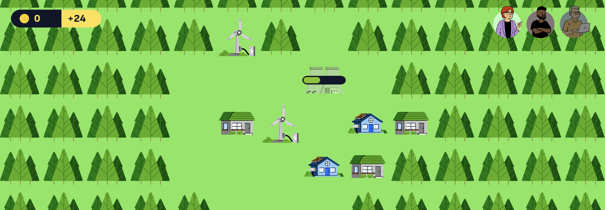
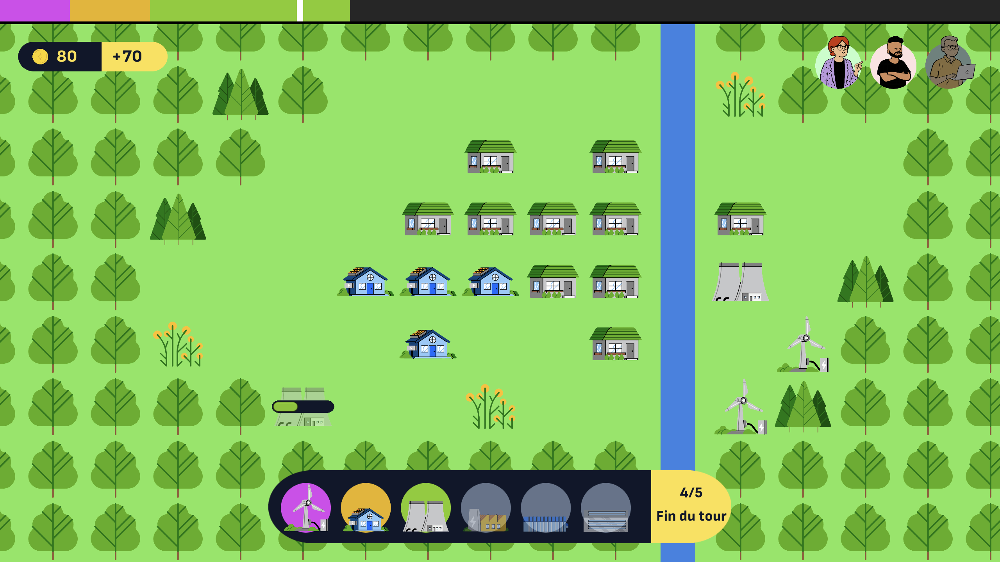
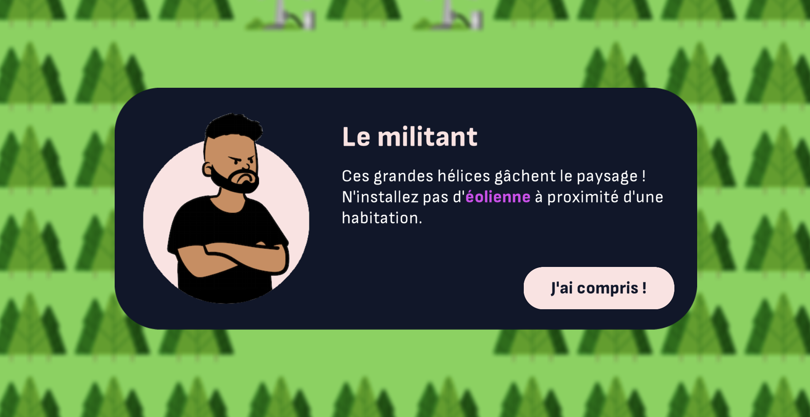

PowerUp est un jeu de gestion minimaliste dans lequel vous devez alimenter la ville en électricité de manière écologique. Votre mission ne sera pas simple, car vous devrez répondre aux exigences des acteurs locaux qui ont chacun une idée bien précise de ce qui serait bon pour la ville…

## Un sujet souvent oublié

Si, dans les _city-builders_[^city-builder] modernes, il est souvent demandé de produire de l'électricité à l'aide de différentes centrales, de nombreuses problématiques intéressantes liées au réseau électrique sont mises sous le tapis. Par exemple, dans _[Cities: Skylines](https://www.paradoxinteractive.com/games/cities-skylines/about)_, il faut faire attention à la pollution des sols et la pollution sonore, mais d'autres sujets majeurs de la transition énergétique ne sont pas représentés, notamment la **stabilité du réseau** et le fait que certaines énergies sont **intermittentes**[^intermittence]. Cette notion, peu abordée à l'école, est pourtant cruciale pour comprendre les défis d'une transition énergétique réussie.

[^city-builder]: Jeu de construction et de gestion d'une ville.
[^intermittence]: Ainsi, dans la vraie vie, il serait impossible d'être écolo en remplaçant toute notre production par des champs d'éoliennes, car elles ne peuvent pas produire d'énergie en continu ! Il faut forcément compenser avec des **sources d'énergie pilotables** comme le nucléaire.

Ces questions n'ont peut-être pas leur place dans _Cities: Skylines_, mais il me semblait facile de les traduire en mécaniques dans un jeu dédié. En fait, le concept me paraît si naturel qu'il ne m'a pas quitté depuis que nous l'avons suggéré dans une vidéo pour Game Dev Alliance[^vidéo]. Quand j'ai dû réaliser un serious game dans le cadre de mes études, j'ai sauté sur l'occasion pour produire ce prototype, *PowerUp* !

[^vidéo]: « [Peut-on jouer aux jeux vidéo et être écolo ?](https://www.youtube.com/watch?v=pXkEx7iBvEo) » écrit par [Goulven Clec'h](https://goulven-clech.dev) et réalisé par [Aurélien Dos Santos](https://aureliendossantos.com), Game Dev Alliance sur YouTube, 28 décembre 2021

## Le jeu vidéo, outil de choix pour représenter la transition énergétique

Il existe plusieurs manières de penser le jeu vidéo, mais considérons ici que c'est un **système de règles et de variables** avec lequel le joueur peut expérimenter. D'après cette conception, le jeu vidéo est tout indiqué pour **représenter un système du monde réel** via son gameplay : jeu de gestion de ville, jeu d'apprentissage d'une langue, etc.

Après avoir étudié les jeux existants sur le thème de l'écologie, j'ai identifié deux approches possibles :

- Aborder le développement durable au sens large, comme le fait _[The Climate Game](https://ig.ft.com/climate-game/)_ sous la forme d'un jeu textuel aux variables simplifiées, en mettant l'emphase sur les enjeux sociaux et politiques.
- Représenter un domaine précis de la transition énergétique, à une échelle locale, afin de représenter des enjeux techniques et d'infrastructure de manière plus précise.

La deuxième approche me séduit car elle implique de concevoir de véritables mécaniques de gameplay et met en valeur la spécificité du jeu vidéo dans la représentation d'un système. De plus, les sujets intéressants ne manquent pas dans le domaine de l'écologie. Je me suis arrêté sur un thème qui me semble important d'éclaircir avec pédagogie : le **mix électrique**. Le sujet anime de grands débats politiques et fait l'actualité, puisqu'en fin 2022, les médias évoquaient la possible instabilité du réseau électrique français pour les hivers à venir.

Il est d'ailleurs important, même dans un jeu au sujet technique, d'apporter une dimension politique et sociale permettant de prendre du recul et de créer le débat en classe. C'est pourquoi le joueur rencontrera trois acteurs locaux ayant chacun des exigences bien particulières :

- **Le militant.** _Il est bien intentionné mais campe trop sur ses positions, qu’importe qu’elles soient justes ou non. Respectez ses contraintes si vous ne voulez pas faire la une des réseaux sociaux !_
- **Le banquier.** _Un projet de transition énergétique ambitieux ? Cet aventurisme ne le rassure pas… sauf si vous remplissez ses garanties financières bien sûr._
- **La politique.** _La transition énergétique, elle trouve ça cool, mais ce qu’elle trouverait encore plus cool, c’est que vous remplissiez les promesses qu’elle a tenues pendant la campagne électorale !_

Vous l'aurez compris, ces personnages sont l’occasion de critiquer avec bienveillance trois types de mauvaises postures face au changement climatique.

Pour mener à bien ce projet, j'ai été aidé par mon fidèle ami [Goulven](https://goulven-clech.dev/) qui m'a beaucoup inspiré sur les différents moyens de transformer les problématiques environnementales en mécaniques de jeu. Après avoir mis au point le design ensemble, j'ai programmé le tout en une grosse semaine -- le fameux rush des projets scolaires !

Je serais ravi d'étendre le jeu au sein d'une structure pro, car les idées pour la suite ne manquent pas ! De plus, le contexte pour qu'un tel jeu soit apprécié me semble favorable. Ces dernières années, les programmes scolaires ont été renforcés sur la biodiversité et le climat. L'Éducation Nationale encourage une éducation transversale qui s'appuie sur toutes les disciplines, de la maternelle à la terminale. Les possibilités d'intégration d'une activité ludique sont donc nombreuses ! Ce jeu est pensé pour créer le débat en classe et trouverait facilement sa place dans un cours de SVT, de géographie ou d'éducation civique.
