<section>
	

		
			<label for="sn-0" class="margin-toggle">
				&#8853;
			</label>
			<input type="checkbox" id="sn-0" class="margin-toggle" />
			
				<strong>Table des matières</strong>  
				<a href="#versions-pc">Versions PC</a>  
				<a href="#consoles-de-salon">Consoles de salon</a>  
				<a href="#consoles-portables">Consoles portables</a>  
				<a href="#figures-majeures">Figures majeures</a>
				 
				 
			
		
	

	

		
			<label for="sn-1" class="margin-toggle">
				&#8853;
			</label>
			<input type="checkbox" id="sn-1" class="margin-toggle" />
			
				Cet article documente l’histoire de toutes les versions de RPG Maker. Pour choisir une
				version de RPG Maker adaptée à votre projet, consultez plutôt le
				<a href="https://wiki.gamedevalliance.fr/rpgmaker/comparatif/">comparatif</a> de Game Dev Alliance
				qui compare les critères pertinents à cet effet.
				 
				 
			
		
	

	

		RPG Maker est une série faisant partie de la gamme des Makers, originellement publiée par ASCII
		puis par Enterbrain à partir de 2001, les deux marques étant des filiales de Kadokawa, un
		conglomérat médiatique japonais.
	

	

		ASCII Corporation était à l’origine une maison d’édition produisant des magazines et des livres
		sur l’informatique, connue notamment pour la publication des RPG Maker et son rôle dans la
		création du MSX. Suite à des restructurations au sein de Kadokawa, c’est la filiale Enterbrain
		qui prendra le relais en 2001. Durant toute la période ASCII, RPG Maker n’a été commercialisé
		qu’au Japon, où la série est connue sous le nom RPG Tsukūru
		
			<label for="sn-2" class="margin-toggle sidenote-number"></label>
			<input type="checkbox" id="sn-2" class="margin-toggle" />
			
				Titre original : RPGツクール.
				 
				 
			
		.
	

	

		Tsukūru est un mot inventé combinant « tsukuru » (créer) et « tsūru » (outil) : « l’outil pour
		créer »
		<a href="#fn1" class="footnote-ref" id="fnref1" role="doc-noteref">
			1
		</a>. A l’époque où les logiciels n’étaient distribués qu’au Japon, le terme a parfois été
		confondu à l’étranger avec « sukūru » (école), ce qui amenait à traduire incorrectement RPG
		Maker en « RPG School ». La série des Tsukūru a proposé une variété d’outils moins connus au
		cours de son histoire : il y a eu des Makers de jeux de combat, de shoot’em up, mais aussi de
		composition musicale, de pixel art ou d’animation 3D !
		<a href="#fn2" class="footnote-ref" id="fnref2" role="doc-noteref">
			2
		</a>
	

</section>
<figure class="fullwidth">
	<table>
		<thead>
			<tr class="header">
				<th>Titre</th>
				<th>Plateforme</th>
				<th>Année</th>
				<th>Développeur</th>
				<th></th>
			</tr>
		</thead>
		<tbody>
			<tr class="odd">
				<td>
					<a href="#rpg-construction-tool-dante">RPG Construction Tool Dante</a>
				</td>
				<td>MSX</td>
				<td>1990</td>
				<td>ASCII</td>
				<td></td>
			</tr>
			<tr class="even">
				<td>
					<a href="#action-rpg-construction-tool-dante-2">Action RPG Construction Tool Dante 2</a>
				</td>
				<td>MSX</td>
				<td>1992</td>
				<td>ASCII</td>
				<td></td>
			</tr>
			<tr class="odd">
				<td>
					<a href="#rpg-tsukūru-dante-98">RPG Tsukūru Dante 98</a>
				</td>
				<td>PC-98</td>
				<td>1992</td>
				<td>ASCII</td>
				<td></td>
			</tr>
			<tr class="even">
				<td>
					<a href="#rpg-tsukūru-dante-98-ii">RPG Tsukūru Dante 98 II</a>
				</td>
				<td>PC-98</td>
				<td>1996</td>
				<td>ASCII</td>
				<td></td>
			</tr>
			<tr class="odd">
				<td>
					<a href="#rpg-maker-95">RPG Maker 95</a>
				</td>
				<td>Windows</td>
				<td>1997</td>
				<td>ASCII</td>
				<td></td>
			</tr>
			<tr class="even">
				<td>
					<a href="#sim-rpg-maker-95">Sim RPG Maker 95</a>
				</td>
				<td>Windows</td>
				<td>1998</td>
				<td>ASCII</td>
				<td></td>
			</tr>
			<tr class="odd">
				<td>
					<a href="#rpg-maker-2000">RPG Maker 2000</a>
				</td>
				<td>Windows</td>
				<td>2000</td>
				<td>ASCII</td>
				<td></td>
			</tr>
			<tr class="even">
				<td>
					<a href="#rpg-maker-2003">RPG Maker 2003</a>
				</td>
				<td>Windows</td>
				<td>2002</td>
				<td>ASCII</td>
				<td></td>
			</tr>
			<tr class="odd">
				<td>
					<a href="#rpg-maker-xp">RPG Maker XP</a>
				</td>
				<td>Windows</td>
				<td>2004</td>
				<td>Enterbrain</td>
				<td></td>
			</tr>
			<tr class="even">
				<td>
					<a href="#rpg-maker-vx">RPG Maker VX</a>
				</td>
				<td>Windows</td>
				<td>2007</td>
				<td>Enterbrain</td>
				<td></td>
			</tr>
			<tr class="odd">
				<td>
					<a href="#rpg-maker-vx-ace">RPG Maker VX Ace</a>
				</td>
				<td>Windows</td>
				<td>2011</td>
				<td>Enterbrain</td>
				<td></td>
			</tr>
			<tr class="even">
				<td>
					<a href="#rpg-maker-mv">RPG Maker MV</a>
				</td>
				<td>Windows, Mac, Linux</td>
				<td>2015</td>
				<td>Kadokawa</td>
				<td></td>
			</tr>
			<tr class="odd">
				<td>
					<a href="#rpg-maker-mz">RPG Maker MZ</a>
				</td>
				<td>Windows, Mac, Linux</td>
				<td>2020</td>
				<td>Kadokawa</td>
				<td></td>
			</tr>
		</tbody>
	</table>
</figure>
<section id="versions-pc" class="level1">
	<h1>Versions PC</h1>
	<section id="premiers-travaux" class="level2">
		<h2>Premiers travaux</h2>
		

			ASCII a distribué plusieurs éditeurs de RPG sans les intégrer à sa gamme des Tsukūru. Le
			premier d’entre eux est Dungeon Manjirou
			
				<label for="sn-3" class="margin-toggle sidenote-number"></label>
				<input type="checkbox" id="sn-3" class="margin-toggle" />
				
					Titre original : ダンジョン万次郎.
					 
					 
				
			, sorti dans le magazine LOGiN sur PC-8801 en 1987
			<a href="#fn3" class="footnote-ref" id="fnref3" role="doc-noteref">
				3
			</a>
			puis sur MSX en 1988
			<a href="#fn4" class="footnote-ref" id="fnref4" role="doc-noteref">
				4
			</a>
			, et qui permet de créer un labyrinthe à explorer avec une vue à la première personne. On peut
			choisir parmi différents types de murs, dessiner plusieurs étages, et mettre en place un
			système de RPG simple avec des équipements, des magies et des objets.
		

		<figure class="fullwidth">
			

				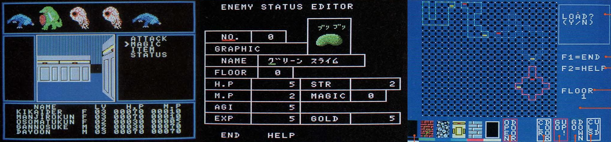
			

		</figure>
		

			
				<label for="sn-4" class="margin-toggle">
					&#8853;
				</label>
				<input type="checkbox" id="sn-4" class="margin-toggle" />
				
					Ci-dessus : Images de Dungeon Manjirou.
					 
					<em>MSX Magazine</em>, novembre 1988 (
					<a href="https://archive.org/details/MSX_Magazine_1988-11_ASCII_JP/page/n105">archive</a>)
					 
					 
				
			
		

		

			Vint ensuite Mamirin
			
				<label for="sn-5" class="margin-toggle sidenote-number"></label>
				<input type="checkbox" id="sn-5" class="margin-toggle" />
				
					Titre original : まみりん.
					 
					 
				
			, sorti sur PC-8801 en avril 1988
			<a href="#fn5" class="footnote-ref" id="fnref5" role="doc-noteref">
				5
			</a>. Il est difficile de trouver des informations à son propos.
		

		

			Plus tard, pendant la période du PC-98, d’autres logiciels similaires seront publiés par ASCII
			sans être intégrés à la série des Dante ou des RPG Maker, notamment Chimes Quest
			<a href="#fn6" class="footnote-ref" id="fnref6" role="doc-noteref">
				6
			</a>
			en 1992 et Dungeon RPG Tsukūru Dan-Dan Dungeon
			<a href="#fn7" class="footnote-ref" id="fnref7" role="doc-noteref">
				7
			</a>
			en 1994.
		

	</section>
	<section id="rpg-construction-tool-dante" class="level2">
		<h2>RPG Construction Tool Dante</h2>
		

			Le premier logiciel de la série Dante sort en 1990 dans l’édition de février de
			<em>MSX Magazine</em>
			<a href="#fn8" class="footnote-ref" id="fnref8" role="doc-noteref">
				8
			</a>
			, un mensuel publié par ASCII.
			
				<label for="sn-6" class="margin-toggle">
					&#8853;
				</label>
				<input type="checkbox" id="sn-6" class="margin-toggle" />
				
					La plupart des parutions de <em>MSX Magazine</em> peuvent aujourd’hui être lues sur
					<a href="https://archive.org/details/msxmagazinejp">archive.org</a> ou
					<a href="https://issuu.com/msxblog/stacks/29f3f163a46440f68724bcfe5c786ccd">issuu.com</a>.
					 
					 
				
			
			Dante était livré avec le jeu d’exemple Badoma, pensé pour présenter les possibilités du logiciel
			et servir de référence
			<a href="#fn9" class="footnote-ref" id="fnref9" role="doc-noteref">
				9
			</a>
			.
		

		

			Un éditeur de sprites permet de dessiner ses graphismes, mais le choix des musiques est limité
			à celles par défaut. Deux types de personnage joueur peuvent être créés : un pour la terre
			ferme et un pour la mer (en bâteau). Par contre, les PNJ sont considérés comme une case de
			décor : ils ne peuvent pas bouger ou être animés, et il faut dessiner le décor autour d’eux
			puisqu’il n’y a pas de gestion de la transparence.
		

		<figure>
			
				Ci-contre : Images de <em>Badoma</em>, le jeu d’exemple fourni avec Dante.
			
			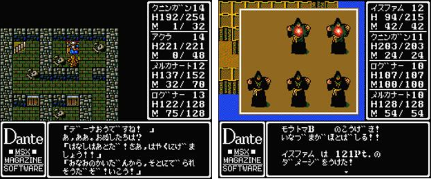
		</figure>
	</section>
	<section id="action-rpg-construction-tool-dante-2" class="level2">
		<h2>Action RPG Construction Tool Dante 2</h2>
		

			
				<label for="sn-7" class="margin-toggle">
					&#8853;
				</label>
				<input type="checkbox" id="sn-7" class="margin-toggle" />
				
					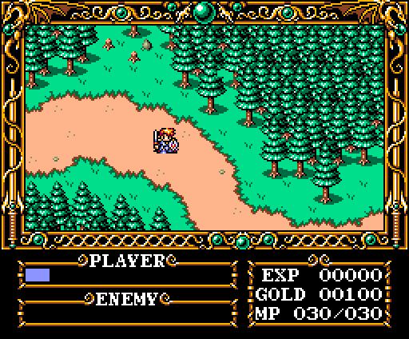
					 
					<em>Legend of Lidorun</em>, le jeu d’exemple fourni avec Dante 2.
					 
					 
				
			
		

		

			Cette nouvelle version sort en février 1992, toujours publiée par <em>MSX Magazine</em> et
			développée par ASCII
			<a href="#fn10" class="footnote-ref" id="fnref10" role="doc-noteref">
				10
			</a>. Il ne s’agit pas d’une simple suite mais bien d’une proposition très différente puisque
			le programme permet de réaliser des action-RPG : les affrontements se déroulent directement
			sur la carte du jeu.
		

		

			Les boss peuvent avoir une taille plus grande que le personnage et émettre des projectiles.
			Cette fois, les PNJ peuvent se déplacer, et il est possible d’ajouter ses propres musiques en
			utilisant le logiciel de composition MuSICA, également distribué dans <em>MSX Magazine</em>.
		

		<figure class="fullwidth">
			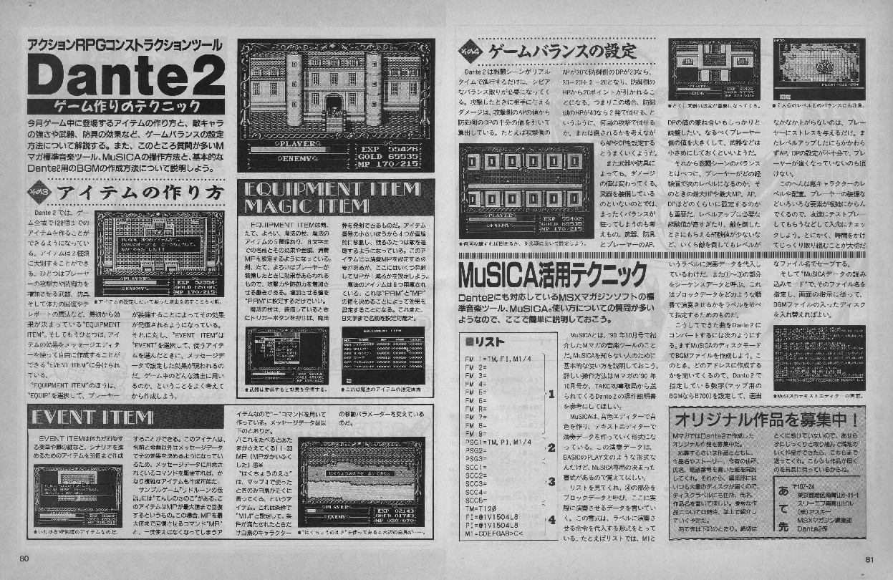
		</figure>
		

			
				<label for="sn-8" class="margin-toggle">
					&#8853;
				</label>
				<input type="checkbox" id="sn-8" class="margin-toggle" />
				
					Ci-dessus : Sur cette double page de <em>MSX Magazine</em>, on peut lire des conseils pour
					mieux équilibrer ses jeux et apprendre à utiliser MuSICA.  
					<em>MSX Magazine</em>, avril 1992 (<a href="https://archive.org/details/MSX_Magazine_1992-04_ASCII_JP/page/n79">
						archive
					</a>) 
					 
				
			
		

		

			Il est très difficile de trouver des jeux réalisés avec Dante 2 aujourd’hui. Le jeu d’exemple
			<em>Legend of Lidorun</em>
			
				<label for="sn-9" class="margin-toggle sidenote-number"></label>
				<input type="checkbox" id="sn-9" class="margin-toggle" />
				
					Titre original : リドルーンの伝説.
					 
					 
				
			
			est un jeu d’exploration comportant des zones de forêt, de grotte et d’autres donjons.
			
				<label for="sn-10" class="margin-toggle">
					&#8853;
				</label>
				<input type="checkbox" id="sn-10" class="margin-toggle" />
				
					Il est possible de trouver des vidéos de <em>Legend of Lidorun</em>
					<a href="https://www.nicovideo.jp/search/%E3%83%AA%E3%83%89%E3%83%AB%E3%83%BC%E3%83%B3%E3%81%AE%E4%BC%9D%E8%AA%AC">
						sur Niconico
					</a>
					en cherchant le titre du jeu en japonais.
					 
					 
				
			
			Le projet avorté <em>Cipher</em>, inspiré par les jeux cyberpunk de l’ère MSX, était une belle
			démonstration du potentiel de Dante 2 et se démarquait par ses environnements modernes. Enfin,
			Takumi Naramura, connu pour être le directeur de <em>La-Mulana</em>
			
				<label for="sn-11" class="margin-toggle">
					&#8853;
				</label>
				<input type="checkbox" id="sn-11" class="margin-toggle" />
				
					<em>La-Mulana</em> est un jeu de plateforme sorti en 2006 au Japon, restituant le style
					des jeux MSX. Salué par la critique, il a fait l’objet d’un remake publié sur consoles et
					d’une suite financée sur Kickstarter.
					 
					 
				
			
			, avait à l’époque utilisé Dante 2 pour créer un remake de l’action-RPG <em>Hydlide</em>
			<a href="#fn11" class="footnote-ref" id="fnref11" role="doc-noteref">
				11
			</a>
			.
		

		<figure>
			
				Ci-contre : Images de <em>Cipher</em> (Ramon Verlinden, 2004) tirées de la page de
				présentation officielle, toujours accessible sur le site de l’auteur.  
				https://sdsnatcher.jorito.net/dante2.html
			
			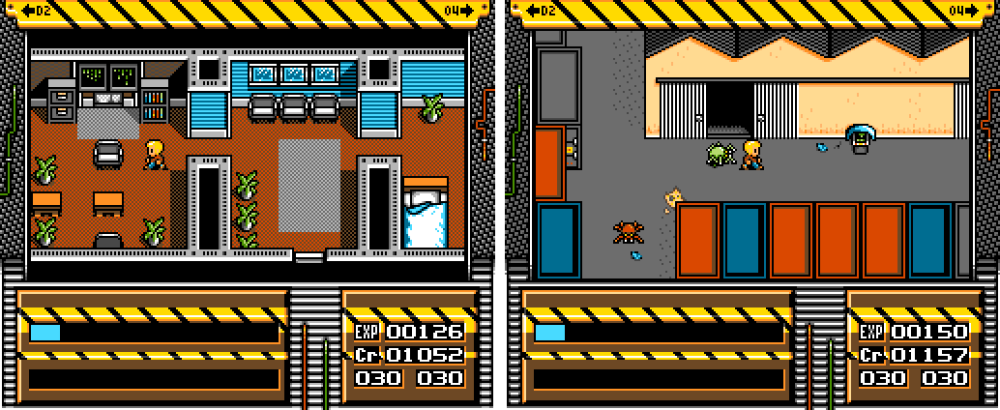
		</figure>
		

			Le développement d’un Dante 3 avait été annoncé dans <em>MSX Magazine</em> en mai 1992
			<a href="#fn12" class="footnote-ref" id="fnref12" role="doc-noteref">
				12
			</a>, mais il fut abandonné lorsque la publication du magazine s’arrêta durant l’été.
			Cependant, les nouveautés prévues pour Dante 3, notamment un affichage de la carte en
			plein-écran, seront conservées pour Dante 98 et même approfondies grâce aux possibilités du
			PC-98.
		

	</section>
	<section id="rpg-tsukūru-dante-98" class="level2">
		<h2>RPG Tsukūru Dante 98</h2>
		

			
				<label for="sn-12" class="margin-toggle">
					&#8853;
				</label>
				<input type="checkbox" id="sn-12" class="margin-toggle" />
				
					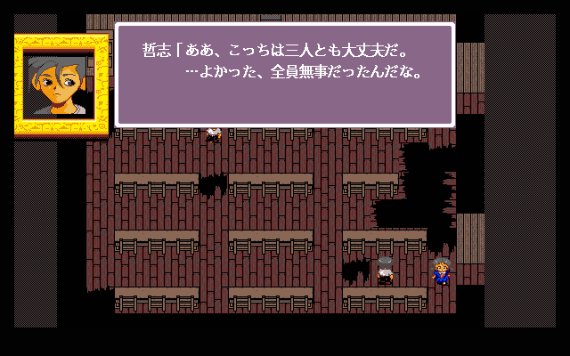  
					<em>Corpse Party</em> (Makoto Kedōin, 1996).  
					<em>Corpse Party -Rebuilt-</em>, Memories of Fear (
					<a href="https://web.archive.org/web/20200814021358/http://www.memoriesoffear.com/games_corpsepartyrebuilt/index.html">
						archive
					</a>
					) 
					 
				
			
		

		

			Publié le 19 décembre 1992
			<a href="#fn13" class="footnote-ref" id="fnref13" role="doc-noteref">
				13
			</a>
			dans le magazine LOGiN d’ASCII, Dante 98 marque une véritable rupture dans la série. Plus
			moderne grâce aux capacités du PC-98 mais aussi plus simple d’utilisation, il connaît un
			certain succès et de nombreux jeux sont réalisés avec, notamment la version originale de
			<em>Corpse Party</em>.
				<label for="sn-13" class="margin-toggle">
					&#8853;
				</label>
				<input type="checkbox" id="sn-13" class="margin-toggle" />
				
					<em>Corpse Party</em> est un jeu d’horreur réalisé par Makoto Kedōin, un étudiant de 22
					ans. Il est initialement publié dans le magazine LOGiN en 1996. Très influent pour son
					utilisation de Dante 98 à des fins narratives et horrifiques, le jeu devient une véritable
					licence culte dont de nouveaux épisodes paraissent sur mobile et consoles.
					<em>Corpse Party</em> est également reproduit sur RPG Maker XP par un japonais anonyme ayant
					l’intention de retranscrire fidèlement le jeu original. Cette version sera ensuite traduite
					en anglais par le collectif Memories of Fear.  
					<em>Corpse Party -Rebuilt-</em>, Memories of Fear (
					<a href="https://web.archive.org/web/20200814021358/http://www.memoriesoffear.com/games_corpsepartyrebuilt/index.html">
						archive
					</a>
					) 
					 
				
			
		

		

			Contrairement à d’habitude, il n’y a pas de suivi de la caméra en jeu. Les écrans sont fixes
			et lorsque le joueur en atteint le bord, le prochain s’affiche dans une transition similaire à
			celle de Zelda sur NES. Cependant, dans l’éditeur, il est possible de dézoomer pour afficher
			une vue simplifiée de la carte globale du jeu, dont la taille totale est de 1024 écrans.
		

		

			On peut importer ses propres graphismes et musiques, mais cela se fait en remplaçant les
			données existantes, non pas en ajoutant du contenu. Par exemple, il faut importer son tileset
			en prenant en compte les cases passables ou non passables à l’origine, car il n’est pas
			possible de changer la passabilité des tiles
			<a href="#fn14" class="footnote-ref" id="fnref14" role="doc-noteref">
				14
			</a>.
		

		

			
				<label for="sn-14" class="margin-toggle">
					&#8853;
				</label>
				<input type="checkbox" id="sn-14" class="margin-toggle" />
				
					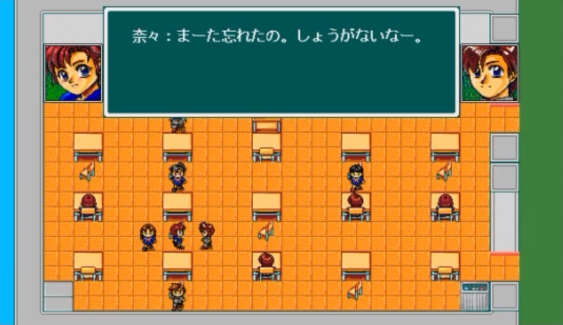  
					<em>If I Fell</em>, une histoire romantique à l’école.  
					ゆうや,
					<a href="https://www.nicovideo.jp/watch/sm21591666">
						【PC98】恋に落ちたら……～If I Fell～【RPGツクール】
					</a>, Niconico Video
					 
					 
				
			
		

		

			Les histoires d’amour étaient populaires à l’époque sur RPG Maker. Une astuce couramment
			utilisée était d’afficher des visages autour des dialogues en les plaçant sur la carte
			<a href="#fn15" class="footnote-ref" id="fnref15" role="doc-noteref">
				15
			</a>.
		

		

			Les jeux réalisés avec Dante 98 peuvent être lancés sur Windows 95 à l’aide de vieux
			émulateurs, mais ceux-ci ne semblent pas toujours fonctionner correctement sur les systèmes
			modernes.
		

	</section>
	<section id="rpg-tsukūru-dante-98-ii" class="level2">
		<h2>RPG Tsukūru Dante 98 II</h2>
		

			
				<label for="sn-15" class="margin-toggle">
					&#8853;
				</label>
				<input type="checkbox" id="sn-15" class="margin-toggle" />
				
					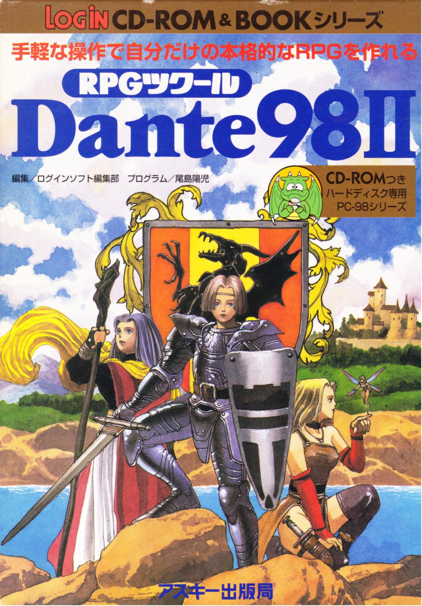  
					Couverture du manuel vendu avec Dante 98 II.  
					<em>LOGiN CD-ROM &amp; Book Dante RPG Maker 98 II</em>, ASCII, juillet 1996 (
					<a href="https://archive.org/details/Dante98RPGMakerII">archive</a>) 
					 
				
			
		

		

			Sortie en juillet 1996, la suite de Dante 98 devait conserver la simplicité d’utilisation de
			l’original tout en ajoutant des fonctionnalités importantes comme les variables et les cartes
			hiérarchisées.
		

		

			Le développement commence durant la deuxième moitié de 1994 mais il s’avère difficile
			d’ajouter les fonctionnalités manquant à Dante 98 et attendues par la communauté. ASCII
			collabore donc avec Yoji Ojima et le moteur est reconstruit sur de meilleures bases, ce qui
			retarde la sortie de plus d’un an par rapport à ce qui était originellement prévu, laissant
			peu d’écart avec la sortie de RPG Maker 95 pour Windows, développé en parallèle.
		

		

			En raison du passage à Windows et du déclin du PC-98, Dante 98 II fut moins populaire que son
			prédécesseur et peu de jeux ont été produits avec. Ojima a ensuite travaillé sur RPG Maker
			2000 et les versions PC suivantes.
		

		

			L’émulateur D2Win permet de jouer aux jeux Dante 98 II sur Windows, mais il ne fonctionne pas
			correctement sur les versions récentes.
		

	</section>
	<section id="rpg-maker-95" class="level2">
		<h2>RPG Maker 95</h2>
		

			RPG Maker 95 est le premier titre de la série pour Windows, développé et publié au Japon le 28
			mars 1997 par ASCII.
			
				<label for="sn-16" class="margin-toggle">
					&#8853;
				</label>
				<input type="checkbox" id="sn-16" class="margin-toggle" />
				
					La numérotation peut porter à confusion mais RPG Maker 95, publié en 1997 pour Windows 95,
					est bien une version plus récente que Dante 98, publié en 1996 pour PC-98.
					 
					 
				
			
		

		

			Bien qu’aujourd’hui dépassé, RPG Maker 95 est l’un des premiers logiciels rendant la création
			de jeu accessible à un plus large public. C’est une petite révolution pour la série et le
			milieu de la création amatrice.
		

		<section id="traductions" class="level3">
			<h3>Traductions</h3>
			

				Des versions illégales de RPG Maker 95 traduites en anglais étaient distribuées par
				KanjiHack, un groupe également à l’origine des traductions des versions SNES mais qui finit
				par arrêter son activité en 1999 suite à un e-mail de mise en demeure venant des avocats
				d’ASCII. Une traduction plus complète est ensuite publiée sous le nom de RPG Maker 95+ par
				Don Miguel, un programmeur russe qui deviendra particulièrement populaire par la suite pour
				sa traduction de RPG Maker 2000
				<a href="#fn16" class="footnote-ref" id="fnref16" role="doc-noteref">
					16
				</a>. La traduction en français est réalisée par Edwin du site Black Sword
				<a href="#fn17" class="footnote-ref" id="fnref17" role="doc-noteref">
					17
				</a>.
			

		</section>
		<section id="fonctionnalités" class="level3">
			<h3>Fonctionnalités</h3>
			

				Les jeux ont une résolution de 640×480 pixels, ce qui est honorable pour l’époque. On y
				importe des images bitmap indexées en 256 couleurs, des fichiers audio en WAVE et des vidéos
				au format AVI. De plus, il est possible de jouer des pistes CD si le jeu est partagé par ce
				biais.
			

			

				Les systèmes de véhicule et de déplacement en chenille sont déjà présents. L’équipe s’étend
				jusqu’à huit personnages, dont quatre peuvent participer aux combats traditionnels en vue
				subjective. Le moteur permet de créer facilement des magasins et des auberges, menus
				incontournables d’un RPG. Une option est proposée pour afficher des images et des dialogues
				dès le démarrage du jeu.
			

			

				Cependant, le logiciel manque encore de maturité : un seul tileset est autorisé et les
				commandes d’évènement tiennent sur une page. Toute la logique du jeu doit être programmée
				avec des interrupteurs puisque les variables n’existent pas encore. On note cependant une
				gestion native de la souris dans les jeux, fonctionnalité qui disparaitra dans les versions
				suivantes et que l’on ne retrouvera que bien plus tard avec RPG Maker MV.
			

			<figure class="fullwidth">
				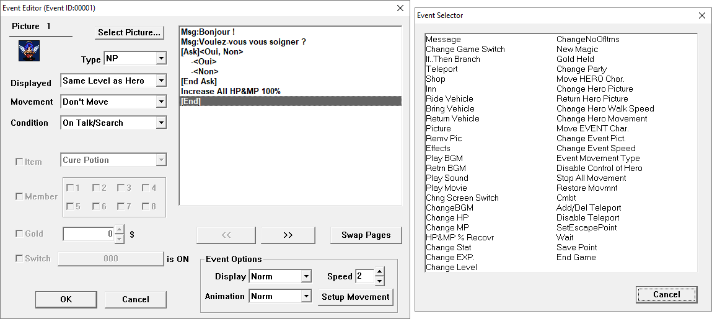
			</figure>
			

				
					<label for="sn-17" class="margin-toggle">
						&#8853;
					</label>
					<input type="checkbox" id="sn-17" class="margin-toggle" />
					
						Ci-dessus : Éditeur d’événéments et liste des commandes de RPG Maker 95.
						 
						 
					
				
			

			

				Les utilisateurs doivent faire preuve d’ingéniosité et de ténacité pour réaliser des
				systèmes originaux malgré l’absence de fonctions essentielles telles que les variables et
				les boucles.
				<a href="#fn18" class="footnote-ref" id="fnref18" role="doc-noteref">
					18
				</a>
				Le logiciel perd rapidement en popularité à la sortie de RPG Maker 2000, une alternative
				bien plus intéressante.
			

			

				Certains atouts et particularités de RPG Maker 95 sont néanmoins perdus dans la transition,
				notamment le support de la souris, la résolution 640×480 et la lecture de pistes CD. C’est
				aussi le seul RPG Maker permettant de distribuer ses jeux sous la forme d’un installeur
				divisé en plusieurs petits fichiers, une méthode utile à une époque où les disquettes, d’une
				capacité de 1,47 Mo, étaient un support de stockage couramment utilisé.
				<a href="#fn19" class="footnote-ref" id="fnref19" role="doc-noteref">
					19
				</a>
			

		</section>
		<section id="support" class="level3">
			<h3>Support</h3>
			

				RPG Maker 95 est entièrement compatible avec Windows 95, 98 et ME. Depuis la version RPG
				Maker 95 VALUE!, l’éditeur et les jeux fonctionnent également sur Windows NT, bien qu’aucune
				information officielle n’ait été communiquée à ce sujet. En raison du mode 256 couleurs
				remplaçant la palette de Windows, les jeux s’affichent de façon incorrecte sur les systèmes
				actuels, rendant plusieurs menus illisibles. Sur certains systèmes, les jeux plantent en
				passant du mode plein-écran au mode fenêtré.
			

		</section>
	</section>
	<section id="sim-rpg-maker-95" class="level2">
		<h2>Sim RPG Maker 95</h2>
		

			Sim RPG Maker 95 sort officiellement le 29 mai 1998 au Japon uniquement, un an après RPG Maker
			95. Il se démarque du reste de la série par son aspect restrictif et son système de combat de
			type tactical RPG.
		

		

			Le logiciel permet de créer des jeux similaires aux <em>Fire Emblem</em> et
			<em>Final Fantasy Tactics</em>. Une carte inclut généralement une cinématique d’introduction, un
			combat, puis une cinématique de conclusion. Une carte peut aussi être uniquement dédiée à une cinématique.
			Entre les cartes, le joueur peut être envoyé au campement pour acheter des objets et gérer son
			équipe. Plusieurs objectifs sont possibles pour déclencher la victoire d’un combat :
		

		<ul>
			<li>Vaincre tous les ennemis</li>
			<li>Vaincre un ennemi spécifique</li>
			<li>Survivre à suffisamment de tours</li>
			<li>Atteindre un emplacement défini</li>
			<li>Protéger un personnage</li>
		</ul>
		

			Bien que la progression sur une carte soit linéaire, il est possible de créer des
			embranchements dans l’histoire en choisissant la carte vers laquelle le joueur est envoyé.
		

	</section>
	<section id="rpg-maker-2000" class="level2">
		<h2>RPG Maker 2000</h2>
		

			RPG Maker 2000, sorti le 5 avril 2000, est la seconde version principale de la série sur
			Windows. C’est une version importante, qui a fixé de nombreux éléments que l’on retrouve
			encore dans les RPG Maker modernes, 20 ans plus tard.
			
				<label for="sn-18" class="margin-toggle">
					&#8853;
				</label>
				<input type="checkbox" id="sn-18" class="margin-toggle" />
				
					Si nous pourrions voir, dans la ressemblance entre RPG Maker 2000 et les versions
					récentes, un certain manque d’innovation dans la série ces dernières années, cela montre
					néanmoins le caractère visionnaire de RPG Maker 2000.
					 
					 
				
			
			C’est la version la plus ancienne qui soit encore communément utilisée aujourd’hui.
		

		<section id="graphismes" class="level3">
			<h3>Graphismes</h3>
			

				Le style graphique change drastiquement par rapport à RPG Maker 95, puisque la résolution de
				320×240 pixels est deux fois plus petite, tout en restant à 256 couleurs. Ce qui pourrait
				être vu comme une régression a probablement été un point fort du logiciel en réalité : les
				cases de 16×16 pixels donnent un aspect pixel art qui rend la personnalisation plus
				abordable pour les débutants, et le format permet de réutiliser les <em>rips</em> des RPG
				cultes de l’époque SNES.
				
					<label for="sn-19" class="margin-toggle">
						&#8853;
					</label>
					<input type="checkbox" id="sn-19" class="margin-toggle" />
					
						Dans le jeu vidéo, un <em>rip</em> est un fichier extrait d’un jeu. Il peut s’agir d’une
						son ou d’une texture, mais pour un usage sur RPG Maker, les <em>rips</em> sont
						principalement des décors (<em>tilesets</em>), des personnages (<em>sprites</em> ou
						<em>charsets</em>) et des musiques provenant de jeux rétro et adaptés au format de RPG Maker
						pour être utilisés dans l’éditeur.
						 
						 
					
				
				Ainsi, n’importe quel amateur pouvait marcher dans les pas de ses jeux favoris. Beaucoup de
				jeux populaires réalisés sur RPG Maker 2000 et 2003 contiennent des <em>rips</em>.
			

		</section>
		<section id="fonctionnalités-1" class="level3">
			<h3>Fonctionnalités</h3>
			

				RPG Maker 2000 réintroduit les variables, permettant de créer des événements beaucoup plus
				complexes. Parmi les nombreuses nouveautés, on compte les visages à afficher lors des
				dialogues, un éditeur d’animations de combat, une base de données plus complète, etc.
			

			

				RPG Maker 2000 introduit le concept du Run-Time Package (RTP) permettant aux créateurs de
				distribuer leurs jeux sans inclure les ressources de base du logiciel, pour peu que les
				joueurs les possèdent déjà. Ce concept était très apprécié à l’époque en raison de la faible
				vitesse des connexions. Cependant, inclure les RTP à son jeu pour le rendre indépendant
				était une tâche complexe et mal documentée, ce qui fut une source d’erreurs dans de nombreux
				jeux.
			

		</section>
	</section>
	<section id="rpg-maker-2003" class="level2">
		<h2>RPG Maker 2003</h2>
		

			Cette version ressemble beaucoup à son prédécesseur RPG Maker 2000 en améliorant certains
			aspects techniques. De plus, le système de combat change pour une vue de côté à la
			<em>Final Fantasy</em>, avec des personnages animés.
		

		<figure>
			
				Ci-contre : Le jeu <em>Space Funeral</em> ouvert dans RPG Maker 2003.
			
			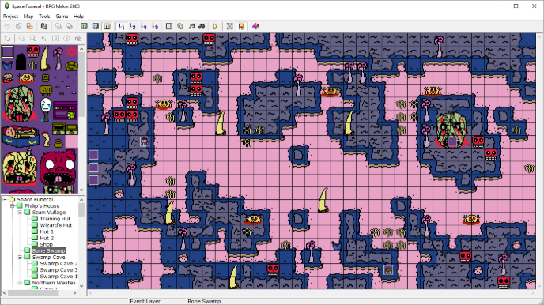
		</figure>
		

			Il est possible de convertir un projet RPG Maker 2000 en projet RPG Maker 2003. Cette
			fonctionnalité ne sera plus proposée dans les logiciels suivants. RPG Maker 2003, tout comme
			RPG Maker XP, a été traduit en anglais et distribué par un programmeur sous le pseudonyme RPG
			Advocate.
		

		

			Après de nombreuses demandes et pétitions des utilisateurs, qui travaillaient sur des projets
			de plus en plus ambitieux et souhaitaient les publier dans la légalité, une version anglaise
			officielle est enfin distribuée le 24 avril 2015 par Degica, sous la direction de Kadokawa
			Games et Enterbrain et avec l’aide de Cherry, auteur de nombreux hacks non officiels à
			l’époque. Le code source du logiciel ayant été perdu, l’expérience de Cherry dans le domaine
			fut cruciale pour améliorer le programme par des moyens détournés.
		

	</section>
	<section id="rpg-maker-xp" class="level2">
		<h2>RPG Maker XP</h2>
		

			RPG Maker XP est le premier logiciel de la série, hors versions consoles, à connaitre une
			traduction anglaise officielle. La version japonaise est publiée en juillet 2004 et la version
			anglaise en septembre 2005. La résolution maximum des jeux est de 640×480 pixels avec
			l’introduction du support des PNG transparents. On peut y lire des musiques MIDI, Ogg, WAVE,
			MP3 et WMA.
		

		<figure>
			
				RPG Maker XP favorise l’utilisation de grands éléments de décor dans un style graphique plus
				complexe qu’à l’accoutumée.  
				 
				Ci-contre : Le jeu <em>Reincarnations</em> ouvert dans RPG Maker XP.
			
			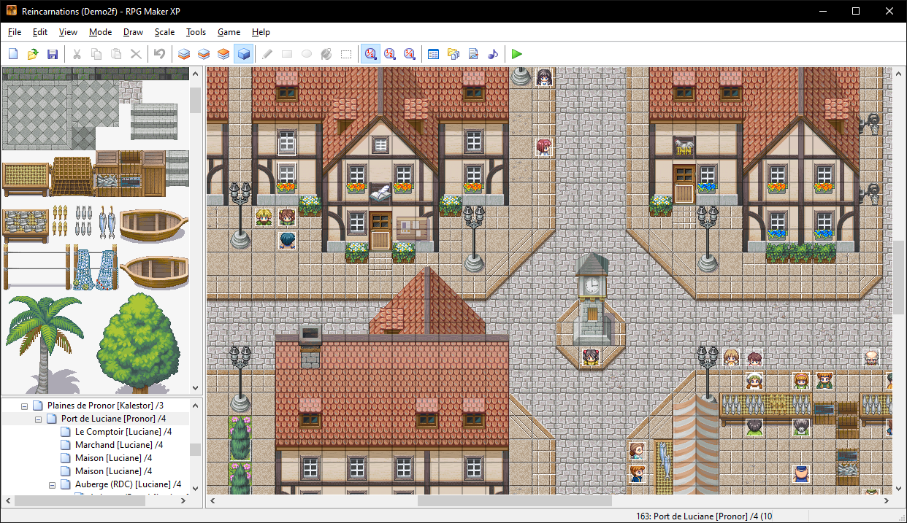
		</figure>
		

			La grande révolution apportée par RPG Maker XP est le système de scripting.
			
				<label for="sn-20" class="margin-toggle">
					&#8853;
				</label>
				<input type="checkbox" id="sn-20" class="margin-toggle" />
				
					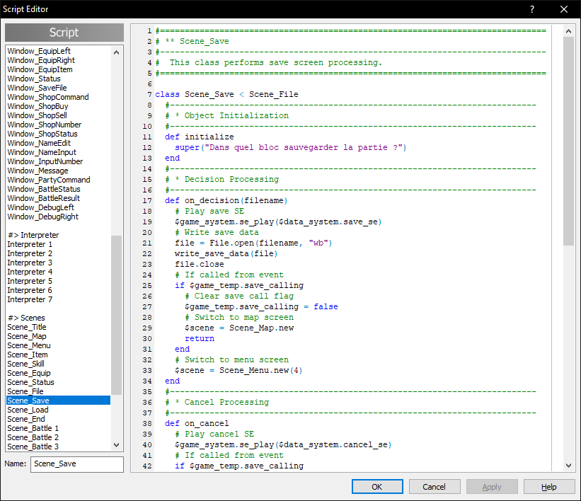
					 
					L’éditeur de scripts de RPG Maker XP.
					 
					 
				
			
			Les utilisateurs peuvent modifier les systèmes existants en profondeur ou créer les leurs en
			utilisant le langage Ruby et la bibliothèque RGSS (Ruby Game Scripting System) spécialement
			écrite pour le logiciel. Très rapidement, les makers s’échangent des scripts sur Internet et
			les forums ouvrent des sections dédiées, ce qui permet aux néophytes de personnaliser leurs
			jeux sans savoir programmer.
		

		

			De RPG Maker XP à RPG Maker VX Ace, tous les scripts sont sauvegardés dans un même fichier de
			données au format propre à RPG Maker. Il est donc obligatoire de passer par l’éditeur inclus
			au logiciel pour les écrire, bien qu’il soit rudimentaire en comparaison avec un véritable
			éditeur de code. C’est pourquoi Joke a écrit un extracteur de scripts pour RPG Maker VX Ace
			<a href="#fn20" class="footnote-ref" id="fnref20" role="doc-noteref">
				20
			</a>, permettant d’exporter les scripts d’un projet en plusieurs fichiers texte indépendants,
			puis de les réimporter au format de RPG Maker.
			
				<label for="sn-21" class="margin-toggle">
					&#8853;
				</label>
				<input type="checkbox" id="sn-21" class="margin-toggle" />
				
					Az’ a ensuite adapté le script de Joke à RPG Maker XP.
					 
					 
				
			
		

		<section id="rpg-maker-xp-value" class="level3">
			<h3>RPG Maker XP Value!+</h3>
			

				Les RPG Maker sont parfois distribués une deuxième fois dans une édition VALUE! au prix plus
				bas et avec quelques ajouts. Lorsqu’il y a une troisième édition, comme c’est le cas avec
				RPG Maker XP, elle est appelée VALUE!+.
			

			

				Les éditions VALUE! de RPG Maker XP, distribuées uniquement au Japon, apportent de nouveaux
				jeux d’exemple en japonais, les musiques de RPG Maker 3 sur PS2, un changement dans le
				système d’activation de la licence ainsi qu’une meilleure compatibilité avec les systèmes
				récents. Ces améliorations techniques sont parvenues en Occident sous la forme de simples
				patchs.
			

		</section>
	</section>
	<section id="rpg-maker-vx" class="level2">
		<h2>RPG Maker VX</h2>
		

			RPG Maker VX conserve la taille des cases de 32×32 pixels, mais le style graphique évolue vers
			un style plus coloré et minimaliste, revenant aux influences <em>old school</em> des premiers
			RPG sur NES.
			
				<label for="sn-22" class="margin-toggle">
					&#8853;
				</label>
				<input type="checkbox" id="sn-22" class="margin-toggle" />
				
					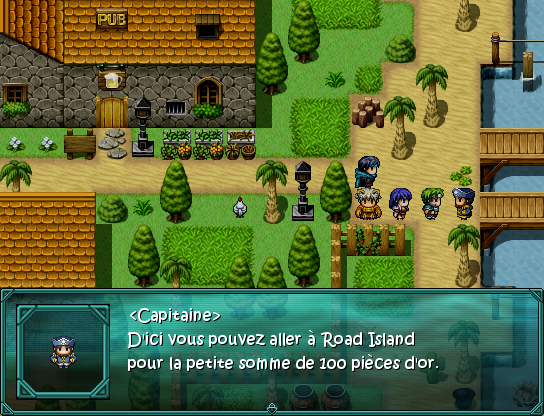 <em>Quest Legend</em> de Benakin
					 
					 
				
			
			Cela a l’avantage de permettre une grande simplicité d’utilisation : les arbres et autres
			éléments de décors sont plus petits, les bâtiments sont plus simples à construire, et les
			tilesets contiennent beaucoup d’autotiles qui dessinent automatiquement les bordures des
			chemins, murs, etc.
		

		<section id="réception" class="level3">
			<h3>Réception</h3>
			

				On estime que la direction artistique <em>old school</em> et l’efficacité qu’elle offre a
				été pensée pour le public japonais, friand de jeux traditionnels à la Dragon Quest, mais a
				été moins comprise par le public international qui pouvait lui préférer le ton plus sombre
				et mature de RPG Maker 2003 et RPG Maker XP.
			

			

				Dans la communauté francophone, plusieurs forums dédiés à VX naissent
				
					<label for="sn-23" class="margin-toggle">
						&#8853;
					</label>
					<input type="checkbox" id="sn-23" class="margin-toggle" />
					
						Parmi les forums fondés autour de RPG Maker VX, on peut évoquer
						<a href="https://www.rpgmakervx-fr.com/">rpgmakervx-fr.com</a>, souvent surnommé « la Commu »
						par ses membres, ou encore
						<a href="https://rpg-maker-vx.bbactif.com">rpg-maker-vx.bbactif.com</a>. 
						 
					
				
				et demeurent relativement isolés. RPG Maker VX est boudé et porte une mauvaise réputation en
				raison de plusieurs facteurs, notamment le changement drastique de style graphique et
				musical, la simplification du logiciel créant beaucoup de limites pour les vétérans et
				imposant une nouvelle façon de créer, mais aussi le fait que le programme a attiré beaucoup
				de jeunes utilisateurs polluant les forums et publiant des jeux de mauvaise qualité avec les
				ressources par défaut. En 2010, Joke
				
					<label for="sn-24" class="margin-toggle">
						&#8853;
					</label>
					<input type="checkbox" id="sn-24" class="margin-toggle" />
					
						Joke est un <em>maker</em> reconnu dans la communauté française, ayant réalisé des
						tutoriels populaires sur la programmation avec RPG Maker 2003. Il est aussi connu pour
						son jeu <em>Bogoss Story</em>, son implication dans les projets communautaires et sa
						série de démos techniques impressionnantes, appelées <em>BilouConcepts</em> et
						exploitant toutes les possibilités de RPG Maker 2003. Avec des membres de son collectif
						Biloucorp, il initie en 2014 le projet <em>RPG Maker Extender</em> et réalise le jeu
						<em>Almost Heroic</em>. 
						 
					
				
				parle du logiciel comme étant attrayant « pour les enfants » et source des « boulets sur les
				communautés », en remarquant tout de même que quelques utilisateurs « savent utiliser le logiciel
				pour créer un univers »
				<a href="#fn21" class="footnote-ref" id="fnref21" role="doc-noteref">
					21
				</a>
				.
			

			

				Il faudra du temps avant que la communauté dans son ensemble reconnaisse le charme de VX et
				les possibilités qu’il peut offrir, et ce à cause d’un comportement élitiste, estime elm6 :
			

			

				<blockquote>
					

						Dois-je rappeler la discrimination qui a touché VX à son arrivée ? Dois-je rappeler
						comment ici-même, sur Oniromancie, les gens qui se pointaient avec un projet sur VX se
						faisaient piétiner par les anciens ? Et ceci a duré pendant longtemps. En fait, jusqu’à
						ce que quelques makers « reconnus » […] décident de se lancer sur cette plateforme. Ou
						alors jusqu’à ce que Benakin réussisse à avoir un succès fou avec <em>Quest Legend</em>.
						[…] Bref, le passé est le passé, mais VX est toujours sous-représenté, et nourrit de
						nombreux préjugés.
					

					<footer>
						elm6, Oniromancie
						<a href="#fn22" class="footnote-ref" id="fnref22" role="doc-noteref">
							22
						</a>
					</footer>
				</blockquote>
			

			

				Encore aujourd’hui, les nouveaux RPG Maker suivent la philosophie de VX quant au style
				graphique et au format des tilesets. Si certains utilisateurs se sont adaptés avec le temps,
				un attachement aux versions pré-VX subsiste auprès d’une partie de la communauté.
			

		</section>
	</section>
	<section id="rpg-maker-vx-ace" class="level2">
		<h2>RPG Maker VX Ace</h2>
		

			RPG Maker VX Ace sort le 15 janvier 2011 au Japon et le 15 mars 2012 en version anglaise.
			Cette version revient sur les options manquantes de RPG Maker VX et peut être perçue comme une
			grande mise à jour, de la même manière que RPG Maker 2003 a amélioré RPG Maker 2000. Le
			logiciel est strictement supérieur à son prédécesseur RPG Maker VX, désormais considéré par la
			communauté comme obsolète.
		

		<figure class="fullwidth">
			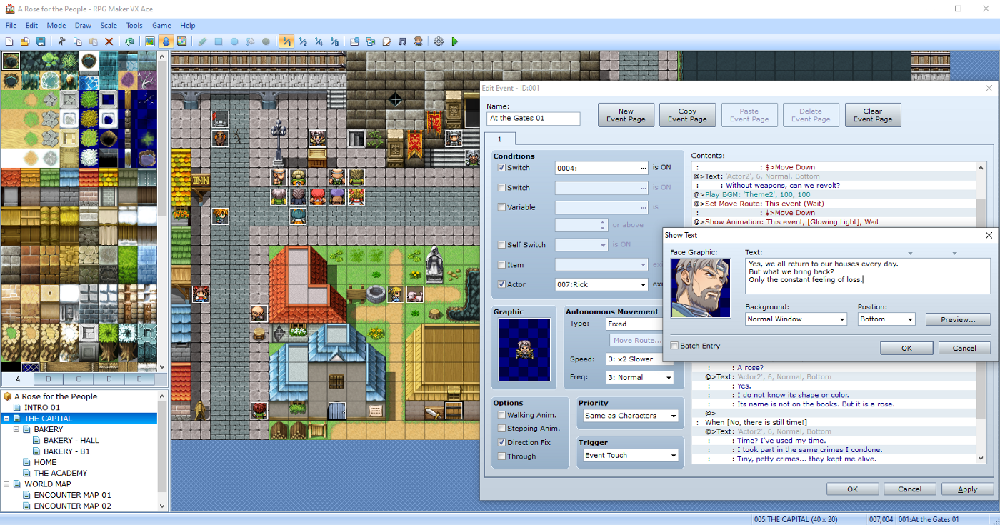
		</figure>
		

			
				<label for="sn-25" class="margin-toggle">
					&#8853;
				</label>
				<input type="checkbox" id="sn-25" class="margin-toggle" />
				
					Ci-dessus : La fenêtre d’évènement et l’éditeur de carte de RPG Maker VX Ace.
					 
					 
				
			
		

		

			Les évènements et la base de données deviennent plus complets et agréables à utiliser avec RPG
			Maker VX Ace.
		

		

			Une traduction française amatrice est réalisée par Kaila et Arthur Jeannin, alias Kitu, pour
			la communauté RPG Maker Détente. Degica récupère plus tard cette traduction pour l’intégrer à
			une mise à jour distribuée sur Steam. Cependant, la qualité de la traduction est altérée au
			fil des mises à jour, si bien qu’Arthur décide de modifier la traduction de Steam, avec l’aide
			d’Aurélien Dos Santos
			
				<label for="sn-26" class="margin-toggle">
					&#8853;
				</label>
				<input type="checkbox" id="sn-26" class="margin-toggle" />
				
					Aurélien Dos Santos est le fondateur de la communauté Game Dev Alliance, anciennement
					appelée RPG Maker Alliance. Note : retrouver les anciens threads annoncant la nouvelle
					traduction. La demande de feedback et les branches beta ne sont arrivées que pour RPG
					Maker MV.
					 
					 
				
			, pour y réintégrer la traduction de RPG Maker Détente et corriger quelques détails. La
			modification est officiellement ajoutée le 10 mai 2018.
		

	</section>
	<section id="rpg-maker-mv" class="level2">
		<h2>RPG Maker MV</h2>
		

			RPG Maker MV est annoncé avec la promesse de produire des jeux multi-plateformes pour la
			première fois dans la série. Grâce aux technologies web, les jeux peuvent être exportés en
			version navigateur, mais aussi Windows, Mac, Linux, Android et iOS. L’éditeur est disponible
			sur Windows, Mac et Linux. Les scripts, désormais appelés plugins, s’écrivent en JavaScript.
		

		

			L’écran de jeu s’agrandit avec des cases de 48×48 pixels et une résolution par défaut fixée à
			816×624 pixels mais personnalisable à l’aide de plugins.
		

		

			Malgré de nombreux changements sur le plan technique, un manque d’innovation se fait sentir
			quant à l’expérience utilisateur et aux possibilités de création : le format des images tout
			comme l’interface sont calquées sur RPG Maker VX Ace. On note tout de même l’apparition d’un
			choix entre la vue de face et la vue de côté lors des combats, là où les RPG Maker précédents
			ne proposaient à chaque fois qu’une seule des deux possibilités. De plus, un gestionnaire de
			plugins facilite le partage entre utilisateurs. Les auteurs de plugins peuvent spécifier des
			paramètres à personnaliser depuis l’éditeur de RPG Maker, sans ouvrir le code et
			potentiellement causer des erreurs.
		

		<figure>
			
				Ci-contre : Le gestionnaire de plugins peut afficher une aide et des paramètres à modifier.
			
			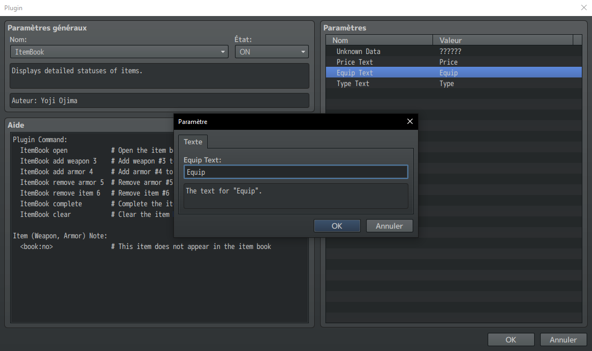
		</figure>
		

			Début 2021, RPG Maker MV avait réalisé 500 000 ventes
			<a href="#fn23" class="footnote-ref" id="fnref23" role="doc-noteref">
				23
			</a>.
		

		<section id="limites" class="level3">
			<h3>Limites</h3>
			

				En pratique, l’expérience sur mobile ne fonctionne pas aussi bien que l’on pouvait
				l’espérer : les performances sont mauvaises, l’interface n’est pas intuitive au tactile, et
				le procédé pour exporter le jeu est complexe, le manuel renvoyant les utilisateurs vers des
				programmes externes pour effectuer la compilation.
			

			

				Les jeux fonctionnent correctement sur navigateur, pour peu que l’on possède un ordinateur
				suffisamment récent pour supporter les technologies web, mais quelques problèmes sont
				présents : les écrans de chargement intempestifs à chaque changement de carte, le poids des
				jeux relativement lourd en raison d’un processus d’optimisation rudimentaire et aux images
				plus grandes que par le passé. Une fois exportés, les jeux restent fractionnés en un grand
				nombre de petits fichiers qui dépasse souvent la limite fixée par itch.io, un site populaire
				de publication de jeux et d’organisation de game jams, utilisé par des communautés telles
				que RPG Maker Alliance
				
					<label for="sn-27" class="margin-toggle">
						&#8853;
					</label>
					<input type="checkbox" id="sn-27" class="margin-toggle" />
					
						Définir la communauté RPG Maker Alliance. Fondée tard, petite équipe, donc utilise des
						moyens modernes et légers comme discord et itch.io
						 
						 
					
				.
			

		</section>
		<section id="rpg-atsumāru" class="level3">
			<h3>RPG Atsumāru</h3>
			

				RPG Atsumāru
				
					<label for="sn-28" class="margin-toggle">
						&#8853;
					</label>
					<input type="checkbox" id="sn-28" class="margin-toggle" />
					
						RPG Atsumāru est accessible à l’adresse
						<a href="https://game.nicovideo.jp/atsumaru/">game.nicovideo.jp/atsumaru</a>. 
						 
					
				
				est un site exclusivement en japonais ouvert en 2016 et permettant de partager et jouer à
				des jeux RPG Maker depuis le navigateur. Le service est hébergé par Niconico, un site de
				partage de vidéos très populaire au Japon.
				
					<label for="sn-29" class="margin-toggle">
						&#8853;
					</label>
					<input type="checkbox" id="sn-29" class="margin-toggle" />
					
						L’association entre Niconico et RPG Maker est rendue possible par le fait que DWANGO, la
						société gérant Niconico, est une filiale de Kadokawa.
						 
						 
					
				
				Il est possible de publier son jeu directement depuis l’éditeur de RPG Maker MV
				
					<label for="sn-30" class="margin-toggle">
						&#8853;
					</label>
					<input type="checkbox" id="sn-30" class="margin-toggle" />
					
						La fonction de partage est disponible à partir de la version 1.3.4 de RPG Maker MV.
						 
						 
					
				
				en liant son compte Niconico
				<a href="#fn24" class="footnote-ref" id="fnref24" role="doc-noteref">
					24
				</a>
				. Les jeux RPG Maker 2000 et 2003 sont également compatibles grâce à une version modifiée
				d’EasyRPG
				
					<label for="sn-31" class="margin-toggle">
						&#8853;
					</label>
					<input type="checkbox" id="sn-31" class="margin-toggle" />
					
						Les jeux RPG Maker 2000 et 2003 ne sont compatibles nativement qu’avec Windows. EasyRPG
						est un projet open source qui interprète ces jeux pour les rendre compatibles avec Mac,
						Linux, certaines consoles et les navigateurs web. Les jeux RPG Maker 2000 et 2003
						envoyés sur RPG Atsumāru sont automatiquement convertis dans une version améliorée
						d’EasyRPG qui supporte les fonctionnalités du site : captures d’écran, sauvegardes sur
						le serveur, manette virtuelle pour le téléphone, etc. Il est également possible pour les
						créateurs d’utiliser l’API du site (pour envoyer un score au serveur par exemple) en
						écrivant des commentaires dans les évènements de RPG Maker.
						 
						 
					
				
				intégrant l’API de RPG Atsumāru
				<a href="#fn25" class="footnote-ref" id="fnref25" role="doc-noteref">
					25
				</a>
				.
			

			

				L’exclusivité japonaise de cette initiative peut s’expliquer par une différence culturelle,
				selon le directeur marketing de la série RPG Maker :
			

			

				<blockquote>
					

						Peu d’utilisateurs japonais réalisent leurs jeux dans le but de les vendre, ce qui est
						une grande différence avec le reste du monde. […] Nous avons ouvert ce site parce que
						nous pensions qu’il était important d’avoir un endroit où les gens puissent publier
						leurs créations facilement.
					

					<footer>
						Hiroyuki Ichinose, Famitsu.com
						<a href="#fn26" class="footnote-ref" id="fnref26" role="doc-noteref">
							26
						</a>
					</footer>
				</blockquote>
			

		</section>
	</section>
	<section id="rpg-maker-mz" class="level2">
		<h2>RPG Maker MZ</h2>
		

			<em>Section vide.</em>
		

	</section>
</section>
<section id="consoles-de-salon" class="level1">
	<h1>Consoles de salon</h1>
	

		La plupart des versions console jusqu’à la PS2 ont été développées par Kuusou Kagaku, un studio
		japonais ayant réalisé des jeux principalement pour la Saturn, la Super Famicom et la
		PlayStation, avant de transitionner vers le jeu mobile au cours des années 2000
		<a href="#fn27" class="footnote-ref" id="fnref27" role="doc-noteref">
			27
		</a>. Parmi les titres de cette époque, trois sont traduits en anglais et publiés en Amérique du
		Nord par Agetec, une société créée par ASCII pour distribuer ses jeux aux États-Unis
		<a href="#fn28" class="footnote-ref" id="fnref28" role="doc-noteref">
			28
		</a>.
	

	<figure class="fullwidth">
		<table>
			<thead>
				<tr class="header">
					<th>Titre japonais</th>
					<th>Cons.</th>
					<th>Ann.</th>
					<th>Développeur</th>
					<th>Localisation</th>
				</tr>
			</thead>
			<tbody>
				<tr class="odd">
					<td>
						<a href="#rpg-tsukūru-super-dante">RPG Tsukūru: Super Dante</a>
					</td>
					<td>SNES</td>
					<td>1995</td>
					<td>Kuusou Kagaku</td>
					<td></td>
				</tr>
				<tr class="even">
					<td>
						<a href="#rpg-tsukūru-2">RPG Tsukūru 2</a>
					</td>
					<td>SNES</td>
					<td>1996</td>
					<td>Kuusou Kagaku</td>
					<td></td>
				</tr>
				<tr class="odd">
					<td>
						<a href="#rpg-tsukūru-3-rpg-maker">RPG Tsukūru 3</a>
					</td>
					<td>PS</td>
					<td>1997</td>
					<td>Kuusou Kagaku</td>
					<td>RPG Maker (2000)</td>
				</tr>
				<tr class="even">
					<td>Simulation RPG Tsukūru</td>
					<td>PS</td>
					<td>1998</td>
					<td>Pegasus Japan</td>
					<td></td>
				</tr>
				<tr class="odd">
					<td>RPG Tsukūru GB</td>
					<td>GBC</td>
					<td>2000</td>
					<td>Kuusou Kagaku</td>
					<td></td>
				</tr>
				<tr class="even">
					<td>
						<a href="#rpg-tsukūru-4">RPG Tsukūru 4</a>
					</td>
					<td>PS</td>
					<td>2000</td>
					<td>argent (Agenda)</td>
					<td></td>
				</tr>
				<tr class="odd">
					<td>RPG Tsukūru GB 2</td>
					<td>GBC</td>
					<td>2001</td>
					<td></td>
					<td></td>
				</tr>
				<tr class="even">
					<td>
						<a href="#rpg-tsukūru-5-rpg-maker-2">RPG Tsukūru 5</a>
					</td>
					<td>PS2</td>
					<td>2002</td>
					<td>Kuusou Kagaku</td>
					<td>RPG Maker 2 (2003)</td>
				</tr>
				<tr class="odd">
					<td>RPG Tsukūru Advance</td>
					<td>GBA</td>
					<td>2003</td>
					<td>Enterbrain</td>
					<td></td>
				</tr>
				<tr class="even">
					<td>
						<a href="#rpg-tsukūru-rpg-maker-3">RPG Tsukūru</a>
					</td>
					<td>PS2</td>
					<td>2004</td>
					<td>Runtime</td>
					<td>RPG Maker 3 (2005)</td>
				</tr>
			</tbody>
		</table>
	</figure>
	<section id="rpg-tsukūru-super-dante" class="level2">
		<h2>RPG Tsukūru: Super Dante</h2>
		

			RPG Tsukūru: Super Dante
			
				<label for="sn-32" class="margin-toggle sidenote-number"></label>
				<input type="checkbox" id="sn-32" class="margin-toggle" />
				
					Titre original : RPGツクール SUPER DANTE.
					 
					 
				
			
			paraît le 31 mars 1995 sur SNES, uniquement au Japon.
			
				<label for="sn-33" class="margin-toggle">
					&#8853;
				</label>
				<input type="checkbox" id="sn-33" class="margin-toggle" />
				
					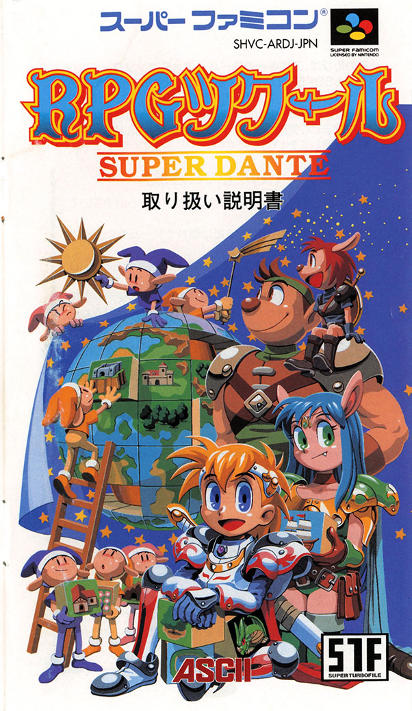  
					Le manuel inclus, de 100 pages (<a href="https://archive.org/details/rpgtsukurusuperdantesfchiresscans">
						archive
					</a>), permet de se lancer facilement.
					 
					 
				
			
		

		

			Cette version se veut être un portage de RPG Tsukūru Dante 98 pour la Super NES, appelée Super
			Famicom au Japon. Le programme se rapproche beaucoup de l’original, bien qu’il soit plus
			difficile d’écrire du texte à la manette et que l’espace de stockage soit limité. Quelques
			améliorations sont présentes, notamment la possibilité d’afficher de plus grands ennemis. La
			forme du jeu et des combats était un peu dépassée par rapports aux RPG de l’époque SNES, mais
			cette simplicité a probablement permis d’éviter des contraintes supplémentaires.
		

		

			Une variété de méthodes ont justement été mis en place, à plusieurs niveaux, pour pallier au
			manque de stockage et de mémoire, notamment :
		

		<ul>
			<li>
				Les cartes normales sont dessinées avec des blocs de 4×4 cases. Quant à la carte du monde,
				elle ne peut pas être modifiée : le programme propose un choix de quatre cartes pré-faites.
			</li>
			<li>
				Si le joueur apprend 10 sorts ou plus, les premiers sorts appris dans l’ordre chronologique
				seront oubliés.
			</li>
			<li>
				Lors du level up, les caractéristiques des personnages augmentent d’après leur nombre
				d’origine. Ainsi, plus le niveau des personnages est élevé et plus les disparités entre eux
				vont se creuser.
			</li>
		</ul>
		

			Sur la carte, les personnages ont des dimensions de 16*16 pixels, ce qui était courant à
			l’époque NES. Le programme propose un total de 55 personnages (dont les véhicules et les
			animaux), 43 images d’ennemi et 31 musiques.
		

		

			Il y a plusieurs animations pour les attaques magiques, mais elles sont toutes accompagnées du
			même effet sonore, qui réduit la sensation de variété. De plus, il n’est pas possible de
			changer la musique de combat spécifiquement pour les boss.
		

		

			En combat, on peut créer des groupes de 4 petits ennemis. Cependant, il est impossible
			d’ajouter le même ennemi deux fois dans un même groupe.
			
				<label for="sn-34" class="margin-toggle">
					&#8853;
				</label>
				<input type="checkbox" id="sn-34" class="margin-toggle" />
				
					Le seul moyen d’afficher un ennemi deux fois serait de le recopier à deux ID différents de
					la base de données.
					 
					 
				
			
			Les grands ennemis sont réservés aux combats de boss individuels, à lancer depuis un
			évènement.
		

		

			Le jeu d’exemple inclus, FATE, est aussi un portage de la version Dante 98. Les possibilités
			de Super Dante sont exploitées autant que possible, mais les évènements sont tout de même
			simplifiés et parfois supprimés en raison des limitations d’espace. On trouve par exemple
			moins de dialogues et de personnages en ville.
		

		

			Super Dante supporte le Turbo File Twin, un boîtier de stockage de données distribué par ASCII
			et principalement compatible avec les jeux de l’éditeur
			<a href="#fn29" class="footnote-ref" id="fnref29" role="doc-noteref">
				29
			</a>.
		

	</section>
	<section id="rpg-tsukūru-2" class="level2">
		<h2>RPG Tsukūru 2</h2>
		

			Suite à la popularité de Super Dante, un successeur est publié à moins d’un an d’intervalle,
			le 31 janvier 1996. Dans cette version, les ressources incluses sont plus nombreuses et plus
			travaillées, et davantage de kanji sont disponibles. De nombreux problèmes de la version
			précédente ont été résolus, mais quelques bugs subsistent.
		

		

			Le jeu d’exemple est nommé <em>Dankichi’s Bakuchin Daisakusen!!</em>
			
				<label for="sn-35" class="margin-toggle sidenote-number"></label>
				<input type="checkbox" id="sn-35" class="margin-toggle" />
				
					Titre original : だんきちのバクチン大作戦!!
					 
					 
				
			.
		

		<section id="satellaview" class="level3">
			<h3>Satellaview</h3>
			

				
					<label for="sn-36" class="margin-toggle">
						&#8853;
					</label>
					<input type="checkbox" id="sn-36" class="margin-toggle" />
					
						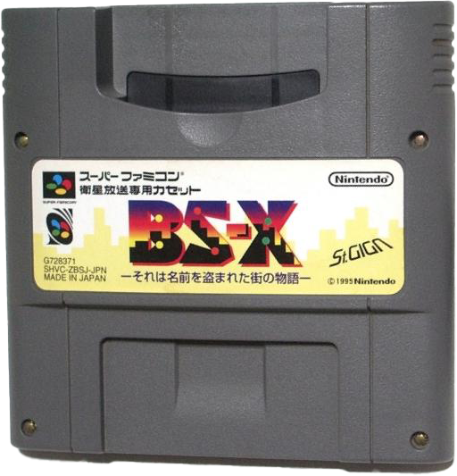  
						Cartouche fournie avec Satellaview et comportant une fente pour Memory Pack.
						 
						 
					
				
			

			

				A partir d’avril 1996, trois mois après la sortie de RPG Tsukūru 2, du contenu
				supplémentaire est diffusé sur Satellaview, un périphérique commercialisé au Japon par
				Nintendo et qui se branche à la Super Famicom pour permettre le téléchargement de jeux et de
				médias par satellite
				<a href="#fn30" class="footnote-ref" id="fnref30" role="doc-noteref">
					30
				</a>.
			

			

				Pour télécharger du contenu, il fallait utiliser la cartouche de BS-X fournie avec
				Satellaview, comportant une fente accueillant un Memory Pack de 8 Mbit sur lequel les
				données étaient enregistrées.
			

			

				On pouvait ainsi télécharger quelques jeux réalisés avec Super Dante, à lancer directement
				depuis BS-X
				
					<label for="sn-37" class="margin-toggle">
						&#8853;
					</label>
					<input type="checkbox" id="sn-37" class="margin-toggle" />
					
						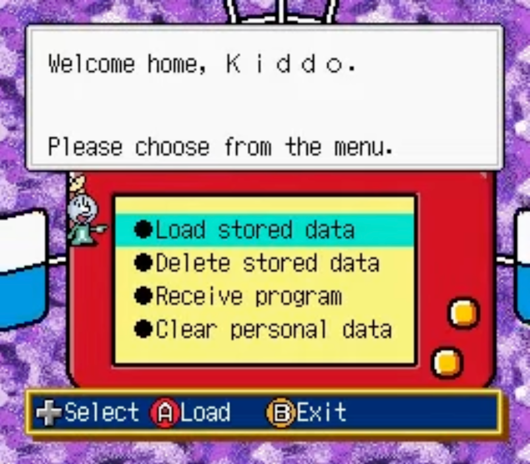  
						Une vidéo YouTube montre le lancement d’un jeu Super Dante depuis BS-X.  
						Cabbusses’s Retro Obscurities,
						<a href="https://www.youtube.com/watch?v=XFxlTSK7l_A">
							クック・ドゥ・ドゥル・ドゥー (RPGツクールSUPER DANTE) |
							<em>Cock-A-Doodle-Doo (BS) (Satellaview)</em>
						</a>, YouTube, 29 octobre 2012
						 
						 
					
				, mais aussi des jeux et ressources pour RPG Tsukūru 2 qui devaient alors être
				chargés depuis le programme d’origine
				<a href="#fn31" class="footnote-ref" id="fnref31" role="doc-noteref">
					31
				</a>. Il fallait pour cela insérer le Memory Pack dans la cartouche de RPG Tsukūru 2, qui
				comportait également la fente adéquate. RPG Tsukūru 2 et BS-X ont ainsi fait partie des 9
				jeux à avoir bénéficié d’une cartouche à fente
				<a href="#fn32" class="footnote-ref" id="fnref32" role="doc-noteref">
					32
				</a>.
			

			

				A noter que pour étendre les capacités de stockage, RPG Tsukūru 2 supporte également le
				Turbo File Twin, tout comme son prédécesseur Super Dante.
			

		</section>
	</section>
	<section id="rpg-tsukūru-3-rpg-maker" class="level2">
		<h2>RPG Tsukūru 3 (RPG Maker)</h2>
		

			RPG Tsukūru 3 marque le passage de la série à la PlayStation, ce qui implique un passage au
			CD-ROM. Les ressources incluses deviennent plus sophistiquées.
		

		

			C’est aussi le premier opus console à paraître en Amérique du Nord, où il est simplement
			intitulé RPG Maker.
		

		

			Les jeux sont en 2D et les combats en vue de face à la Dragon Quest. Sur l’écran-titre, on a
			le choix entre RPG Maker et Anime Maker, un éditeur de sprites. Dessiner à la manette est très
			difficile, d’autant plus que l’interface n’est pas très aboutie : il est par exemple
			impossible de se déplacer précisément pixel par pixel
			<a href="#fn33" class="footnote-ref" id="fnref33" role="doc-noteref">
				33
			</a>. La souris PlayStation est supportée, mais elle est jugée imprécise. On peut tout de même
			personnaliser les ressources existantes assez simplement en changeant leur palette de couleurs
			<a href="#fn34" class="footnote-ref" id="fnref34" role="doc-noteref">
				34
			</a>. Les créations de l’utilisateur sont sauvegardées sur la carte mémoire pour être
			utilisées dans RPG Maker. Curieusement, certaines ressources telles que des grands monstres et
			des personnages modernes sont uniquement présentes dans Anime Maker, et doivent donc être
			sauvegardées dans la carte mémoire pour être utilisées dans RPG Maker
			<a href="#fn35" class="footnote-ref" id="fnref35" role="doc-noteref">
				35
			</a>.
		

		

			Anime Maker a également été utilisé par des speedrunners : grâce à des techniques de
			corruption de sauvegarde, il était possible d’ouvrir les sauvegardes d’autres jeux et de
			« redessiner » leurs données, afin d’arriver directement à la fin du jeu par exemple
			<a href="#fn36" class="footnote-ref" id="fnref36" role="doc-noteref">
				36
			</a>.
		

		

			Il est aussi possible d’importer des musiques réalisées avec Music Maker 2, un autre programme
			pour PlayStation, mais des bugs rendent l’expérience peu satisfaisante
			<a href="#fn37" class="footnote-ref" id="fnref37" role="doc-noteref">
				37
			</a>.
		

		

			Un nouveau système de carte du monde est introduit, dans lequel on se déplace entre des points
			reliés par des lignes. Il reste possible de créer une carte traditionnelle, avec des
			déplacements plus libres, en utilisant l’éditeur de carte normal.
		

		

			Les variables ne sont toujours pas présentes – il faudra attendre RPG Tsukūru 4 pour cela.
			Certains créateurs utilisaient donc l’argent possédé comme une variable
			<a href="#fn38" class="footnote-ref" id="fnref38" role="doc-noteref">
				38
			</a>. Quelques autres défauts sont présents, comme la disparition des fonds de combat, mais
			RPG Tsukūru 3 propose globalement un bon équilibre entre liberté créative et simplicité
			d’utilisation.
		

		

			
				<label for="sn-38" class="margin-toggle">
					&#8853;
				</label>
				<input type="checkbox" id="sn-38" class="margin-toggle" />
				
					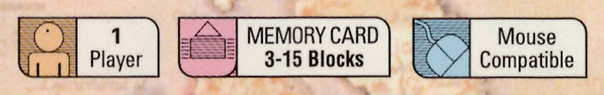  
					RPG Tsukūru 3 est un des premiers jeux à demander sur sa boîte un nombre variable de blocs
					de mémoire.
					 
					 
				
			
		

		

			Les cartes mémoire de la PlayStation permettent en théorie de régler le problème de mémoire
			limitée qui compliquait l’utilisation des versions console précédentes. Il est techniquement
			possible de créer des histoires sans limite : si la taille du jeu devient trop grande pour une
			seule carte mémoire, on peut en utiliser plusieurs pour un même jeu. Cependant, tout n’est pas
			parfait. Les cartes et les événements sont stockés dans des blocs de mémoire différents ; un
			nouveau projet demande donc au minimum deux blocs sur les 15 disponibles sur une carte
			mémoire, et ce chiffre peut grimper rapidement
			<a href="#fn39" class="footnote-ref" id="fnref39" role="doc-noteref">
				39
			</a>.
		

	</section>
	<section id="rpg-tsukūru-4" class="level2">
		<h2>RPG Tsukūru 4</h2>
		

			
				<label for="sn-39" class="margin-toggle">
					&#8853;
				</label>
				<input type="checkbox" id="sn-39" class="margin-toggle" />
				
					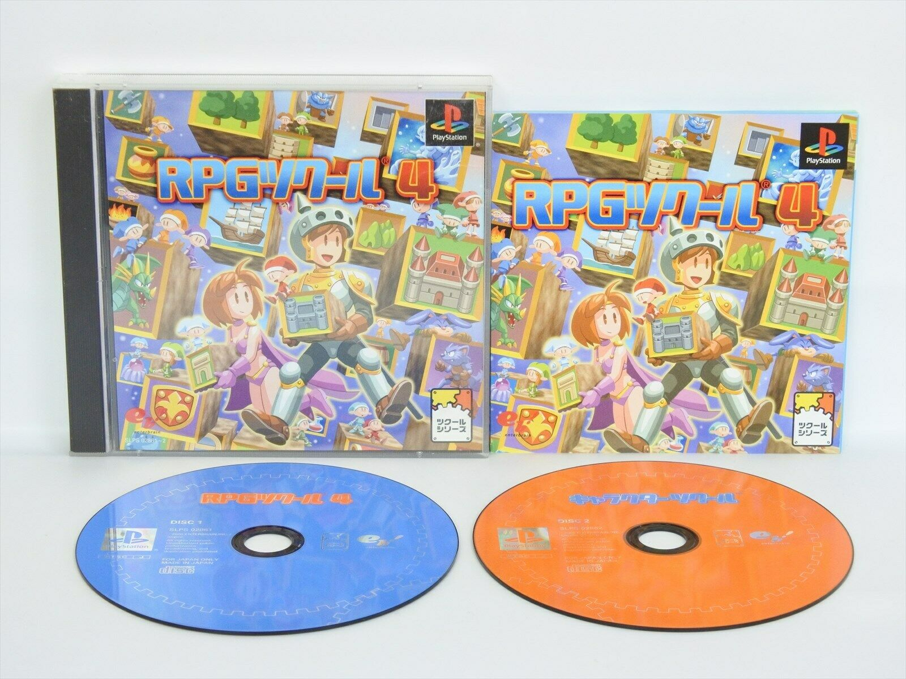  
					La boîte de RPG Tsukūru 4, son manuel et les deux disques.
					 
					 
				
			
		

		

			Contrairement à son prédécesseur, ce titre n’a pas été localisé pour l’Amérique du Nord, et
			reste donc exclusif au Japon. C’est aussi le seul épisode a être réalisé par l’entreprise de
			développement japonaise Agenda, présentée dans le jeu sous l’ancien nom de sa division jeu
			vidéo, « argent »
			<a href="#fn40" class="footnote-ref" id="fnref40" role="doc-noteref">
				40
			</a>. Agenda a également travaillé pour Enterbrain sur d’autres titres de la gamme des Tsukūru
			<a href="#fn41" class="footnote-ref" id="fnref41" role="doc-noteref">
				41
			</a>.
		

		

			Cette version propose de grandes évolutions, notamment l’apparition des variables, des timers,
			et d’un système de combat en vue de côté et en temps réel avec des animations dynamiques. Sur
			la carte, les sprites sont plus détaillés et un portrait leur est associé pour les dialogues.
			Des vidéos pré-enregistrées peuvent être jouées au cours du jeu. Dans la boîte du jeu, un
			deuxième CD contient une version améliorée d’Anime Maker
			<a href="#fn42" class="footnote-ref" id="fnref42" role="doc-noteref">
				42
			</a>.
		

	</section>
	<section id="rpg-tsukūru-5-rpg-maker-2" class="level2">
		<h2>RPG Tsukūru 5 (RPG Maker 2)</h2>
		

			
				<label for="sn-40" class="margin-toggle">
					&#8853;
				</label>
				<input type="checkbox" id="sn-40" class="margin-toggle" />
				
					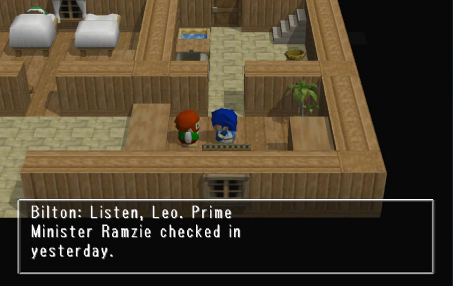 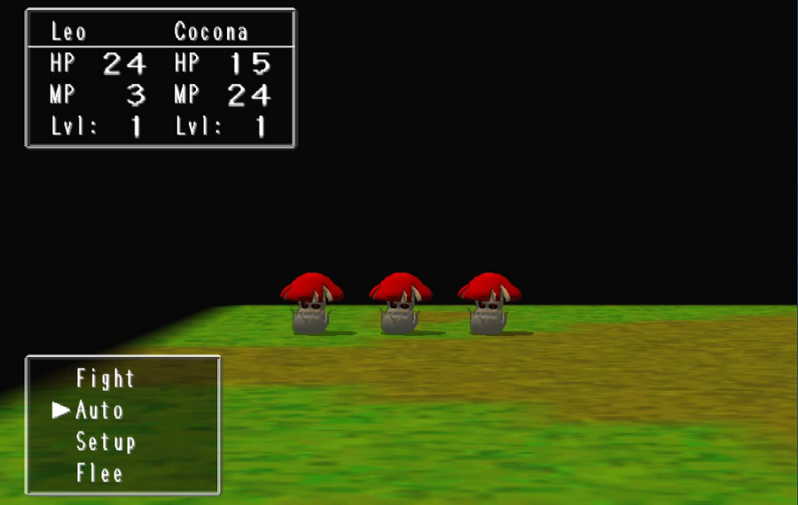
					 
					Images de <em>fu-ma</em>, le jeu d’exemple de RPG Maker 2.  
					<a href="https://gamefabrique.com/games/rpg-maker-2/">
						<em>RPG Maker 2</em>
					</a>, GameFabrique
					 
					 
				
			
		

		

			RPG Tsukūru 5, appelé RPG Maker 2 en Occident, paraît le 8 août 2002 pour la PS2. C’est le
			premier RPG Maker en 3D. La caméra reste en vue de dessus, mais le joueur peut la faire
			pivoter sur 360°. De plus, depuis le menu de debug en cours de jeu, on peut aussi changer la
			distance de la caméra et son inclinaison par rapport au sol. Les combats sont eux aussi en 3D,
			avec une vue de face à la Dragon Quest et des ennemis animés.
		

		

			Le menu de debug, qui s’ouvre avec la touche Carré, permet également de désactiver les combats
			aléatoires, modifier les attributs des personnages, mais aussi de changer la météo et l’heure
			de la journée.
		

		

			Cette version est plus complète sur de nombreux points : on y trouve un générateur de
			personnages où l’on peut modifier les différentes parties du corps, un éditeur d’arrière-plan,
			un éditeur d’effets spéciaux, un éditeur de texte et un générateur de monstres.
		

		<figure>
			
				Ci-contre : Éditeur de RPG Maker 3.  
				https://www.youtube.com/playlist?list=PLE521469AEA09B4FE
			
			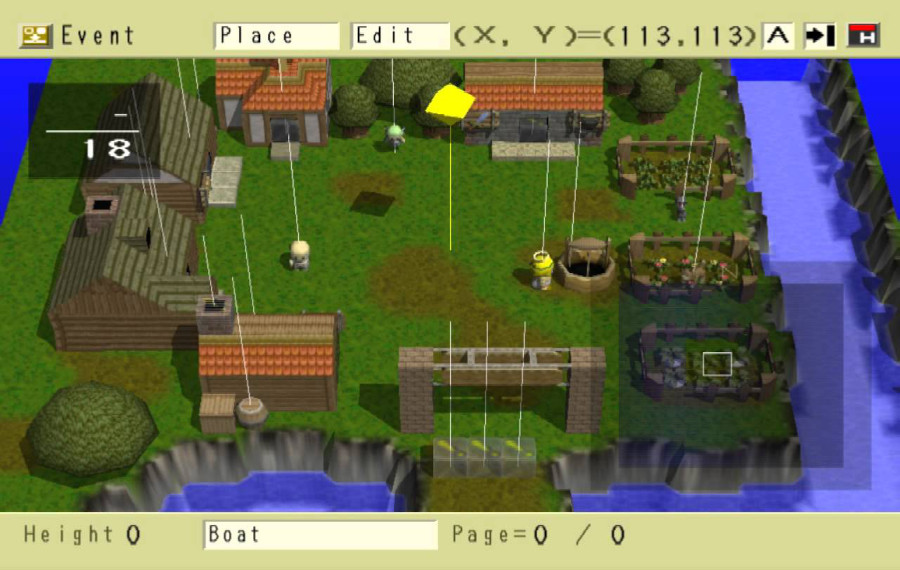
		</figure>
		

			Le principe des évènements est entièrement repensé : désormais, les scripts sont à écrire
			séparément et peuvent être appelés par un événement, mais aussi un objet ou une magie.
			
				<label for="sn-41" class="margin-toggle">
					&#8853;
				</label>
				<input type="checkbox" id="sn-41" class="margin-toggle" />
				
					Comme un symbole de l’éloignement au reste de la série, le terme
					<em>switch</em> (interrupteur), élément traditionnel des événements, est ici renommé
					<em>flag</em>. 
					 
				
			
			Plusieurs scripts peuvent être exécutés en parallèle, ce qui n’était auparavant pas le cas.
			Les possibilités sont décuplées, permettant de réaliser toutes sortes de mini-jeux, mais
			l’interface n’en est que plus difficile à utiliser. Trois niveaux de complexité sont donc
			disponibles pour l’éditeur : débutant, normal ou difficile.
		

		

			Le mode débutant est limité en fonctionnalités et la création se fait en déposant des éléments
			pré-construits. Il ne permet pas de créer de nouveaux fichiers de données, mais il crée des
			données et des cartes de départ très utiles pour commencer. Une astuce courante est donc de
			lancer le jeu en débutant pour créer les données d’exemple, puis repasser en difficile
			<a href="#fn43" class="footnote-ref" id="fnref43" role="doc-noteref">
				43
			</a>.
		

		

			Les modes de complexité suivants donnent un contrôle plus fin dans la création des cartes et
			des événements. Les claviers USB sont supportés afin d’écrire les dialogues plus facilement.
			
				<label for="sn-42" class="margin-toggle">
					&#8853;
				</label>
				<input type="checkbox" id="sn-42" class="margin-toggle" />
				
					Dans la version japonaise, l’écriture en japonais via le clavier et la conversion
					kana-kanji est possible.
					 
					 
				
			
		

		

			Le jeu d’exemple, <em>fu-ma</em>, a été réalisé par l’équipe de développement de
			<em>Dragon Quest</em> en utilisant uniquement les outils du programme.<a
				href="#fn44"
				class="footnote-ref"
				id="fnref44"
				role="doc-noteref"
			>
				44
			</a>
		

		

			RPG Tsukūru 5 s’éloigne donc des principes de design de la série par son passage à la 3D et sa
			grande liberté de création, pour un résultat aussi complet que difficile d’accès, avec une
			vitesse d’exécution plutôt lente et une capacité de sauvegarde limitée.
		

		

			
				<label for="sn-43" class="margin-toggle">
					&#8853;
				</label>
				<input type="checkbox" id="sn-43" class="margin-toggle" />
				
					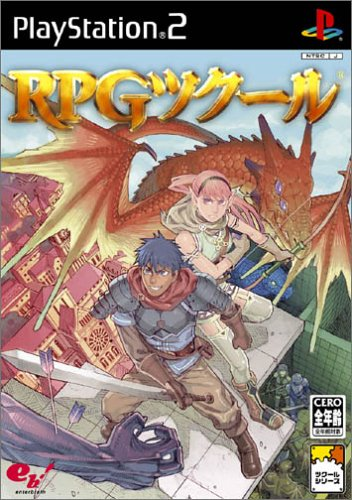  
					La boite japonaise de RPG Tsukūru.
					 
					 
				
			
		

	</section>
	<section id="rpg-tsukūru-rpg-maker-3" class="level2">
		<h2>RPG Tsukūru (RPG Maker 3)</h2>
		

			Appelé RPG Maker 3 en Occident et simplement RPG Tsukūru au Japon, bien qu’il soit le
			successeur de RPG Tsukūru 5, cet opus est le dernier RPG Maker publié sur PS2. C’est également
			le seul épisode développé par le studio Runtime.
			
				<label for="sn-44" class="margin-toggle">
					&#8853;
				</label>
				<input type="checkbox" id="sn-44" class="margin-toggle" />
				
					Runtime est un studio de développement tokyoïte fondé en 2001 puis racheté en 2006 par
					Marvelous Entertainment, avant d’être fusionné en 2008.  
					ランタイム会社概要, runtime-inc.com (<a href="http://web.archive.org/web/20071102065502/http://www.runtime-inc.com:80/company.html">
						archive
					</a>)  
					<a href="https://en.wikipedia.org/wiki/Marvelous_Entertainment">
						<em>Marvelous Entertainment</em>
					</a>
					, Wikipedia
					 
					 
				
			
			Il se veut plus simple à utiliser que son prédecesseur, mais une variété de problèmes
			techniques altèrent la qualité de l’expérience.
		

		

			Alors que RPG Tsukūru 5 était très proche du style <em>Dragon Quest</em>, les combats se
			rapprochent ici plutôt du style de <em>Final Fantasy</em>, et plus précisément de l’ère PS2
			avec des angles de caméra immersifs. De manière générale, la direction artistique, plus sombre
			et réaliste, semble très influencée par les jeux occidentaux.
		

		<figure>
			
				Ci-contre : La qualité des visuels en combat fait un véritable bon en avant dans RPG Maker
				3.  
				Puyo,
				<a href="https://www.gamekult.com/actualite/rpg-maker-de-retour-sur-ps2-36894.html">
					<em>RPG Maker de retour sur PS2</em>
				</a>
				, Gamekult, 1er octobre 2004
			
			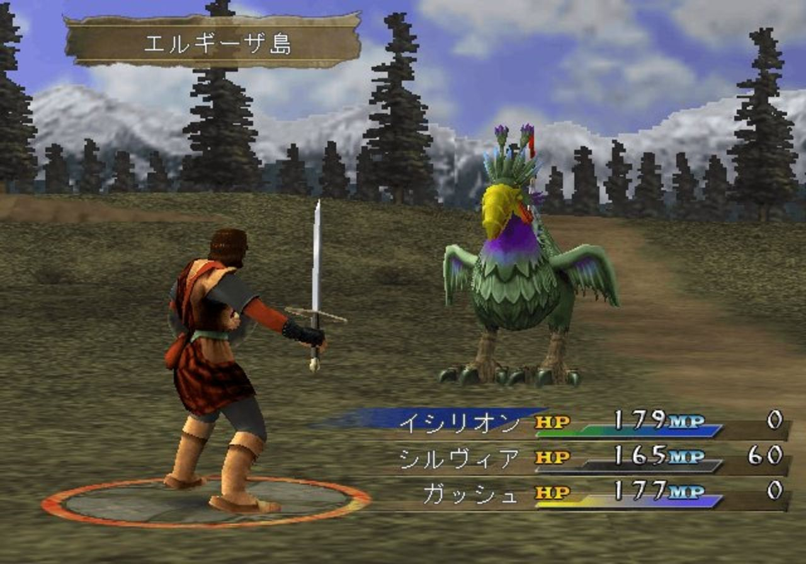
		</figure>
		

			Le système de jauge ATB
			
				<label for="sn-45" class="margin-toggle sidenote-number"></label>
				<input type="checkbox" id="sn-45" class="margin-toggle" />
				
					Active-Time Battle.
					 
					 
				
			
			rappelle RPG Tsukūru 4, mais le rythme des combats est gâché par un très long chargement
			initial, des animations au séquençage haché,
			
				<label for="sn-46" class="margin-toggle">
					&#8853;
				</label>
				<input type="checkbox" id="sn-46" class="margin-toggle" />
				
					Un bon exemple du problème de rythme dans les animations est l’attaque normale du héros.
					Plusieurs animations se jouent successivement : le héros fait un bon en avant, il donne un
					coup d’épée, il recule alors que les dégâts s’affichent, puis le monstre tombe à terre si
					ses points de vie ont atteint zéro. Ces quatre étapes, au lieu de s’enchaîner
					naturellement, sont entrecoupées de pauses pour un résultat moins immersif.
					 
					 
				
			
			ainsi que des ralentissements lors des animations spéciales.
		

		

			Il existe trois types de carte : les villes, les donjons et les cartes du monde (ou
			<em>fields</em>). Des cartes de départ sont disponibles pour chaque environnement afin d’éviter
			de tout dessiner manuellement.
		

		

			
				<label for="sn-47" class="margin-toggle">
					&#8853;
				</label>
				<input type="checkbox" id="sn-47" class="margin-toggle" />
				
					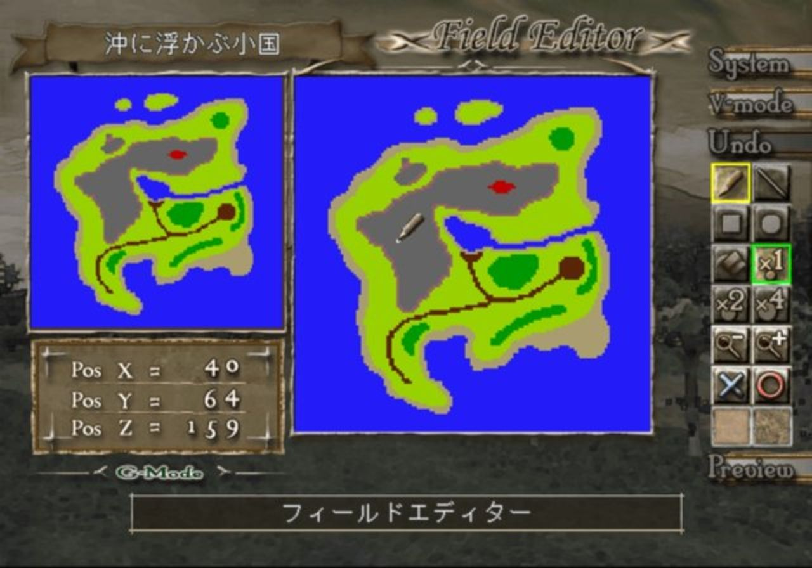  
					L’éditeur de terrain de RPG Tsukūru.
					 
					 
				
			
		

		

			L’éditeur de terrain permet de créer les cartes du monde en dessinant les emplacements de
			l’herbe, l’eau, la forêt, etc. Des pinceaux sont dédiés à l’élévation de la carte pour créer
			du relief. De plus, en changeant le climat, la saison, l’heure de la journée et la météo, les
			textures du terrain et les effets visuels s’adaptent pour donner une toute autre ambiance.
			
				<label for="sn-48" class="margin-toggle">
					&#8853;
				</label>
				<input type="checkbox" id="sn-48" class="margin-toggle" />
				
					Une astuce consiste à écrire le nom d’utilisateur « Maker » afin de débloquer plus de 100
					arrière-plans cachés. https://w.atwiki.jp/gcmatome/pages/2229.html]
					 
					 
				
			
			L’éditeur de terrain ne permet pas de visualiser en direct les changements en 3D ; il faut
			pour cela passer en mode aperçu, ce qui demande un temps de chargement et permet d’explorer la
			carte à pied. Après avoir créé le terrain, un autre éditeur permet de placer des évènements,
			notamment l’entrée d’une ville ou d’un donjon, symbolisés par des modèles 3D miniatures.
		

		

			L’éditeur de carte est simple à manipuler, même pour créer de vastes étendues de terrain.
			Néanmoins, il n’est pas possible de bloquer le passage en utilisant le relief, car le héros
			peut traverser même les pentes les plus abruptes. Les donjons sont également simples à
			réaliser. Des outils permettent de placer facilement un piège qui fait subir des dégâts au
			joueur, ou encore un passage secret qui se dévoile quand on examine le mur.
		

		

			
				<label for="sn-49" class="margin-toggle">
					&#8853;
				</label>
				<input type="checkbox" id="sn-49" class="margin-toggle" />
				
					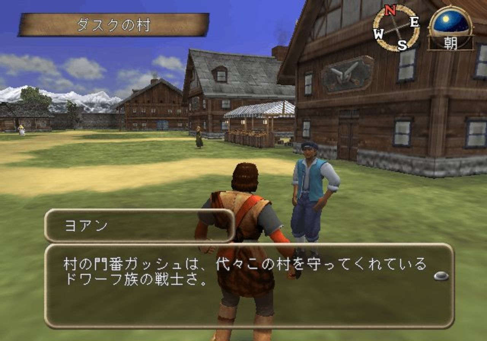
					 
					 
				
			
		

		

			Les musiques, de bonne qualité, furent plus tard republiés dans la version VALUE de RPG Maker
			XP.
		

		

			Deux jeux d’exemple sont inclus : <em>City Where the Sun Rises</em>
			
				<label for="sn-50" class="margin-toggle sidenote-number"></label>
				<input type="checkbox" id="sn-50" class="margin-toggle" />
				
					Titre original : 太陽の昇る街.
					 
					 
				
			, qui est uniquement distribué dans la version japonaise, et <em>Dear Brave Heart</em>,
			qui a la particularité de ne pas utiliser les points d’expérience dans son système de progression :
			les personnages peuvent être renforcés uniquement par l’amélioration d’équipement et l’apprentissage
			de compétences lors d’évènements particuliers.<a
				href="#fn45"
				class="footnote-ref"
				id="fnref45"
				role="doc-noteref"
			>
				45
			</a>
		

		

			Avec RPG Tsukūru, Runtime a pour ambition de proposer un outil de création qui soit accessible
			tout en produisant des jeux convaincants à une époque où les RPG en 3D sont en plein essor.
			
				<label for="sn-51" class="margin-toggle">
					&#8853;
				</label>
				<input type="checkbox" id="sn-51" class="margin-toggle" />
				
					En fin de compte, RPG Maker 2 et 3 auront été les seuls épisodes de la série à permettre
					la création de RPG en 3D. Il faut dire que la 2D rend la création et le partage plus
					accessibles, d’autant plus sur PC où les utilisateurs s’échangent <em>tilesets</em> et
					<em>sprites</em>. Les épisodes 3D ne semblent pas avoir répondu aux attentes du public, notamment
					en raison de la difficulté d’utilisation dans le cas de RPG Maker 2 et des contraintes techniques
					et créatives dans le cas de RPG Maker 3. Aussi, il faudra attendre 2010 avant que la série
					ne fasse son retour sur console portable avec RPG Maker DS, et 2018 pour un retour sur consoles
					de salon avec RPG Maker MV Trinity.
					 
					 
				
			
			Le pari est en partie réussi ; néanmoins, les restrictions créatives et les longs temps de
			chargement peuvent rendre l’expérience laborieuse pour le créateur comme pour le joueur.
			Contrairement à RPG Tsukūru 4 et 5 qui peuvent être défendus par une partie du public pour
			leur capacité à produire des jeux intéressants en dépit de la complexité de l’éditeur, cet
			épisode contient des défauts difficiles à ignorer pour les créateurs débutants comme
			expérimentés.
			<a href="#fn46" class="footnote-ref" id="fnref46" role="doc-noteref">
				46
			</a>
		

	</section>
</section>
<section id="consoles-portables" class="level1">
	<h1>Consoles portables</h1>
	<section id="rpg-maker-gb" class="level2">
		<h2>RPG Maker GB</h2>
		

			
				<label for="sn-52" class="margin-toggle">
					&#8853;
				</label>
				<input type="checkbox" id="sn-52" class="margin-toggle" />
				
					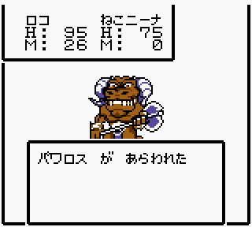
					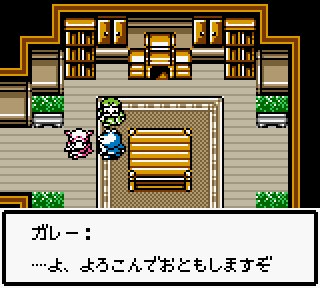
					 
					Images de RPG Maker GB
					 
					 
				
			
		

		

			Le premier RPG Maker de poche ! Sorti le 17 mars 2000, il permet de créer des petits RPG
			facilement et n’importe où. On peut enregistrer des raccourcis pour écrire facilement les mots
			fréquemment utilisés. Les combats en vue de face rappellent beaucoup ceux de Dragon Quest sur
			la même console, mais sans les arrière-plans. Une traduction anglaise non officielle de
			l’éditeur a été réalisée par MageCraft Translations, la dernière version datant de janvier
			2002
			<a href="#fn47" class="footnote-ref" id="fnref47" role="doc-noteref">
				47
			</a>.
		

		

			Le programme comporte quelques bugs et certains aspects pourraient être améliorés, mais la
			proposition est convaincante et les musiques sont particulièrement appréciées. Field 1, en
			particulier, a acquis une petite réputation au sein de la communauté
			<a href="#fn48" class="footnote-ref" id="fnref48" role="doc-noteref">
				48
			</a>. Pour commémorer la sortie du logiciel, l’évènement “Tag Team Maker Contest” fut organisé
			<a href="#fn49" class="footnote-ref" id="fnref49" role="doc-noteref">
				49
			</a>
			dans lequel les participants devaient créer un jeu en duo en tirant parti de la fonction de
			partage par câble link
			<a href="#fn50" class="footnote-ref" id="fnref50" role="doc-noteref">
				50
			</a>
			. Le jeu ayant gagné le Grand Prix a ensuite été intégré à RPG Maker GB 2.
		

		<figure>
			

				<iframe
					allowfullscreen
					allow="autoplay"
					frameborder="0"
					src="https://embed.nicovideo.jp/watch/sm17957227?allowProgrammaticFullScreen=1"
					style="position: absolute; top: 0; left: 0; width: 100%; height: 100%; border: 0"
				></iframe>
			

			<figcaption>RPG Maker GB – Field 1</figcaption>
		</figure>
		

			L’espace disponible dans la cartouche permet de sauvegarder un jeu de quelques heures. Pour
			étendre la capacité de stockage, ASCII a mis sur le marché le Turbo File GB, un accessoire de
			stockage permettant de stocker plusieurs jeux sans problème.
		

	</section>
	<section id="taro-the-space-alien-in-rpg-maker-gb-2" class="level2">
		<h2>Taro the Space Alien in RPG Maker GB 2</h2>
		

			
				<label for="sn-53" class="margin-toggle">
					&#8853;
				</label>
				<input type="checkbox" id="sn-53" class="margin-toggle" />
				
					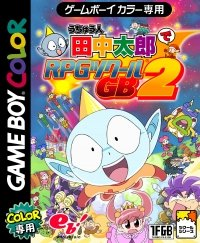
					 
					 
				
			
		

		

			Cette nouvelle version, sortie le 20 juillet 2001
			<a href="#fn51" class="footnote-ref" id="fnref51" role="doc-noteref">
				51
			</a>, contient la même base que RPG Maker GB et, fait unique dans la série, met en avant une
			collaboration avec un manga, Taro the Space Alien, publié dans le Monthly CoroCoro Comic.
		

		

			Monthly CoroCoro Comic est un magazine de prépublication de mangas destiné aux enfants, connu
			pour publier des histoires en lien avec l’univers du jeu vidéo. Bien que la collaboration avec
			Taro soit parue étrange aux yeux de la communauté RPG Maker japonaise ; il est supposé
			qu’Enterbrain tentait plutôt d’attirer une nouvelle audience
			<a href="#fn52" class="footnote-ref" id="fnref52" role="doc-noteref">
				52
			</a>. Le manga, disponible uniquement en japonais, raconte l’histoire de Takashi, un écolier
			dont la classe accueille Taro, nouvel élève qui se révèle être un alien. Takashi, intrigué,
			tente de percer le mystère autour des origines de Taro. RPG Maker GB 2 comprend un jeu
			d’exemple avec les deux personnages qui expliquent d’une façon accessible aux débutants
			comment réaliser un RPG.
		

		

			L’autre jeu d’exemple, <em>Monster School</em>
			
				<label for="sn-54" class="margin-toggle sidenote-number"></label>
				<input type="checkbox" id="sn-54" class="margin-toggle" />
				
					Titre original : MONSTERスクール.
					 
					 
				
			, n’est autre que le gagnant du “Tag Team Maker Contest” ayant eu lieu pour commémorer la
			sortie de RPG Maker GB. Le jeu est particulièrement bien réalisé, ce qui en fait une bonne référence
			pour les apprentis créateurs<a
				href="#fn53"
				class="footnote-ref"
				id="fnref53"
				role="doc-noteref"
			>
				53
			</a>.
		

		

			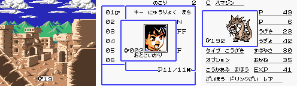
		

		

			Le logiciel est très similaire, les ajouts notables étant de nouvelles images de monstres
			ainsi que l’apparition des images de visage et de scène. De plus, le menu de debug, que l’on
			ouvre avec SELECT en cours de jeu, a été étoffé de plusieurs options intéressantes. On peut
			maintenant y modifier l’équipe, changer le niveau et les caractéristiques des personnages,
			s’ajouter des objets et de l’argent, ainsi que réinitialiser la position du véhicule
			<a href="#fn54" class="footnote-ref" id="fnref54" role="doc-noteref">
				54
			</a>.
		

	</section>
	<section id="rpg-maker-advance" class="level2">
		<h2>RPG Maker Advance</h2>
		

			Sortie uniquement au Japon le 25 avril 2003, cette version Game Boy Advance propose des
			graphismes soignés et une vue de côté pendant les combats. La volonté des développeurs est de
			réunir les deux activités habituellement séparées que sont la création et le jeu.
			<a href="#fn55" class="footnote-ref" id="fnref55" role="doc-noteref">
				55
			</a>
		

		

			Le câble link de la Game Boy peut être utilisé pour envoyer ses créations vers d’autres
			consoles. De plus, en branchant le Turbo File Advance, un accessoire de stockage prévu pour
			les jeux d’ASCII et conçu en collaboration avec Sammy, il est possible de stocker jusqu’à 15
			sauvegardes différentes afin de pallier à la limite d’une cartouche GBA
			<a href="#fn56" class="footnote-ref" id="fnref56" role="doc-noteref">
				56
			</a>.
		

	</section>
</section>
<section id="figures-majeures" class="level1">
	<h1>Figures majeures</h1>
	<section id="yoji-ojima" class="level2">
		<h2>Yoji Ojima</h2>
		

			
				<label for="sn-55" class="margin-toggle">
					&#8853;
				</label>
				<input type="checkbox" id="sn-55" class="margin-toggle" />
				
					  
					Photo de Yoji Ojima dans le manuel de Dante 98 II (1996).
					 
					 
				
			
		

		

			Yoji Ojima (尾島陽児) est le programmeur de RPG Maker Dante 98 II, Sim RPG Maker 95, RPG Maker
			2000, XP, VX, VX Ace et MV
			<a href="#fn57" class="footnote-ref" id="fnref57" role="doc-noteref">
				57
			</a>. On peut imaginer que l’équipe des RPG Maker plus récents comporte plusieurs
			programmeurs, mais on sait qu’il était encore chargé du design des systèmes en 2017
			<a href="#fn58" class="footnote-ref" id="fnref58" role="doc-noteref">
				58
			</a>
			et les logiciels récents continuent d’être accompagnés de la mention « Copyright KADOKAWA
			GAMES / YOJI OJIMA ». C’est donc une figure centrale dans l’histoire de la série, bien qu’il
			soit étonamment difficile de trouver des informations à son sujet.
		

		

			Né dans la préfecture de Kanagawa en 1977, Ojima a appris la programmation en autodidacte
			alors qu’il était à l’école. Dante 98 II est sorti alors qu’il n’avait que 19 ans ! En plus
			des RPG Maker, il a travaillé sur Zen, un programme d’IA pour le jeu Go, à partir de 2007
			environ
			<a href="#fn59" class="footnote-ref" id="fnref59" role="doc-noteref">
				59
			</a>. Il devint plus tard DeepZenGo
			<a href="#fn60" class="footnote-ref" id="fnref60" role="doc-noteref">
				60
			</a>.
		

		

			
				<label for="sn-56" class="margin-toggle">
					&#8853;
				</label>
				<input type="checkbox" id="sn-56" class="margin-toggle" />
				
					Cherry est un programmeur reconnu pour ses connaissances approfondies à propos du
					fonctionnement de RPG Maker 2000 et 2003. Il a réalisé plusieurs patchs pour étendre les
					fonctionnalités des logiciels sans avoir accès au code source de manière officielle.
					 
					 
				
			
		

		

			<blockquote>
				

					On peut sentir la patte de Yoji partout, dans le code, dans l’interface et plus
					généralement dans le design et l’architecture du programme. Et j’aime beaucoup ça. Seul
					RM2003 est bizarre, et on peut clairement sentir l’absence de Yoji dans ses ajouts. […] On
					dirait vraiment que quelqu’un qui n’a aucune compréhension et aucun respect pour sa façon
					de penser et de designer des programmes a travaillé dessus (et avait sûrement un budget
					serré), ce qui a transformé certaines choses en un vrai désastre.
				

				<footer>
					Cherry, rpgmaker.net
					<a href="#fn61" class="footnote-ref" id="fnref61" role="doc-noteref">
						61
					</a>
				</footer>
			</blockquote>
		

	</section>
	<section id="autres-crédits" class="level2">
		<h2>Autres crédits</h2>
		

			RPG Maker Dante 98 est écrit par Nobuyuki Yamashita. RPG Maker 95 est programmé par You Ito et
			Tsuneari Okumoto. Les parties uniques à RPG Maker 2003 sont écrites par 濱田信次 (Shinji
			Hamada ?)
			<a href="#fn62" class="footnote-ref" id="fnref62" role="doc-noteref">
				62
			</a>.
		

		

		

			Cet article utilise <a href="https://github.com/jez/tufte-pandoc-css">Tufte Pandoc CSS</a>, un
			projet basé sur <a href="https://edwardtufte.github.io/tufte-css/">Tufte CSS</a>.
		

	</section>
</section>
<section class="footnotes footnotes-end-of-document" role="doc-endnotes">
	

	<ol>
		<li id="fn1" role="doc-endnote">
			

				ツクール概要, ツクールweb (
				<a href="http://web.archive.org/web/20100601165042/http://tkool.jp/outline/">archive</a>)
				<a href="#fnref1" class="footnote-back" role="doc-backlink">
					↩︎
				</a>
			

		</li>
		<li id="fn2" role="doc-endnote">
			

				ツクール博物館, ツクールweb (
				<a href="https://web.archive.org/web/20070823073359/http://www.enterbrain.co.jp/tkool/museum.html">
					archive
				</a>
				)<a href="#fnref2" class="footnote-back" role="doc-backlink">
					↩︎
				</a>
			

		</li>
		<li id="fn3" role="doc-endnote">
			

				<a href="http://www.8-bits.info/gamelist/PC88/info/info_Dq0aLbayw8i0gM7b.php">
					ダンジョン万次郎
				</a>
				, 8-bits.info
				<a href="#fnref3" class="footnote-back" role="doc-backlink">
					↩︎
				</a>
			

		</li>
		<li id="fn4" role="doc-endnote">
			

				<a href="http://msx.jpn.org/tagoo/s_check.cgi?LINE=1511">ダンジョン万次郎</a>, Tagoo
				<a href="#fnref4" class="footnote-back" role="doc-backlink">
					↩︎
				</a>
			

		</li>
		<li id="fn5" role="doc-endnote">
			

				<a href="http://www.8-bits.info/gamelist/PC88/info/info_DLjnk9rS0IqKAwe4.php">
					RPGツクール まみりん
				</a>
				, 8-bits.info
				<a href="#fnref5" class="footnote-back" role="doc-backlink">
					↩︎
				</a>
			

		</li>
		<li id="fn6" role="doc-endnote">
			

				<a href="http://www.uraken.net/zatsugaku/zatsugaku_60.html">
					ゲームを作ろう！（２）RPGツクールでつくーる
				</a>
				, uraken.net
				<a href="#fnref6" class="footnote-back" role="doc-backlink">
					↩︎
				</a>
			

		</li>
		<li id="fn7" role="doc-endnote">
			

				ツクール博物館, ツクールweb (
				<a href="https://web.archive.org/web/20070823073359/http://www.enterbrain.co.jp/tkool/museum.html">
					archive
				</a>
				)<a href="#fnref7" class="footnote-back" role="doc-backlink">
					↩︎
				</a>
			

		</li>
		<li id="fn8" role="doc-endnote">
			

				<em>MSX Magazine</em>, février 1990, p. 76 (
				<a href="https://archive.org/details/MSX_Magazine_1990-02_ASCII_JP/page/n75">archive</a>)
				<a href="#fnref8" class="footnote-back" role="doc-backlink">
					↩︎
				</a>
			

		</li>
		<li id="fn9" role="doc-endnote">
			

				<em>MSX Magazine</em>, février 1990, p. 88 (
				<a href="https://archive.org/details/MSX_Magazine_1990-02_ASCII_JP/page/n87">archive</a>)
				<a href="#fnref9" class="footnote-back" role="doc-backlink">
					↩︎
				</a>
			

		</li>
		<li id="fn10" role="doc-endnote">
			

				<em>MSX Magazine</em>, février 1992, p. 48 (
				<a href="https://archive.org/details/MSX_Magazine_1992-02_ASCII_JP/page/n47">archive</a>)
				<a href="#fnref10" class="footnote-back" role="doc-backlink">
					↩︎
				</a>
			

		</li>
		<li id="fn11" role="doc-endnote">
			

				Koji Fukuyama,
				<a href="https://automaton-media.com/articles/reportjp/20180805-73517/">
					MSX愛＆インディー精神を貫いてきたNIGOROのこれまでの道のり。『LA-MULANA
					2』の完成記念イベント「LA-MULANA 通の会」レポート
				</a>, AUTOMATON, 5 août 2018<a href="#fnref11" class="footnote-back" role="doc-backlink">
					↩︎
				</a>
			

		</li>
		<li id="fn12" role="doc-endnote">
			

				<em>MSX Magazine</em>, mai 1992, p. 79 (
				<a href="https://archive.org/details/MSX_Magazine_1992-05_ASCII_JP/page/n77">archive</a>)
				<a href="#fnref12" class="footnote-back" role="doc-backlink">
					↩︎
				</a>
			

		</li>
		<li id="fn13" role="doc-endnote">
			

				RPGツクールの歴史, ツクール (
				<a href="https://web.archive.org/web/20070717234604/http://www.enterbrain.co.jp/tkool/histry.html">
					archive
				</a>
				)<a href="#fnref13" class="footnote-back" role="doc-backlink">
					↩︎
				</a>
			

		</li>
		<li id="fn14" role="doc-endnote">
			

				<a href="https://w.atwiki.jp/gcmatome/pages/1911.html">RPGツクールDante98</a>,
				ゲームカタログ@Wiki
				<a href="#fnref14" class="footnote-back" role="doc-backlink">
					↩︎
				</a>
			

		</li>
		<li id="fn15" role="doc-endnote">
			

				<a href="https://w.atwiki.jp/gcmatome/pages/1911.html">RPGツクールDante98</a>,
				ゲームカタログ@Wiki
				<a href="#fnref15" class="footnote-back" role="doc-backlink">
					↩︎
				</a>
			

		</li>
		<li id="fn16" role="doc-endnote">
			

				<a href="https://en.wikipedia.org/wiki/RPG_Maker">
					<em>RPG Maker</em>
				</a>
				, Wikipedia
				<a href="#fnref16" class="footnote-back" role="doc-backlink">
					↩︎
				</a>
			

		</li>
		<li id="fn17" role="doc-endnote">
			

				<a href="http://www.rpg-maker.fr/wiki-23-rpg-maker-95.html">
					<em>RPG Maker 95</em>
				</a>
				, wiki d’Oniromancie
				<a href="#fnref17" class="footnote-back" role="doc-backlink">
					↩︎
				</a>
			

		</li>
		<li id="fn18" role="doc-endnote">
			

				<a href="http://www.rpg-maker.fr/decouvrir-logiciel-rm95.html">
					<em>Découvrir les logiciels : RPG Maker 95</em>
				</a>
				, Oniromancie
				<a href="#fnref18" class="footnote-back" role="doc-backlink">
					↩︎
				</a>
			

		</li>
		<li id="fn19" role="doc-endnote">
			

				<a href="https://ja.wikipedia.org/wiki/RPG%E3%83%84%E3%82%AF%E3%83%BC%E3%83%AB95">
					RPGツクール95
				</a>
				, Wikipedia
				<a href="#fnref19" class="footnote-back" role="doc-backlink">
					↩︎
				</a>
			

		</li>
		<li id="fn20" role="doc-endnote">
			

				BilouMaster, <a href="https://github.com/BilouMaster/buildozer">buildozer</a>, GitHub, mis à
				jour le 26 février 2018
				<a href="#fnref20" class="footnote-back" role="doc-backlink">
					↩︎
				</a>
			

		</li>
		<li id="fn21" role="doc-endnote">
			

				Nuki,
				<a href="https://e-magination.jeun.fr/t3204-joke-nous-offre-sa-vision">
					<em>Joke nous offre sa vision</em>
				</a>, E-magination Games, 22 février 2010<a
					href="#fnref21"
					class="footnote-back"
					role="doc-backlink"
				>
					↩︎
				</a>
			

		</li>
		<li id="fn22" role="doc-endnote">
			

				<a href="https://www.rpg-maker.fr/index.php?page=news&amp;id=226">Commentaire d’elm6</a>,
				Oniromancie, 3 février 2011 à 12:48:18
				<a href="#fnref22" class="footnote-back" role="doc-backlink">
					↩︎
				</a>
			

		</li>
		<li id="fn23" role="doc-endnote">
			

				<a href="https://forums.rpgmakerweb.com/index.php?threads/rpg-maker-mv-500k-midweek-madness-sales-map-madness-event.134680/">
					<em>RPG Maker MV 500k Midweek Madness Sales + Map Madness Event!</em>
				</a>
				, RPG Maker Forums, 24 mars 2021
				<a href="#fnref23" class="footnote-back" role="doc-backlink">
					↩︎
				</a>
			

		</li>
		<li id="fn24" role="doc-endnote">
			

				<a href="https://wiki.denfaminicogamer.jp/tkoolmv/RPG%E3%82%A2%E3%83%84%E3%83%9E%E3%83%BC%E3%83%AB%E3%81%AB%E3%81%A4%E3%81%84%E3%81%A6">
					RPGアツマールについて
				</a>
				, RPGツクールMVまとめwiki
				<a href="#fnref24" class="footnote-back" role="doc-backlink">
					↩︎
				</a>
			

		</li>
		<li id="fn25" role="doc-endnote">
			

				<a href="https://atsumaru.github.io/api-references/download/200x-player">
					RPGツクール2000/2003プレイヤー
				</a>
				, ゲームアツマール APIリファレンス, consulté le 28 juin 2021
				<a href="#fnref25" class="footnote-back" role="doc-backlink">
					↩︎
				</a>
			

		</li>
		<li id="fn26" role="doc-endnote">
			

				戸塚伎一,
				<a href="https://www.famitsu.com/news/201704/29132229.html">
					PC版『RPGツクール』100万本突破記念インタビュー！
					Steamでの展開やコミュニティの活性化がヒットにつながった
				</a>, ファミ通.com, 29 avril 2017<a
					href="#fnref26"
					class="footnote-back"
					role="doc-backlink"
				>
					↩︎
				</a>
			

		</li>
		<li id="fn27" role="doc-endnote">
			

				<a href="https://www.giantbomb.com/kuusou-kagaku/3010-6849/">
					<em>Kuusou Kagaku (company)</em>
				</a>
				, Giant Bomb
				<a href="#fnref27" class="footnote-back" role="doc-backlink">
					↩︎
				</a>
			

		</li>
		<li id="fn28" role="doc-endnote">
			

				<a href="https://fr.wikipedia.org/wiki/Agetec">
					<em>Agetec</em>
				</a>
				, Wikipédia
				<a href="#fnref28" class="footnote-back" role="doc-backlink">
					↩︎
				</a>
			

		</li>
		<li id="fn29" role="doc-endnote">
			

				<a href="https://en.wikipedia.org/wiki/Turbo_File_(ASCII)">
					<em>Turbo File (ASCII)</em>
				</a>
				, Wikipedia
				<a href="#fnref29" class="footnote-back" role="doc-backlink">
					↩︎
				</a>
			

		</li>
		<li id="fn30" role="doc-endnote">
			

				<a href="https://satellaview.fandom.com/wiki/RPG_Tsuk%C5%ABru_2">
					<em>RPG Tsukūru 2</em>
				</a>
				, The English Satellaview Wiki
				<a href="#fnref30" class="footnote-back" role="doc-backlink">
					↩︎
				</a>
			

		</li>
		<li id="fn31" role="doc-endnote">
			

				<a href="https://god-bird.net/research/satellaoriginal.html">
					サテラビューのオリジナルゲームの一覧。
				</a>
				, GOD BIRD
				<a href="#fnref31" class="footnote-back" role="doc-backlink">
					↩︎
				</a>
			

		</li>
		<li id="fn32" role="doc-endnote">
			

				<a href="https://satellaview.fandom.com/wiki/Slotted_cartridge">
					<em>Slotted cartridge</em>
				</a>
				, The English Satellaview Wiki
				<a href="#fnref32" class="footnote-back" role="doc-backlink">
					↩︎
				</a>
			

		</li>
		<li id="fn33" role="doc-endnote">
			

				https://w.atwiki.jp/gcmatome/pages/3854.html
				<a href="#fnref33" class="footnote-back" role="doc-backlink">
					↩︎
				</a>
			

		</li>
		<li id="fn34" role="doc-endnote">
			

				Topic
				<a href="https://forums.rpgmakerweb.com/index.php?threads/rpgmaker-1-2-and-3.80421/">
					« RPG Maker 1, 2 and 3 »
				</a>
				sur RPG Maker Forums
				<a href="#fnref34" class="footnote-back" role="doc-backlink">
					↩︎
				</a>
			

		</li>
		<li id="fn35" role="doc-endnote">
			

				https://w.atwiki.jp/gcmatome/pages/3854.html
				<a href="#fnref35" class="footnote-back" role="doc-backlink">
					↩︎
				</a>
			

		</li>
		<li id="fn36" role="doc-endnote">
			

				もか,
				<a href="https://news.denfaminicogamer.jp/gamenewsplus/200422c">
					『ドラクエ7』を4分でクリアするために必要なのは『RPGツクール3』。お絵かきツール「アニメティカ」と「メモリーカード」による攻略の歴史
				</a>, 電ファミニコゲーマー, 22 avril 2020<a
					href="#fnref36"
					class="footnote-back"
					role="doc-backlink"
				>
					↩︎
				</a>
			

		</li>
		<li id="fn37" role="doc-endnote">
			

				https://w.atwiki.jp/gcmatome/pages/3854.html
				<a href="#fnref37" class="footnote-back" role="doc-backlink">
					↩︎
				</a>
			

		</li>
		<li id="fn38" role="doc-endnote">
			

				https://w.atwiki.jp/gcmatome/pages/3854.html
				<a href="#fnref38" class="footnote-back" role="doc-backlink">
					↩︎
				</a>
			

		</li>
		<li id="fn39" role="doc-endnote">
			

				Topic
				<a href="https://forums.rpgmakerweb.com/index.php?threads/rpgmaker-1-2-and-3.80421/">
					« RPG Maker 1, 2 and 3 »
				</a>
				sur RPG Maker Forums
				<a href="#fnref39" class="footnote-back" role="doc-backlink">
					↩︎
				</a>
			

		</li>
		<li id="fn40" role="doc-endnote">
			

				昔は「アージェント」と名乗っていなかった？, agenda-game.com, 28 juin 2007 (
				<a href="https://web.archive.org/web/20110909161042/http://agenda-game.com/about/faq/000974.html">
					archive
				</a>
				)<a href="#fnref40" class="footnote-back" role="doc-backlink">
					↩︎
				</a>
			

		</li>
		<li id="fn41" role="doc-endnote">
			

				製品情報（目次）, agenda-game.com (
				<a href="https://web.archive.org/web/20110811054013/http://agenda-game.com/products/">
					archive
				</a>
				)<a href="#fnref41" class="footnote-back" role="doc-backlink">
					↩︎
				</a>
			

		</li>
		<li id="fn42" role="doc-endnote">
			

				<a href="https://psxdatacenter.com/games/J/R/SLPS-02861.html">
					<em>RPG Tsukuru 4</em>
				</a>
				, The Playstation Datacenter
				<a href="#fnref42" class="footnote-back" role="doc-backlink">
					↩︎
				</a>
			

		</li>
		<li id="fn43" role="doc-endnote">
			

				TheUnproPro,
				<a href="https://www.youtube.com/watch?v=h4k7ZRAlC7A">
					<em>RPG maker 2</em>
				</a>
				, 0:48 à 1:50, YouTube
				<a href="#fnref43" class="footnote-back" role="doc-backlink">
					↩︎
				</a>
			

		</li>
		<li id="fn44" role="doc-endnote">
			

				Matthew Scribner,
				<a href="https://archive.rpgamer.com/games/rpgm/rpgm2/rpgm2prev.html">
					<em>Preview: RPG Maker 2</em>
				</a>, RPGamer<a href="#fnref44" class="footnote-back" role="doc-backlink">
					↩︎
				</a>
			

		</li>
		<li id="fn45" role="doc-endnote">
			

				https://w.atwiki.jp/gcmatome/pages/2229.html
				<a href="#fnref45" class="footnote-back" role="doc-backlink">
					↩︎
				</a>
			

		</li>
		<li id="fn46" role="doc-endnote">
			

				https://w.atwiki.jp/gcmatome/pages/2229.html
				<a href="#fnref46" class="footnote-back" role="doc-backlink">
					↩︎
				</a>
			

		</li>
		<li id="fn47" role="doc-endnote">
			

				<a href="https://www.romhacking.net/translations/42/">
					<em>Translations - RPG Tsukuru GB</em>
				</a>
				, Romhacking.net
				<a href="#fnref47" class="footnote-back" role="doc-backlink">
					↩︎
				</a>
			

		</li>
		<li id="fn48" role="doc-endnote">
			

				<a href="http://tukutuku-con.blogspot.com/2019/03/blog-post.html">RPGツクールGB</a>,
				RPGツクールの森, 28 mars 2019
				<a href="#fnref48" class="footnote-back" role="doc-backlink">
					↩︎
				</a>
			

		</li>
		<li id="fn49" role="doc-endnote">
			

				<a href="http://tabiteam.s16.xrea.com/gbkouza-situmon.html">
					RPGツクールGB講座 - よくある質問
				</a>
				, TABITEAM
				<a href="#fnref49" class="footnote-back" role="doc-backlink">
					↩︎
				</a>
			

		</li>
		<li id="fn50" role="doc-endnote">
			

				Résultats du concours, tkool.jp (
				<a href="http://web.archive.org/web/20080217005320/http://tkool.jp/products/rpggb/tagkon/tagkon_2.html">
					archive
				</a>
				)<a href="#fnref50" class="footnote-back" role="doc-backlink">
					↩︎
				</a>
			

		</li>
		<li id="fn51" role="doc-endnote">
			

				<a href="https://ja.wikipedia.org/wiki/RPG%E3%83%84%E3%82%AF%E3%83%BC%E3%83%AB">
					RPGツクール
				</a>
				, Wikipedia
				<a href="#fnref51" class="footnote-back" role="doc-backlink">
					↩︎
				</a>
			

		</li>
		<li id="fn52" role="doc-endnote">
			

				<a href="http://tukutuku-con.blogspot.com/2019/09/rpggb2.html">RPGツクールGB2</a>,
				RPGツクールの森, 9 septembre 2019
				<a href="#fnref52" class="footnote-back" role="doc-backlink">
					↩︎
				</a>
			

		</li>
		<li id="fn53" role="doc-endnote">
			

				<a href="http://tukutuku-con.blogspot.com/2019/09/rpggb2.html">RPGツクールGB2</a>,
				RPGツクールの森, 9 septembre 2019
				<a href="#fnref53" class="footnote-back" role="doc-backlink">
					↩︎
				</a>
			

		</li>
		<li id="fn54" role="doc-endnote">
			

				<a href="http://tabiteam.s16.xrea.com/gbkouza-seihin.html">RPGツクールGB講座 - 製品紹介</a>,
				TABITEAM
				<a href="#fnref54" class="footnote-back" role="doc-backlink">
					↩︎
				</a>
			

		</li>
		<li id="fn55" role="doc-endnote">
			

				RPGツクールの歴史, ツクール (
				<a href="https://web.archive.org/web/20070717234604/http://www.enterbrain.co.jp/tkool/histry.html">
					archive
				</a>
				)<a href="#fnref55" class="footnote-back" role="doc-backlink">
					↩︎
				</a>
			

		</li>
		<li id="fn56" role="doc-endnote">
			

				Puyo,
				<a href="https://www.gamekult.com/actualite/rpg-maker-advance-retarde-22421.html">
					<em>RPG Maker Advance retardé</em>
				</a>, Gamekult, 9 décembre 2002<a href="#fnref56" class="footnote-back" role="doc-backlink">
					↩︎
				</a>
			

		</li>
		<li id="fn57" role="doc-endnote">
			

				<a href="https://rpgmaker.net/forums/topics/24958/?post=898942#post898942">
					Post de Dragon_Kamillo
				</a>
				sur le forum de rpgmaker.net<a href="#fnref57" class="footnote-back" role="doc-backlink">
					↩︎
				</a>
			

		</li>
		<li id="fn58" role="doc-endnote">
			

				戸塚伎一,
				<a href="https://www.famitsu.com/news/201704/29132229.html">
					PC版『RPGツクール』100万本突破記念インタビュー！
					Steamでの展開やコミュニティの活性化がヒットにつながった
				</a>, ファミ通.com, 29 avril 2017<a
					href="#fnref58"
					class="footnote-back"
					role="doc-backlink"
				>
					↩︎
				</a>
			

		</li>
		<li id="fn59" role="doc-endnote">
			

				株式会社 毎日コミュニケーションズ, 『「第14回
				コンピュータオリンピアード」優勝の思考エンジンを搭載した最強ソフトWindows向け囲碁対局ソフト『天頂の囲碁』を9月18日に発売』,
				News2u.net, 11 septembre 2009 (
				<a href="http://web.archive.org/web/20100429060824/http://www.news2u.net/releases/56419/items/4/">
					archive
				</a>
				)<a href="#fnref59" class="footnote-back" role="doc-backlink">
					↩︎
				</a>
			

		</li>
		<li id="fn60" role="doc-endnote">
			

				<a href="https://ja.wikipedia.org/wiki/DeepZenGo">
					<em>DeepZenGo</em>
				</a>
				, Wikipedia
				<a href="#fnref60" class="footnote-back" role="doc-backlink">
					↩︎
				</a>
			

		</li>
		<li id="fn61" role="doc-endnote">
			

				<a href="https://rpgmaker.net/forums/topics/24958/?post=914391#post914391">
					Post de Cherry
				</a>
				, forum de rpgmaker.net, 5 novembre 2020
				<a href="#fnref61" class="footnote-back" role="doc-backlink">
					↩︎
				</a>
			

		</li>
		<li id="fn62" role="doc-endnote">
			

				<a href="https://rpgmaker.net/forums/topics/24958/?post=898942#post898942">
					Post de Dragon_Kamillo
				</a>
				sur le forum de rpgmaker.net<a href="#fnref62" class="footnote-back" role="doc-backlink">
					↩︎
				</a>
			

		</li>
	</ol>
</section>
